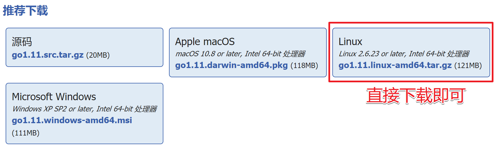
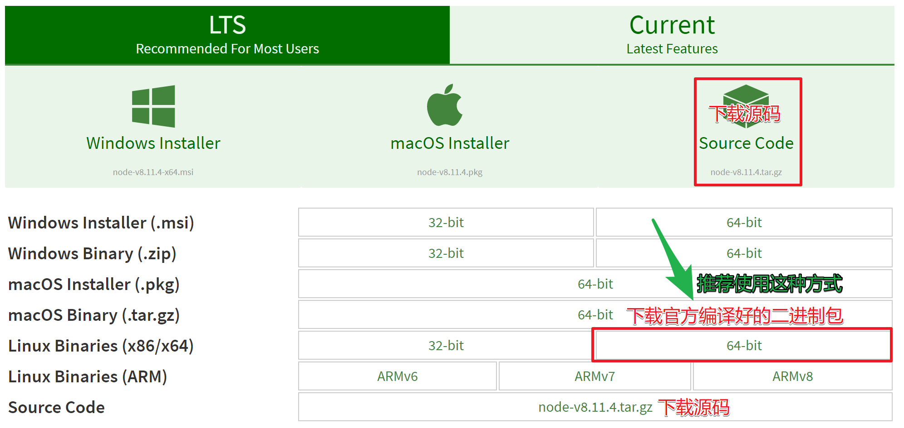

## 	1. Fabric环境搭建

准备工作

> 1. 官方帮助文档：https://hyperledger-fabric.readthedocs.io/en/release-1.2/
> 2. 安装 cURL(https://curl.haxx.se/download.html),`curl --version` 查询版本
> 3. 安装docker，`docker --version` 查询版本
> 4. 安装docker-compose,`docker-compose --version` 查询版本
> 5. 安装 go 语言环境，`go version` 查询版本
> 6. 安装node.js, `node  -v` 查询版本
> 7. Python 版本要求为 2.7，`python --version` 查询版本

### 1.1 安装docker

1. 基础软件安装

   ```shell
   # 安装基本软件
   $ sudo apt-get update
   $ sudo apt-get install apt-transport-https ca-certificates curl git software-properties-common lrzsz -y
   ```

2. 添加阿里的docker镜像仓库

   ```shell
   # 添加阿里的docker镜像仓库
   $ curl -fsSL https://mirrors.aliyun.com/docker-ce/linux/ubuntu/gpg | sudo apt-key add -
   $ sudo add-apt-repository "deb [arch=amd64] https://mirrors.aliyun.com/docker-ce/linux/ubuntu $(lsb_release -cs) stable"
   # 更新软件源
   $ sudo apt-get update
   ```

3. 安装docker

   ```shell
   # 安装docker
   $ sudo apt-get install docker-ce -y
   # 查看安装的docker版本
   $ docker version
   	Client:
            Version:           18.06.1-ce
            API version:       1.38
            Go version:        go1.10.3
            Git commit:        e68fc7a
            Built:             Tue Aug 21 17:24:51 2018
            OS/Arch:           linux/amd64
            Experimental:      false
       Got permission denied while trying to connect to the Docker daemon socket at
       unix:///var/run/docker.sock: Get
       http://%2Fvar%2Frun%2Fdocker.sock/v1.38/version: 
       dial unix /var/run/docker.sock: connect: `permission denied`
   # 当前用户直接操作docker时, 权限不够, 需要做下面的第4不操作
   ```

4. 将当前用户添加到docker组

   ```shell
   # 将用户加入该 group 内。然后退出并重新登录就生效啦。
   $ sudo gpasswd -a ${USER} docker
   # 重启docker服务
   $ systemctl restart docker
   # 当前用户切换到docker群组
   $ newgrp - docker
   $ docker version
   	Client:
            Version:           18.06.1-ce
            API version:       1.38
            Go version:        go1.10.3
            Git commit:        e68fc7a
            Built:             Tue Aug 21 17:24:51 2018
            OS/Arch:           linux/amd64
            Experimental:      false
   
       Server:
            Engine:
            Version:          18.06.1-ce
            API version:      1.38 (minimum version 1.12)
            Go version:       go1.10.3
            Git commit:       e68fc7a
            Built:            Tue Aug 21 17:23:15 2018
            OS/Arch:          linux/amd64
            Experimental:     false
   ```

5. 安装docker-compose

   ```shell
   #安装依赖工具
   $ sudo apt-get install python-pip -y
   #安装编排工具
   $ sudo pip install docker-compose
   #查看版本
   $ sudo docker-compose version
   ```

### 1.2 安装go

```http
# 安装包下载地址:
https://golang.org/dl/  - 翻墙
https://studygolang.com/dl - 国内镜像源
```



如果没有进行安装包下载, 课直接使用如下命令(目前最新版本):

```shell
# 1. 使用wget工具下载安装包
$ wget https://dl.google.com/go/go1.11.linux-amd64.tar.gz
# 2. 解压tar包到/usr/local
$ sudo tar zxvf go1.11.linux-amd64.tar.gz -C /usr/local
# 3. 创建Go目录
$ mkdir $HOME/go
# 4. 用vi打开~./bashrc，配置环境变量
$ vim ~/.bashrc
# 5. 增加下面的环境变量，保存退出
	export GOROOT=/usr/local/go
    export GOPATH=$HOME/go
    export PATH=$PATH:$GOROOT/bin:$GOPATH/bin
# 6. 使环境变量立即生效, 一些命令二选一
$ source ~/.bashrc  
$ . ~/.bashrc
# 7. 检测go是否安装好
$ go version
```

### 1.3 安装Node.js

1. 官方下载地址

   ```http
   https://nodejs.org/en/download/
   ```

   

1. 下载二进制源码包

   ```shell
   $ wget https://nodejs.org/dist/v8.11.4/node-v8.11.4-linux-x64.tar.xz
   ```

2. 解压并安装

   ```shell
   # 指定压缩包解压到/opt目录下
   $ sudo tar xvf node-v8.11.4-linux-x64.tar.xz -C /opt
   	- 在/opt目录下得到 node-v8.11.4-linux-x64 目录
   ```

4. 将node.js设置为全局可用

   ```shell
   # 打开系统级别的配置文件 /etc/profile
   $ sudo vim /etc/profile
   # 添加如下配置项, 保存退出
       export NODEJS_HOME=/opt/node-v8.11.4-linux-x64
       export PATH=$PATH:$NODEJS_HOME/bin
   # 重新加载配置文件
   $ . /etc/profile
   /etc/profile -> 设置环境变量的配置文件
   	- 对当前系统下所有用户生效
   ```

4. 测试

   ```shell
   $ node -v
   ```

### 1.4 部署hyperledger Fabric

1. 下载并执行fabric的引导脚本bootstrap.sh

   ```shell
   # 创建放置的目录，然后进入该目录，用curl下载脚本。
   $ cd ~ # 这里在家目录下创建放置目录
   $ mkdir hyperledger-fabric # 创建放置目录
   $ cd hyperledger-fabric
   # 下载并执行脚本, [ ***语法格式*** ] - 
   # 下边是具体的执行命令 - 看我
   # 下边是具体的执行命令 - 看我
   # 下边是具体的执行命令 -- 重要的事情说三遍, 使用下边不翻墙的命令
   $ curl -sSL http://bit.ly/2ysbOFE | bash -s <fabric> <fabric-ca> <thirdparty>
   	- fabric: fabric的版本
   	- fabric-ca: fabric-ca的版本
   	- thirdparty: 第三方库的版本
   # 下载并执行脚本, [ ***需要翻墙, 需要翻墙, 需要翻墙, 需要翻墙, 需要翻墙,*** ]
   $ curl -sSL http://bit.ly/2ysbOFE | bash -s 1.2.0 1.2.0 0.4.10
   	- http://bit.ly/2ysbOFE: 该地址必须翻墙才能访问
   # ***不翻墙的方式***
   $ curl -sSL https://raw.githubusercontent.com/hyperledger/fabric/master/scripts/bootstrap.sh | bash -s 1.2.0 1.2.0 0.4.10
   # 该脚本启动之后会下载两个压缩包和一些镜像文件, 整个过程会比较长, 耐心等待...
   # 温馨提示: 这个过程会让你产生想要砸电脑的冲动, 控制好你的情绪!!!!
   # 上述命令刚开始会下载以下两个压缩包, 这两个包下载速度特别慢慢慢慢慢慢慢.......
   # 	1. hyperledger-fabric-linux-amd64-1.2.0.tar.gz
   # 	2. hyperledger-fabric-ca-linux-amd64-1.2.0.tar.gz
   以上两个压缩包下载下来之后会被解压, 解压目录:
   ~/hyperledger-fabric/fabric-samples
   可以将事先下载好的两个压缩包放到该目录下, 提高下载速度 (强烈建议), 放好之后再重新执行上边的curl命令
   ```

   安装过程中输出的log信息

   > Installing hyperledger/fabric-samples repo
   >
   > ===> Cloning hyperledger/fabric-samples repo and checkout v1.2.0
   > 正克隆到 'fabric-samples'...
   > remote: Enumerating objects: 29, done.
   > remote: Counting objects: 100% (29/29), done.
   > remote: Compressing objects: 100% (28/28), done.
   > remote: Total 1821 (delta 5), reused 25 (delta 1), pack-reused 1792
   > 接收对象中: 100% (1821/1821), 646.82 KiB | 156.00 KiB/s, 完成.
   > 处理 delta 中: 100% (877/877), 完成.
   > 注意：正在检出 'v1.2.0'。
   >
   > 您正处于分离头指针状态。您可以查看、做试验性的修改及提交，并且您可以通过另外
   > 的检出分支操作丢弃在这个状态下所做的任何提交。
   >
   > 如果您想要通过创建分支来保留在此状态下所做的提交，您可以通过在检出命令添加
   > 参数 -b 来实现（现在或稍后）。例如：
   >
   >   git checkout -b <新分支名>
   >
   > HEAD 目前位于 ed81d7b [FAB-10811] fabric-ca sample is broken on v1.2
   >
   > Installing Hyperledger Fabric binaries
   >
   > ===> Downloading version 1.2.0 platform specific fabric binaries
   > ===> Downloading:  https://nexus.hyperledger.org/content/repositories/releases/org/hyperledger/fabric/hyperledger-fabric/linux-amd64-1.2.0/hyperledger-fabric-linux-amd64-1.2.0.tar.gz
   >   % Total    % Received % Xferd  Average Speed   Time    Time     Time  Current
   > ​                                 Dload  Upload   Total   Spent    Left  Speed
   >   4 39.0M    4 1650k    0     0   7322      0  1:33:08  0:03:50  1:29:18  1642
   > ==> File downloaded. Verifying the md5sum...
   > ==> Extracting hyperledger-fabric-linux-amd64-1.2.0.tar.gz...
   > ==> Done.
   > ===> Downloading version 1.2.0 platform specific fabric-ca-client binary
   > ===> Downloading:  https://nexus.hyperledger.org/content/repositories/releases/org/hyperledger/fabric-ca/hyperledger-fabric-ca/linux-amd64-1.2.0/hyperledger-fabric-ca-linux-amd64-1.2.0.tar.gz
   > ==> Partial binary file found. Resuming download...
   > ==> File downloaded. Verifying the md5sum...
   > ==> Extracting hyperledger-fabric-ca-linux-amd64-1.2.0.tar.gz...
   > ==> Done.
   >
   > Installing Hyperledger Fabric docker images
   >
   > ===> Pulling fabric Images
   > ==> FABRIC IMAGE: peer
   >
   > 1.2.0: Pulling from hyperledger/fabric-peer
   > b234f539f7a1: Pull complete 
   > 55172d420b43: Pull complete 
   > 5ba5bbeb6b91: Pull complete 
   > 43ae2841ad7a: Pull complete 
   > f6c9c6de4190: Pull complete 
   > c6af77e36488: Pull complete 
   > 964f7f4f22f3: Pull complete 
   > d4a3f4cfba3d: Pull complete 
   > 73782018d902: Pull complete 
   > 039eb34e730e: Pull complete 
   > Digest: sha256:949b38bad9496d7694b54d30b90b72653804d761a44d721c4dc7a16a5cbcabe8
   > Status: Downloaded newer image for hyperledger/fabric-peer:1.2.0
   > ==> FABRIC IMAGE: orderer
   >
   > 1.2.0: Pulling from hyperledger/fabric-orderer
   > b234f539f7a1: Already exists 
   > 55172d420b43: Already exists 
   > 5ba5bbeb6b91: Already exists 
   > 43ae2841ad7a: Already exists 
   > f6c9c6de4190: Already exists 
   > c6af77e36488: Already exists 
   > 964f7f4f22f3: Already exists 
   > d4a3f4cfba3d: Already exists 
   > 8d0e11f5a0f7: Pull complete 
   > 0bda0f004d88: Pull complete 
   > Digest: sha256:a10f6d1d4cbb5a0264634c8b5ec63ff6cbbfc7c9fb369a06cc6dfe504d976259
   > Status: Downloaded newer image for hyperledger/fabric-orderer:1.2.0
   > ==> FABRIC IMAGE: ccenv
   >
   > 1.2.0: Pulling from hyperledger/fabric-ccenv
   > b234f539f7a1: Already exists 
   > 55172d420b43: Already exists 
   > 5ba5bbeb6b91: Already exists 
   > 43ae2841ad7a: Already exists 
   > f6c9c6de4190: Already exists 
   > c6af77e36488: Already exists 
   > 964f7f4f22f3: Already exists 
   > 13cd31405e09: Pull complete 
   > e03b35c19d96: Pull complete 
   > 96c2920985e3: Pull complete 
   > e91461be8304: Pull complete 
   > 950c3368692b: Pull complete 
   > c5de8d20c137: Pull complete 
   > 5536b64bc67b: Pull complete 
   > Digest: sha256:0a7fb37111cafce79cf89ca8d1af5ca6f721e60a8bd1b2b93521e671e3348af2
   > Status: Downloaded newer image for hyperledger/fabric-ccenv:1.2.0
   > ==> FABRIC IMAGE: tools
   >
   > 1.2.0: Pulling from hyperledger/fabric-tools
   > b234f539f7a1: Already exists 
   > 55172d420b43: Already exists 
   > 5ba5bbeb6b91: Already exists 
   > 43ae2841ad7a: Already exists 
   > f6c9c6de4190: Already exists 
   > c6af77e36488: Already exists 
   > 964f7f4f22f3: Already exists 
   > 13cd31405e09: Already exists 
   > e03b35c19d96: Already exists 
   > 96c2920985e3: Already exists 
   > e91461be8304: Already exists 
   > 314928def9dd: Pull complete 
   > d5b68ae13f8d: Pull complete 
   > dde25187799d: Pull complete 
   > Digest: sha256:24cca44a2f2ab6325c6ccc1c91a10bd3e0e71764037a85a473f7e9621b3a0f91
   > Status: Downloaded newer image for hyperledger/fabric-tools:1.2.0
   > ===> Pulling fabric ca Image
   > ==> FABRIC CA IMAGE
   >
   > 1.2.0: Pulling from hyperledger/fabric-ca
   > b234f539f7a1: Already exists 
   > 55172d420b43: Already exists 
   > 5ba5bbeb6b91: Already exists 
   > 43ae2841ad7a: Already exists 
   > f6c9c6de4190: Already exists 
   > c6af77e36488: Already exists 
   > 964f7f4f22f3: Already exists 
   > f7a6370a6f7f: Pull complete 
   > 37cc94e973b2: Pull complete 
   > a80e45d2f608: Pull complete 
   > 8feb19f73d3a: Pull complete 
   > 5f3ea048e0c0: Pull complete 
   > Digest: sha256:5fe6d502e52ec2a8d98ee5653e1ba31952098115fb57710ddae86f2c3cc82dad
   > Status: Downloaded newer image for hyperledger/fabric-ca:1.2.0
   > ===> Pulling thirdparty docker images
   > ==> THIRDPARTY DOCKER IMAGE: couchdb
   >
   > 0.4.10: Pulling from hyperledger/fabric-couchdb
   > b234f539f7a1: Already exists 
   > 55172d420b43: Already exists 
   > 5ba5bbeb6b91: Already exists 
   > 43ae2841ad7a: Already exists 
   > f6c9c6de4190: Already exists 
   > c6af77e36488: Already exists 
   > 964f7f4f22f3: Already exists 
   > 13cd31405e09: Already exists 
   > e03b35c19d96: Already exists 
   > 96c2920985e3: Already exists 
   > e91461be8304: Already exists 
   > 6a752ce8f7fe: Pull complete 
   > a49e2cb854b0: Pull complete 
   > 493b25e70e6d: Pull complete 
   > 2721753a3e7c: Pull complete 
   > adede0f2a5f1: Pull complete 
   > 9eb593f76305: Pull complete 
   > bb49a3450e11: Pull complete 
   > 929b9bb5d788: Pull complete 
   > Digest: sha256:c65891b6c2374a06aff61dad8cd60e1f7a8dc2b72cc9f6f5c2f853f94509c1b1
   > Status: Downloaded newer image for hyperledger/fabric-couchdb:0.4.10
   > ==> THIRDPARTY DOCKER IMAGE: kafka
   >
   > 0.4.10: Pulling from hyperledger/fabric-kafka
   > b234f539f7a1: Already exists 
   > 55172d420b43: Already exists 
   > 5ba5bbeb6b91: Already exists 
   > 43ae2841ad7a: Already exists 
   > f6c9c6de4190: Already exists 
   > c6af77e36488: Already exists 
   > 964f7f4f22f3: Already exists 
   > 13cd31405e09: Already exists 
   > e03b35c19d96: Already exists 
   > 96c2920985e3: Already exists 
   > e91461be8304: Already exists 
   > 146aa6695f33: Pull complete 
   > 954e41d8cd46: Pull complete 
   > 9d750070047f: Pull complete 
   > Digest: sha256:3b58cd0f26e7f4d8c49373d6b91e1e465a97321ce106da9c055ed452bb9d7184
   > Status: Downloaded newer image for hyperledger/fabric-kafka:0.4.10
   > ==> THIRDPARTY DOCKER IMAGE: zookeeper
   >
   > 0.4.10: Pulling from hyperledger/fabric-zookeeper
   > b234f539f7a1: Already exists 
   > 55172d420b43: Already exists 
   > 5ba5bbeb6b91: Already exists 
   > 43ae2841ad7a: Already exists 
   > f6c9c6de4190: Already exists 
   > c6af77e36488: Already exists 
   > 964f7f4f22f3: Already exists 
   > 13cd31405e09: Already exists 
   > e03b35c19d96: Already exists 
   > 96c2920985e3: Already exists 
   > e91461be8304: Already exists 
   > c335e6e59168: Pull complete 
   > 016e000b0cc8: Pull complete 
   > e716b0c9790c: Pull complete 
   > 390f47e71470: Pull complete 
   > Digest: sha256:151fe67421663fe860c1aba4b80877a22b6b8fa18cbc97990c309c603cd6f5f1
   > Status: Downloaded newer image for hyperledger/fabric-zookeeper:0.4.10

   **通过上述操作拉取的docker镜像为:**

   |         镜像文件名称         |                        用途                        |
   | :--------------------------: | :------------------------------------------------: |
   |   hyperledger/fabric-peer    |                  peer模块镜像文件                  |
   |  hyperledger/fabric-orderer  |               orderer节点库镜像文件                |
   |   hyperledger/fabric-ccenv   |         Go语言chaincode运行环境库镜像文件          |
   |   hyperledger/fabric-tools   | 相关工具镜像文件包含了cryptogen, configtxgen等工具 |
   |    hyperledger/fabric-ca     |                   CA模块镜像文件                   |
   |  hyperledger/fabric-couchdb  |               couchdb数据库镜像文件                |
   |   hyperledger/fabric-kafka   |                  kafka库镜像文件                   |
   | hyperledger/fabric-zookeeper |                zookeeper库镜像文件                 |


   下载完，可以看到已经下载的docker相关镜像

   > ===> List out hyperledger docker images
   >
   > hyperledger/fabric-ca                1.2.0               66cc132bd09c        2 months ago        252MB
   >
   > hyperledger/fabric-ca                latest              66cc132bd09c        2 months ago        252MB
   > hyperledger/fabric-tools            1.2.0               379602873003        2 months ago        1.51GB
   > hyperledger/fabric-tools            latest              379602873003        2 months ago        1.51GB
   > hyperledger/fabric-ccenv           1.2.0               6acf31e2d9a4        2 months ago        1.43GB
   > hyperledger/fabric-ccenv           latest              6acf31e2d9a4        2 months ago        1.43GB
   > hyperledger/fabric-orderer        1.2.0               4baf7789a8ec        2 months ago        152MB
   > hyperledger/fabric-orderer        latest              4baf7789a8ec        2 months ago        152MB
   > hyperledger/fabric-peer             1.2.0               82c262e65984        2 months ago        159MB
   > hyperledger/fabric-peer             latest              82c262e65984        2 months ago        159MB
   > hyperledger/fabric-zookeeper   0.4.10              2b51158f3898        2 months ago        1.44GB
   > hyperledger/fabric-zookeeper    latest              2b51158f3898        2 months ago        1.44GB
   > hyperledger/fabric-kafka      	  0.4.10              936aef6db0e6        2 months ago        1.45GB
   > hyperledger/fabric-kafka       	   latest              936aef6db0e6        2 months ago        1.45GB
   > hyperledger/fabric-couchdb      0.4.10              3092eca241fc        2 months ago        1.61GB
   > hyperledger/fabric-couchdb       latest              3092eca241fc        2 months ago        1.61GB

2. 设置全局访问

   ```shell
   # 进入到 ~/hyperledger-fabric/fabric-samples/bin 目录
   $ cd ~/hyperledger-fabric/fabric-samples/bin
   itcast@ubuntu:~/hyperledger-fabric/fabric-samples/bin$ tree
       .
       ├── configtxgen
       ├── configtxlator
       ├── cryptogen
       ├── discover
       ├── fabric-ca-client
       ├── get-docker-images.sh
       ├── idemixgen
       ├── orderer
       └── peer
   # 将这些二进制文件拷贝到 /usr/local/bin 目录下
   $ sudo cp * /usr/local/bin
   # 执行完上述操作之后, fabric的这些可执行程序就可以在全局范围内使用了
   ```

###1.5 First-Network 环境测试

####1.5.1 生成相应文件

**执行 ./byfn.sh generate 命令生成相应的文件**

```shell
$ cd ~/hyperledger-fabric/fabric-samples/first-network/
$ ./byfn.sh generate	
```

> Generating certs and genesis block for channel 'mychannel' with CLI timeout of '10' seconds and CLI delay of '3' seconds
> Continue? [Y/n] y
> proceeding ...
> /home/zoro/hyperledger-fabric/fabric-samples/first-network/../bin/cryptogen
>
> ###### ####################################################
>
> <font color="blue" size=5>Generate certificates using cryptogen tool</font>
>
> ###### ####################################################
>
> - <font color="red">cryptogen generate --config=./crypto-config.yaml</font>
>   org1.example.com
>   org2.example.com
> - res=0
> - set +x
>
> /home/zoro/hyperledger-fabric/fabric-samples/first-network/../bin/configtxgen
>
> ###### ####################################################
>
> <font color="blue" size=5>Generating Orderer Genesis block</font>
>
> ###### ####################################################
>
> - <font color="red">configtxgen **-profile** TwoOrgsOrdererGenesis **-outputBlock** ./channel-artifacts/genesis.block</font>
>   2018-09-23 11:03:32.183 CST [common/tools/configtxgen] main -> WARN 001 Omitting the channel ID for configtxgen is deprecated.  Explicitly passing the channel ID will be required in the future, defaulting to 'testchainid'.
>   2018-09-23 11:03:32.183 CST [common/tools/configtxgen] main -> INFO 002 Loading configuration
>   2018-09-23 11:03:32.190 CST [common/tools/configtxgen/encoder] NewChannelGroup -> WARN 003 Default policy emission is deprecated, please include policy specificiations for the channel group in configtx.yaml
>   2018-09-23 11:03:32.191 CST [common/tools/configtxgen/encoder] NewOrdererGroup -> WARN 004 Default policy emission is deprecated, please include policy specificiations for the orderer group in configtx.yaml
>   2018-09-23 11:03:32.191 CST [common/tools/configtxgen/encoder] NewOrdererOrgGroup -> WARN 005 Default policy emission is deprecated, please include policy specificiations for the orderer org group OrdererOrg in configtx.yaml
>   2018-09-23 11:03:32.192 CST [msp] getMspConfig -> INFO 006 Loading NodeOUs
>   2018-09-23 11:03:32.192 CST [common/tools/configtxgen/encoder] NewOrdererOrgGroup -> WARN 007 Default policy emission is deprecated, please include policy specificiations for the orderer org group Org1MSP in configtx.yaml
>   2018-09-23 11:03:32.193 CST [msp] getMspConfig -> INFO 008 Loading NodeOUs
>   2018-09-23 11:03:32.193 CST [common/tools/configtxgen/encoder] NewOrdererOrgGroup -> WARN 009 Default policy emission is deprecated, please include policy specificiations for the orderer org group Org2MSP in configtx.yaml
>   2018-09-23 11:03:32.193 CST [common/tools/configtxgen] doOutputBlock -> INFO 00a Generating genesis block
>   2018-09-23 11:03:32.194 CST [common/tools/configtxgen] doOutputBlock -> INFO 00b Writing genesis block
> - res=0
> - set +x
>
> ###### ###########################################################
>
>  <font color="blue" size=5>Generating channel configuration transaction 'channel.tx'</font>
>
> ###### ###########################################################
>
> - <font color="red">configtxgen **-profile** TwoOrgsChannel **-outputCreateChannelTx** ./channel-artifacts/channel.tx **-channelID** mychannel</font>
>   2018-09-23 11:03:32.238 CST [common/tools/configtxgen] main -> INFO 001 Loading configuration
>   2018-09-23 11:03:32.252 CST [common/tools/configtxgen] doOutputChannelCreateTx -> INFO 002 Generating new channel configtx
>   2018-09-23 11:03:32.253 CST [common/tools/configtxgen/encoder] NewApplicationGroup -> WARN 003 Default policy emission is deprecated, please include policy specificiations for the application group in configtx.yaml
>   2018-09-23 11:03:32.253 CST [msp] getMspConfig -> INFO 004 Loading NodeOUs
>   2018-09-23 11:03:32.254 CST [common/tools/configtxgen/encoder] NewApplicationOrgGroup -> WARN 005 Default policy emission is deprecated, please include policy specificiations for the application org group Org1MSP in configtx.yaml
>   2018-09-23 11:03:32.254 CST [msp] getMspConfig -> INFO 006 Loading NodeOUs
>   2018-09-23 11:03:32.254 CST [common/tools/configtxgen/encoder] NewApplicationOrgGroup -> WARN 007 Default policy emission is deprecated, please include policy specificiations for the application org group Org2MSP in configtx.yaml
>   2018-09-23 11:03:32.257 CST [common/tools/configtxgen] doOutputChannelCreateTx -> INFO 008 Writing new channel tx
> - res=0
> - set +x
>
> ###### ###########################################################
>
> <font color="blue" size=5>Generating anchor peer update for Org1MSP</font>
>
> ###### ###########################################################
>
> - <font color="red">configtxgen **-profile** TwoOrgsChannel **-outputAnchorPeersUpdate** ./channel-artifacts/Org1MSPanchors.tx **-channelID** mychannel **-asOrg** Org1MSP</font>
>   2018-09-23 11:03:32.298 CST [common/tools/configtxgen] main -> INFO 001 Loading configuration
>   2018-09-23 11:03:32.307 CST [common/tools/configtxgen] doOutputAnchorPeersUpdate -> INFO 002 Generating anchor peer update
>   2018-09-23 11:03:32.307 CST [common/tools/configtxgen] doOutputAnchorPeersUpdate -> INFO 003 Writing anchor peer update
> - res=0
> - set +x
>
> ###### ###########################################################
>
> <font color="blue" size=5>Generating anchor peer update for Org2MSP</font>
>
> ###### ###########################################################
>
> - <font color="red">configtxgen **-profile** TwoOrgsChannel **-outputAnchorPeersUpdate** ./channel-artifacts/Org2MSPanchors.tx **-channelID** mychannel **-asOrg** Org2MSP</font>
>   2018-09-23 11:03:32.350 CST [common/tools/configtxgen] main -> INFO 001 Loading configuration
>   2018-09-23 11:03:32.362 CST [common/tools/configtxgen] doOutputAnchorPeersUpdate -> INFO 002 Generating anchor peer update
>   2018-09-23 11:03:32.363 CST [common/tools/configtxgen] doOutputAnchorPeersUpdate -> INFO 003 Writing anchor peer update
> - res=0
> - set +x

#### 1.5.2 启动网路

**执行 ./byfn.sh up 启动网络**

```shell
# byfn == build your first network
$ ./byfn.sh up
```

当我们看到START的时候，表示启动成功。 

> Starting for channel 'mychannel' with CLI timeout of '10' seconds and CLI delay of '3' seconds
> Continue? [Y/n] y
> proceeding ...
> LOCAL_VERSION=1.2.0
> DOCKER_IMAGE_VERSION=1.2.0
> Creating network "net_byfn" with the default driver
> Creating volume "net_peer0.org2.example.com" with default driver
> Creating volume "net_peer1.org2.example.com" with default driver
> Creating volume "net_peer1.org1.example.com" with default driver
> Creating volume "net_peer0.org1.example.com" with default driver
> Creating volume "net_orderer.example.com" with default driver
> Creating peer1.org1.example.com ... done
> Creating peer0.org1.example.com ... done
> Creating peer0.org2.example.com ... done
> Creating orderer.example.com    ... done
> Creating peer1.org2.example.com ... done
> Creating cli                    ... done
>
> ​                                                                        <font color="red" size=24>START</font>
>
> Build your first network (BYFN) end-to-end test
>
> Channel name : mychannel
> Creating channel...
>
> - <font color="red">peer channel create -o orderer.example.com:7050 -c mychannel -f ./channel-artifacts/channel.tx --tls true --cafile /opt/gopath/src/github.com/hyperledger/fabric/peer/crypto/ordererOrganizations/example.com/orderers/orderer.example.com/msp/tlscacerts/tlsca.example.com-cert.pem</font>
> - res=0
> - set +x
>   2018-09-23 03:03:55.350 UTC [channelCmd] InitCmdFactory -> INFO 001 Endorser and orderer connections initialized
>   2018-09-23 03:03:55.420 UTC [cli/common] readBlock -> INFO 002 Got status: &{NOT_FOUND}
>   2018-09-23 03:03:55.422 UTC [channelCmd] InitCmdFactory -> INFO 003 Endorser and orderer connections initialized
>   2018-09-23 03:03:55.629 UTC [cli/common] readBlock -> INFO 004 Received block: 0
>   ===================== Channel 'mychannel' created ===================== 
>
> Having all peers join the channel...
>
> - peer channel join -b mychannel.block
> - res=0
> - set +x
>   2018-09-23 03:03:55.699 UTC [channelCmd] InitCmdFactory -> INFO 001 Endorser and orderer connections initialized
>   2018-09-23 03:03:55.807 UTC [channelCmd] executeJoin -> INFO 002 Successfully submitted proposal to join channel
>   ===================== peer0.org1 joined channel 'mychannel' ===================== 
> - peer channel join -b mychannel.block
> - res=0
> - set +x
>   2018-09-23 03:03:58.874 UTC [channelCmd] InitCmdFactory -> INFO 001 Endorser and orderer connections initialized
>   2018-09-23 03:03:58.976 UTC [channelCmd] executeJoin -> INFO 002 Successfully submitted proposal to join channel
>   ===================== peer1.org1 joined channel 'mychannel' ===================== 
> - peer channel join -b mychannel.block
> - res=0
> - set +x
>   2018-09-23 03:04:02.058 UTC [channelCmd] InitCmdFactory -> INFO 001 Endorser and orderer connections initialized
>   2018-09-23 03:04:02.169 UTC [channelCmd] executeJoin -> INFO 002 Successfully submitted proposal to join channel
>   ===================== peer0.org2 joined channel 'mychannel' ===================== 
> - peer channel join -b mychannel.block
> - res=0
> - set +x
>   2018-09-23 03:04:05.231 UTC [channelCmd] InitCmdFactory -> INFO 001 Endorser and orderer connections initialized
>   2018-09-23 03:04:05.339 UTC [channelCmd] executeJoin -> INFO 002 Successfully submitted proposal to join channel
>   ===================== peer1.org2 joined channel 'mychannel' ===================== 
>
> Updating anchor peers for org1...
>
> - peer channel update -o orderer.example.com:7050 -c mychannel -f ./channel-artifacts/Org1MSPanchors.tx --tls true --cafile /opt/gopath/src/github.com/hyperledger/fabric/peer/crypto/ordererOrganizations/example.com/orderers/orderer.example.com/msp/tlscacerts/tlsca.example.com-cert.pem
> - res=0
> - set +x
>   2018-09-23 03:04:08.406 UTC [channelCmd] InitCmdFactory -> INFO 001 Endorser and orderer connections initialized
>   2018-09-23 03:04:08.422 UTC [channelCmd] update -> INFO 002 Successfully submitted channel update
>   ===================== Anchor peers updated for org 'Org1MSP' on channel 'mychannel' ===================== 
>
> Updating anchor peers for org2...
>
> - peer channel update -o orderer.example.com:7050 -c mychannel -f ./channel-artifacts/Org2MSPanchors.tx --tls true --cafile /opt/gopath/src/github.com/hyperledger/fabric/peer/crypto/ordererOrganizations/example.com/orderers/orderer.example.com/msp/tlscacerts/tlsca.example.com-cert.pem
> - res=0
> - set +x
>   2018-09-23 03:04:11.503 UTC [channelCmd] InitCmdFactory -> INFO 001 Endorser and orderer connections initialized
>   2018-09-23 03:04:11.519 UTC [channelCmd] update -> INFO 002 Successfully submitted channel update
>   ===================== Anchor peers updated for org 'Org2MSP' on channel 'mychannel' ===================== 
>
> Installing chaincode on peer0.org1...
>
> - peer chaincode install -n mycc -v 1.0 -l golang -p github.com/chaincode/chaincode_example02/go/
> - res=0
> - set +x
>   2018-09-23 03:04:14.610 UTC [chaincodeCmd] checkChaincodeCmdParams -> INFO 001 Using default escc
>   2018-09-23 03:04:14.610 UTC [chaincodeCmd] checkChaincodeCmdParams -> INFO 002 Using default vscc
>   2018-09-23 03:04:15.000 UTC [chaincodeCmd] install -> INFO 003 Installed remotely response:<status:200 payload:"OK" > 
>   ===================== Chaincode is installed on peer0.org1 ===================== 
>
> Install chaincode on peer0.org2...
>
> - peer chaincode install -n mycc -v 1.0 -l golang -p github.com/chaincode/chaincode_example02/go/
> - res=0
> - set +x
>   2018-09-23 03:04:15.069 UTC [chaincodeCmd] checkChaincodeCmdParams -> INFO 001 Using default escc
>   2018-09-23 03:04:15.069 UTC [chaincodeCmd] checkChaincodeCmdParams -> INFO 002 Using default vscc
>   2018-09-23 03:04:15.203 UTC [chaincodeCmd] install -> INFO 003 Installed remotely response:<status:200 payload:"OK" > 
>   ===================== Chaincode is installed on peer0.org2 ===================== 
>
> Instantiating chaincode on peer0.org2...
>
> - peer chaincode instantiate -o orderer.example.com:7050 --tls true --cafile /opt/gopath/src/github.com/hyperledger/fabric/peer/crypto/ordererOrganizations/example.com/orderers/orderer.example.com/msp/tlscacerts/tlsca.example.com-cert.pem -C mychannel -n mycc -l golang -v 1.0 -c '{"Args":["init","a","100","b","200"]}' -P 'AND ('\''Org1MSP.peer'\'','\''Org2MSP.peer'\'')'
> - res=0
> - set +x
>   2018-09-23 03:04:15.284 UTC [chaincodeCmd] checkChaincodeCmdParams -> INFO 001 Using default escc
>   2018-09-23 03:04:15.284 UTC [chaincodeCmd] checkChaincodeCmdParams -> INFO 002 Using default vscc
>   ===================== Chaincode is instantiated on peer0.org2 on channel 'mychannel' ===================== 
>
> Querying chaincode on peer0.org1...
> ===================== Querying on peer0.org1 on channel 'mychannel'... ===================== 
> Attempting to Query peer0.org1 ...3 secs
>
> - peer chaincode query -C mychannel -n mycc -c '{"Args":["query","a"]}'
> - res=0
> - set +x
>
> 100
> ===================== Query successful on peer0.org1 on channel 'mychannel' ===================== 
> Sending invoke transaction on peer0.org1 peer0.org2...
>
> - peer chaincode invoke -o orderer.example.com:7050 --tls true --cafile /opt/gopath/src/github.com/hyperledger/fabric/peer/crypto/ordererOrganizations/example.com/orderers/orderer.example.com/msp/tlscacerts/tlsca.example.com-cert.pem -C mychannel -n mycc --peerAddresses peer0.org1.example.com:7051 --tlsRootCertFiles /opt/gopath/src/github.com/hyperledger/fabric/peer/crypto/peerOrganizations/org1.example.com/peers/peer0.org1.example.com/tls/ca.crt --peerAddresses peer0.org2.example.com:7051 --tlsRootCertFiles /opt/gopath/src/github.com/hyperledger/fabric/peer/crypto/peerOrganizations/org2.example.com/peers/peer0.org2.example.com/tls/ca.crt -c '{"Args":["invoke","a","b","10"]}'
> - res=0
> - set +x
>   2018-09-23 03:05:17.876 UTC [chaincodeCmd] chaincodeInvokeOrQuery -> INFO 001 Chaincode invoke successful. result: status:200 
>   ===================== Invoke transaction successful on peer0.org1 peer0.org2 on channel 'mychannel' ===================== 
>
> Installing chaincode on peer1.org2...
>
> - peer chaincode install -n mycc -v 1.0 -l golang -p github.com/chaincode/chaincode_example02/go/
> - res=0
> - set +x
>   2018-09-23 03:05:17.966 UTC [chaincodeCmd] checkChaincodeCmdParams -> INFO 001 Using default escc
>   2018-09-23 03:05:17.966 UTC [chaincodeCmd] checkChaincodeCmdParams -> INFO 002 Using default vscc
>   2018-09-23 03:05:18.340 UTC [chaincodeCmd] install -> INFO 003 Installed remotely response:<status:200 payload:"OK" > 
>   ===================== Chaincode is installed on peer1.org2 ===================== 
>
> Querying chaincode on peer1.org2...
> ===================== Querying on peer1.org2 on channel 'mychannel'... ===================== 
> Attempting to Query peer1.org2 ...3 secs
>
> - peer chaincode query -C mychannel -n mycc -c '{"Args":["query","a"]}'
> - res=0
> - set +x
>
> 90
> ===================== Query successful on peer1.org2 on channel 'mychannel' ===================== 
>
> ========= All GOOD, BYFN execution completed =========== 
>
> ​                                                                             <font color="red" size=24>END</font>

执行结束，显示END

   1. **通过docker ps命令可以查看到节点的启动情况。**

      ```shell
      $ docker ps
      ```

   2. **如果我们要停止网络，可以执行./byfn.sh down 命令来停止**

      ```shell
      $ ./byfn.sh down
      ```

      > Stopping for channel 'mychannel' with CLI timeout of '10' seconds and CLI delay of '3' seconds
      > Continue? [Y/n] y
      > proceeding ...
      > Stopping cli                    ... done
      > Stopping orderer.example.com    ... done
      > Stopping peer1.org2.example.com ... done
      > Stopping peer1.org1.example.com ... done
      > Stopping peer0.org2.example.com ... done
      > Stopping peer0.org1.example.com ... done
      > Removing cli                    ... done
      > Removing orderer.example.com    ... done
      > Removing peer1.org2.example.com ... done
      > Removing peer1.org1.example.com ... done
      > Removing peer0.org2.example.com ... done
      > Removing peer0.org1.example.com ... done
      > Removing network net_byfn
      > Removing volume net_peer0.org3.example.com
      > WARNING: Volume net_peer0.org3.example.com not found.
      > Removing volume net_peer1.org3.example.com
      > WARNING: Volume net_peer1.org3.example.com not found.
      > Removing volume net_orderer.example.com
      > Removing volume net_peer0.org2.example.com
      > Removing volume net_peer0.org1.example.com
      > Removing volume net_peer1.org1.example.com
      > Removing volume net_peer1.org2.example.com
      > 80510c01c3e8
      > 3625e4ce1b01
      > 43b4b0dfb14f
      > Untagged: dev-peer1.org2.example.com-mycc-1.0-26c2ef32838554aac4f7ad6f100aca865e87959c9a126e86d764c8d01f8346ab:latest
      > Deleted: sha256:3c7cf25f6520e39afe9ca0770821bcf8892c398ffa8fafaa4d39d4b18bf9a7af
      > Deleted: sha256:ac116d2c1fbb503f766149a2acf422b754d59ba4be58902981d03b2969ef21c1
      > Deleted: sha256:3e07d57882218fc26936d29deefba9e3bb0230d63b5e82d727ddbc92c59d942d
      > Deleted: sha256:9c88b5b791167d2d37be1fc39886e5efa00d522aad7df03869b8eb30aa564b5f
      > Untagged: dev-peer0.org1.example.com-mycc-1.0-384f11f484b9302df90b453200cfb25174305fce8f53f4e94d45ee3b6cab0ce9:latest
      > Deleted: sha256:16229f944e6c2e665587638a47c80d9594693aede0d25d736d7225370efc67ae
      > Deleted: sha256:6a5c627fbc23a646b17a493a6b7df67a2535501b8d77915aab6ac2c1ba97b1b3
      > Deleted: sha256:4d0d3e96c80a3e0ee4c3553a125c99bbaffe6f1b487348f87ffb3059d6eb7f2e
      > Deleted: sha256:a9600d47e71d3abb5f5afcbf56b6b21955e1bbe7fcb92040f1349667cf712bc0
      > Untagged: dev-peer0.org2.example.com-mycc-1.0-15b571b3ce849066b7ec74497da3b27e54e0df1345daff3951b94245ce09c42b:latest
      > Deleted: sha256:5f7c63593550d018ab28312c3d040b27a53f2d1e844ddd7d50a2fcf63454594b
      > Deleted: sha256:a00c5883309d6a80aaf22f8b704b594c6129150c5048fd00d742077f212b28f7
      > Deleted: sha256:71fae53aba930c88450ff286a5e54bceece45ea7aee465a8f2806aa967ab2b21
      > Deleted: sha256:08fe44e007fd3d5377b44cca32e8f78d2249b0a1d9ce9312c68636fdacda2edc

## 2. Hyperledger Fabric介绍

> 如果说以比特币为代表的货币区块链技术为 1.0，以以太坊为代表的合同区块链技术为 2.0，那么实现了完备的权限控制和安全保障的 Hyperledger 项目毫无疑问代表着区块链技术 3.0 时代的到来。

### Fabric1.0架构简介


> **Fabric架构的核心包括三部分：**
>
> - <font color='red'>**Identity - 身份管理**</font>
> - <font color='red'>**Smart Contact - 智能合约**</font>
> - <font color='red'>**Ledger及Transactions - 账本和交易**</font>

#### 1. Identity

> Identity，也就是身份管理，Fabric是目前为止在设计上最贴近联盟链思想的区块链。联盟链考虑到商业应用对安全、隐私、监管、审计、性能的需求，提高准入门槛，成员必须被许可才能加入网络。Fabric成员管理服务为整个区块链网络提供身份管理、隐私、保密和可审计的服务。成员管理服务通过公钥基础设施PKI和去中心化共识机制使得非许可的区块链变成许可制的区块链。

#### 2. Smart Contract

> Fabric的智能合约smart contract称为链码**chaincode**，是一段代码，它处理网络成员所同意的业务逻辑。和以太坊相比，Fabric链码和底层账本是分开的，升级链码时并不需要迁移账本数据到新链码当中，真正实现了逻辑与数据的分离。
>
> 链码可采用`Go、Java、Node.js`语言编写。链码被编译成一个独立的应用程序，fabric用Docker容器来运行chaincode，里面的base镜像都是经过签名验证的安全镜像，包括OS层和开发chaincode的语言、runtime和SDK层。一旦chaincode容器被启动，它就会通过gRPC与启动这个chaincode的Peer节点连接。

#### 3. Ledger | Transactions

> Fabric使用建立在HTTP/2上的P2P协议来管理分布式账本。采取可插拔的方式来根据具体需求来设置共识协议，比如PBFT，Raft，PoW和PoS等。

- **Ledger**

  > 账本Ledger主要包含两块：blockchain和state。blockchain就是一系列连在一起的block，用来记录历史交易。state对应账本的当前最新状态，它是一个key-value数据库，Fabric默认采用`Level DB`, 可以替换成其他的Key-value数据库，如`Couch DB`。举个例子。我们采用区块链实现一个弹珠交易的系统。我们开发了一个Chaincode, 每个弹珠有以下几个属性：Name, owner, color, size.  可以定义一个JSON对象，用name做KEY, JSON对象做Value，存储在Level DB或者CouchDB中。

- **Transactions**

  > <font color="red">**Fabric上的transction交易分两种，部署交易和调用交易。**</font>
  >
  > - <font color="red">**部署交易**</font>
  >
  >   把Chaincode部署到peer节点上并准备好被调用，当一个部署交易成功执行时，Chaincode就被部署到各个peer节点上。好比把一个web service或者EJB部署到应用服务器上的不同实例上。
  >
  > - <font color="red">**调用交易**</font>
  >
  >   客户端应用程序通过Fabric提供的API调用先前已部署好的某个chaincode的某个函数执行交易，并相应地读取和写入K-V数据库，返回是否成功或者失败。

### APIs,Events,SDKs

站在程序猿的角度Fabric开发主要包括客户端和服务器端应用程序的编写

- 服务器端

  > Fabric提供API方便应用开发，对服务端的ChainCode，目前支持用Go、Java或者Node.js开发。

- 客户端

  > 对客户端应用，Fabric目前提供Node.js和Java SDK, Go SDK。未来计划提供Python，Fabric还提供RESTAPI。

对于开发者，还可以通过CLI快速去测试chaincode，或者去查询交易状态。在区块链网络里，节点和chaincode会发送events来触发一些监听动作，方便与其他外部系统的集成。

### Fabric 应用开发流程

> 如下图所示，开发者创建客户端应用和智能合约（chaincode），Chaincode被部署到区块链网络的Peer节点上面。通过chaincode来操作账本，当你调用一个交易transaction时，你实际上是在调用Chaincode中的一个函数方法，它实现业务逻辑，并对账本进行get, put, delete操作。客户端应用提供用户交互界面，并提交交易到区块链网络上。


### Fabric 业务网络

> 业务网络，也叫共识网络或区块链网络，由不同的节点构成。节点是区块链的通信实体，节点是一个逻辑概念，不同类型的节点可以运行在同一台物理服务器上。这些节点可能部署在云上面或者本地。可能来自不同的公司或者组织。在区块链网络中有两种类型的节点：Peer节点和Orderer节点，如下图所示。


- **Peer节点：**

  > chaincode部署在Peer节点上，它对账本进行读写操作。一个Peer节点可以充当多种角色，如背书者endorser, 提交者committer。一个区块链网络中会有多个Peer节点。

- **Orderer节点：**

  > 对交易进行排序，批量打包，生成区块，发给Peer节点。一个区块链网络中会有多个Orderer节点，它们共同提供排序服务。排序服务可以别实现为多种不同的方式，从一个中心化的服务（被用于开发和测试，如Solo）,到分布式协议（如Kafka）。
  >
  > 排序服务提供了通向客户端和Peer节点的共享通信通道。提供了包含交易的消息广播服务（broadcast和deliver）。客户端可以通过这个通道向所有的节点广播（broadcast）消息。通道可以向连接到该通道的节点投递(deliver)消息。
  >
  > 排序服务支持多通道，类似于发布/订阅消息系统中的主题topic。客户端和Peer节点可以连接到一个给点的通道，并通过给定的通道发送和接收消息。多通道使得Peer节点可以基于应用访问控制策略来订阅任意数量的通道; 也就是说，应用程序在指定Peer节点的子集中架设通道。这些peer组成提交到该通道交易的相关者集合，而且只有这些peer可以接收包含相关交易的区块，与其他交易完全隔离，实现数据隔离和保密。
  >
  > 此外，peers的子集将这些私有块提交到不同的账本上，允许它们保护这些私有交易，与其他peers子集的账本隔离开来。应用程序根据业务逻辑决定将交易发送到1个或多个通道。

- **Channel**

  > Channel在fabric中是一个相当重要的概念，可译作通道或频道。对于channel的理解，不妨想象一下电视节目的频道和“我和你不在一个频道”这句话。Channel本身存在于orderer结点内部，但需要通过peer结点使用`peer channel ...`命令进行维护。一个peer结点要想与另一个peer结点发生交易，最基本的前提就是两个结点必须同时处在同一个Channel中，block账本与channel也是一对一的关系，即一个channel一个账本。


> 例如，如上图所示:
>
> - peer 1,2和N订阅红色通道，并共同维护红色账本; 
> - peer 1和N订阅蓝色通道并维护蓝色账本; 
> - peer 2和peer N在黑色通道上并维护黑色账本。
>
> 在这个例子中，peer N订阅了所有通道，我们看到每个通道都有一个相关的账本。也就是说在一个区块链网络中，每个节点上面可以有多个账本。

## 3.  Fabric核心模块

Fabric是一个由五个核心模块组成的程序组. 在fabric在成功编译完成之后, 一共会有五个核心模块, 如下:

|    模块名称     |                     功能                     |
| :-------------: | :------------------------------------------: |
|     `peer`      | 主节点模块, 负责存储区块链数据, 运行维护链码 |
|    `orderer`    |              交易打包, 排序模块              |
|   `cryptogen`   |              组织和证书生成模块              |
|  `configtxgen`  |              区块和交易生成模块              |
| `configtxlator` |              区块和交易解析模块              |

> 五个模块中`peer`和`orderer`属于系统模块, `cryptogen`, `configtxgen`, `configtxlator`属于工具模块。工具模块负责证书文件、区块链创始块、通道创始块等相关文件和证书的生成工作，但是工具模块不参与系统的运行。peer模块和 orderer 模块作为系统模块是Fabric的核心模块，启动之后会以守护进程的方式在系统后台长期运行。
>
> Fabric的5个核心模块都是基于命令行的方式运行的，目前Fabric没有为这些模块提供相关的图形界面，因此想要熟练使用Fabric的这些核心模块，必须熟悉这些模块的命令选项。

### 3.1 cryptogen

> <font color="red">cryptogen模块主要用来生成组织结构和账号相关的文件</font>，任何Fabric系统的开发通常都是从cryptogen模块开始的。在Fabric项目中，当系统设计完成之后第一项工作就是根据系统的设计来编写cryptogen的配置文件，然后通过这些配置文件生成相关的证书文件。
>
> cryptogen模块所使用的配置文件是整个Fabric项目的基石。下面我们将介绍cryptogen模块命令行选项及其使用方式。

#### cryptogen 模块命令

> cryptogen模块是通过命令行的方式运行的，一个cryptogen命令由命令行参数和配置文件两部分组成，通过执行命令`cryptogen --help`可以显示cryptogen模块的命令行选项，执行结果如下所示：

```shell
$ cryptogen --help
usage: cryptogen [<flags>] <command> [<args> ...]
Utility for generating Hyperledger Fabric key material
Flags:
  --help  Show context-sensitive help (also try --help-long and --help-man).
Commands:
   # 显示帮助信息
  `help [<command>...]
   # 根据配置文件生成证书信息。
  `generate [<flags>]	
   # 显示系统默认的cryptogen模块配置文件信息
  `showtemplate
   # 显示当前模块版本号
  `version`
   # 扩展现有网络
  `extend [<flags>]
```

#### cryptogen 模块配置文件

> cryptogen模块的配置文件用来描述需要生成的证书文件的特性，比如：有多少个组织有多少个节点，需要多少个账号等。这里我们通过一个cryptogen模块配置文件的具体例子来初步了解配置文件的结构，该例子是Fabric源代码中自带的示例 -  crypto-config.yaml:
>
> <font color="red">这个配置文件的名字可以根据自己的意愿进行自定义, 即: xxx.yaml</font>

```yaml
OrdererOrgs:					# 排序节点的组织定义
  - Name: Orderer				# orderer节点的名称
 	Domain: example.com			# orderer节点的根域名 
 	Specs:
	    - Hostname: orderer		# orderer节点的主机名
PeerOrgs:						# peer节点的组织定义
  - Name: Org1					# 组织1的名称	1	1
	Domain: org1.example.com	# 组织1的根域名
 	EnableNodeOUs: true			# 是否支持node.js
 	Template:					
	    Count: 2				# 组织1中的节点(peer)数目
	Users:
 	    Count: 1				# 组织1中的用户数目
  - Name: Org2
    Domain: org2.example.com
    EnableNodeOUs: true
    Template:
        Count: 2
    Users:
        Count: 1
```

> 上述模板文件定义了一个orderer节点，这个orderer节点的名字为orderer，orderer节点的根域名为example.com，主机名为orderer。模板文件同时定义了两个组织，两个组织的名字分别为org1 和 org2，其中组织 org1 包含了2个节点和1个用户，组织 org2 包含2个点和1个用户。
>
> 除了Fabric源码中提供的例子，还可以通过命令`cryptogen showtemplate`获取默认的模板文件，在实际项目中稍加修改这些默认的模板文件即可使用。

#### 生成证书文件

> 在任意目录下创建一个新的目录如: MyTestNetWork， 在该目录下左如下操作： 
>
> - 编写yaml配置文件 - crypto-config.yaml
>   - 一个排序节点： orader
>     - 根域名：itcast.com
>   - 两个组织： java， go
>     - go
>       - peer节点数： 3个
>       - 用户个数： 2个
>       - 根域名：go.itcast.com
>     - java
>       - peer节点数： 3个
>       - 用户个数： 2个
>       - 根域名: java.itcast.com

- 命令

  ```shell
  # 根据默认模板在对应目录下生成证书
  $ cryptogen generate
  # 根据指定的模板在指定目录下生成证书
  $ cryptogen generate --config=./crycrypto-config.yaml --output ./crypto-config
  	--config: 指定配置文件
  	--output: 指定证书文件的存储位置, 可以不指定。会在对应路径生成目录，默认名字为：crypto-config
  ```

- Fabric证书文件结构

  - orderer节点

      ```shell
      # 查看TestNetWork目录
      itcast@ubuntu:~/TestNetWork$ tree -L 2
      .
      ├── crypto-config
      │   ├── ordererOrganizations	# orderer节点相关的证书文件
      │   └── peerOrganizations		# 组织相关的证书文件(组织的节点数, 用户数等证书文件)
      └── crypto-config.yaml			# 配置文件
      
      # 查看排序节点的证书目录, 进入到 ordererOrganizations 子目录中
      itcast@ubuntu:ordererOrganizations$ tree -L 4
      .
      └── itcast.com	# 根域名为itcast.com的orderer节点的相关证书文件
          ├── ca	# CA服务器的签名文件
          │   ├── 94db924d3be00c5adda6ac3c3cb7a5f8b80868681c3dd04b58c2920cdf56fdc7_sk
          │   └── ca.itcast.com-cert.pem
          ├── msp
          │   ├── admincerts	# orderer管理员的证书
          │   │   └── Admin@itcast.com-cert.pem
          │   ├── cacerts		# orderer根域名服务器的签名证书
          │   │   └── ca.itcast.com-cert.pem
          │   └── tlscacerts	# tls连接用的身份证书
          │       └── tlsca.itcast.com-cert.pem
          ├── orderers	# orderer节点需要的相关的证书文件
          │   └── ubuntu.itcast.com
          │       ├── msp	# orderer节点相关证书
          │       └── tls	# orderer节点和其他节点连接用的身份证书
          ├── tlsca
          │   ├── de45aeb112ee820197f7d4d475f2edbeb1705d53a690f3537dd794b66de1d6ba_sk
          │   └── tlsca.itcast.com-cert.pem
          └── users	# orderer节点用户相关的证书
              └── Admin@itcast.com
                  ├── msp
                  └── tls
      ```

      > 在实际开发中orderer节点这些证书其实不需要直接使用, 只是在orderer节点启动时指明项目的位置即可。

  - Peer节点

      > 进入到 peerOrganizations 子目录中,  我们详细介绍这些证书的种类和作用。由于每个组织的目录结构都是一样的， 所以我们只对其中一个组织的目录进行详细介绍。

      ```shell
      # 查看 peerOrganizations 子目录中内容
      itcast@ubuntu:peerOrganizations$ tree -L 1
      .
      ├── go.itcast.com		# go组织
      └── java.itcast.com		# java组织
      # 进入go.itcast.com 组织目录中
      itcast@ubuntu:go.itcast.com$ tree -L 4
      .
      ├── ca 	# 根节点签名证书
      │   ├── 4a367bf9e43142846e7c851830f69f72483ecb7a6def7c782278a9808bbb5fb0_sk
      │   └── ca.go.itcast.com-cert.pem
      ├── msp	
      │   ├── admincerts	# 组织管理员的证书
      │   │   └── Admin@go.itcast.com-cert.pem
      │   ├── cacerts		# 组织的根证书
      │   │   └── ca.go.itcast.com-cert.pem
      │   ├── config.yaml
      │   └── tlscacerts	# TLS连接身份证书
      │       └── tlsca.go.itcast.com-cert.pem
      ├── peers
      │   ├── peer0.go.itcast.com
      │   │   ├── msp
      │   │   │   ├── admincerts	# 组织的管理证书, 创建通道必须要有该证书
      │   │   │   ├── cacerts		# 组织根证书
      │   │   │   ├── config.yaml	
      │   │   │   ├── keystore	# 当前节点的私钥
      │   │   │   ├── signcerts	# 当前节点签名的数字证书
      │   │   │   └── tlscacerts	# tls连接的身份证书
      │   │   └── tls
      │   │       ├── ca.crt		# 组织的根证书
      │   │       ├── server.crt	# 验证本节点签名的证书
      │   │       └── server.key	# 当前节点的私钥
      │   ├── peer1.go.itcast.com
      │   │   ├── msp
      │   │   │   ├── admincerts
      │   │   │   ├── cacerts
      │   │   │   ├── config.yaml
      │   │   │   ├── keystore
      │   │   │   ├── signcerts
      │   │   │   └── tlscacerts
      │   │   └── tls
      │   │       ├── ca.crt
      │   │       ├── server.crt
      │   │       └── server.key
      │   └── peer2.go.itcast.com
      │       ├── msp
      │       │   ├── admincerts
      │       │   ├── cacerts
      │       │   ├── config.yaml
      │       │   ├── keystore
      │       │   ├── signcerts
      │       │   └── tlscacerts
      │       └── tls
      │           ├── ca.crt
      │           ├── server.crt
      │           └── server.key
      ├── tlsca
      │   ├── 3273887b1da2f27a6cbad3ac4acb0379df3d7858e0553a91fb9acb93da50b670_sk
      │   └── tlsca.go.itcast.com-cert.pem
      └── users
          ├── Admin@go.itcast.com
          │   ├── msp
          │   │   ├── admincerts	# 组织的根证书, 作为管理身份的验证
          │   │   ├── cacerts		# 用户所属组织的根证书
          │   │   ├── keystore	# 用户私钥
          │   │   ├── signcerts	# 用户的签名证书
          │   │   └── tlscacerts	# tls连接通信证书, sdk客户端使用
          │   └── tls
          │       ├── ca.crt		# 组织的根证书
          │       ├── client.crt	# 客户端身份的证书
          │       └── client.key	# 客户端的私钥
          ├── User1@go.itcast.com
          │   ├── msp
          │   │   ├── admincerts
          │   │   ├── cacerts
          │   │   ├── keystore
          │   │   ├── signcerts
          │   │   └── tlscacerts
          │   └── tls
          │       ├── ca.crt
          │       ├── client.crt
          │       └── client.key
          └── User2@go.itcast.com
              ├── msp
              │   ├── admincerts
              │   ├── cacerts
              │   ├── keystore
              │   ├── signcerts
              │   └── tlscacerts
              └── tls
                  ├── ca.crt
                  ├── client.crt
                  └── client.key
      ```

### 3.2 configtxgen

>configtxgen 模块的功能一共有两个:
>
>- 生成 orderer 节点的初始化文件
>- 生成 channel 的初始化文件

#### configtxgen 模块命令

>configtxgen 模块是通过命令行的方式运行的，通过执行命令`configtxgen --help`可以显示 configtxgen 模块的命令行选项，执行结果如下所示：

```shell
$ configtxgen --help
Usage of ./configtxgen:
  # 指定所属的组织
  -asOrg string
        Performs the config generation as a particular organization (by name), only 
        including values in the write set that org (likely) has privilege to set
  # 指定创建的channel的名字, 如果没指定系统会提供一个默认的名字.
  -channelID string
        The channel ID to use in the configtx
  # 执行命令要加载的配置文件的路径, 不指定会在当前目录下查找
  -configPath string
        The path containing the configuration to use (if set)
  # 打印指定区块文件中的配置内容，string：查看的区块文件的名字
  -inspectBlock string
        Prints the configuration contained in the block at the specified path
  # 打印创建通道的交易的配置文件
  -inspectChannelCreateTx string
        Prints the configuration contained in the transaction at the specified path
  # 更新channel的配置信息
  -outputAnchorPeersUpdate string
        Creates an config update to update an anchor peer (works only with the default 
        channel creation, and only for the first update)
  # 输出区块文件的路径
  -outputBlock string
        The path to write the genesis block to (if set)
  # 标示输出创始区块文件
  -outputCreateChannelTx string
        The path to write a channel creation configtx to (if set)
  #  将组织的定义打印为JSON(这对在组织中手动添加一个通道很有用)。
  -printOrg string
        Prints the definition of an organization as JSON. (useful for adding an org to
        a channel manually)
  # 指定配置文件中的节点
  -profile string
        The profile from configtx.yaml to use for generation. (default
        "SampleInsecureSolo")
  # 显示版本信息
  -version
        Show version information
```

#### configtxgen模块配置文件

> configtxgen 模块的配置文件包含Fabric系统初始块、Channel初始块文件等信息。configtxgen 模块的配置文件样例如下所示，以下部分定义了整个系统的配置信息：

```yaml
Profiles:
	# 组织定义标识符，可自定义，命令中的 -profile 参数对应该标识符， 二者要保持一致
    ItcastOrgsOrdererGenesis:
        Capabilities:
            <<: *ChannelCapabilities	# 引用下面为 ChannelCapabilities 的属性
        Orderer:						# 配置属性，系统关键字，不能修改
            <<: *OrdererDefaults		# 引用下面为 OrdererDefaults 的属性
            Organizations:
                - *OrdererOrg			# 引用下面为 OrdererOrg 的属性
            Capabilities:
                <<: *OrdererCapabilities # 引用下面为 OrdererCapabilities 的属性
        Consortiums:					# 定义了系统中包含的组织
            SampleConsortium:
                Organizations:			# 系统中包含的组织
                    - *OrgGo				# 引用了下文包含的配置
                    - *OrgJava
    # 通道定义标识符，可自定义
    TwoOrgsChannel:	
        Consortium: SampleConsortium
        Application:
            <<: *ApplicationDefaults
            Organizations:
                - *OrgGo
                - *OrgJava
            Capabilities:
                <<: *ApplicationCapabilities
                
# 所有的值使用默认的true即可， 不要修改                
Capabilities:
    Global: &ChannelCapabilities
        V1_1: true
    Orderer: &OrdererCapabilities
        V1_1: true
    Application: &ApplicationCapabilities
        V1_2: true
        
# 组织节点相关配置信息
Organizations:
	# orderer节点配置信息
    - &OrdererOrg
        Name: OrdererOrg	# orderer节点名称
        ID: OrdererMSP		# orderer节点编号
        MSPDir: ./crypto-config/ordererOrganizations/itcast.com/msp	# msp文件路径
	#orderer节点中包含的组织，如果有有多个需要配置多个
    - &OrgGo
        Name: OrgGoMSP		# 组织名称
        ID: OrgGoMSP		# 组织编号
        # 组织msp文件路径
        MSPDir: ./crypto-config/peerOrganizations/go.itcast.com/msp
        AnchorPeers:		# 组织的访问域名和端口
            - Host: peer0.go.itcast.com
              Port: 7051
    - &OrgJava
        Name: OrgJavaMSP
        ID: OrgJavaMSP
        MSPDir: ./crypto-config/peerOrganizations/java.itcast.com/msp
        AnchorPeers:
            - Host: peer0.java.itcast.com
              Port: 7051
              
# orderer节点的配置信息
Orderer: &OrdererDefaults
    # orderer节点共识算法，有效值："solo" 和 "kafka"
    OrdererType: solo
    Addresses:
        - ubuntu.itcast.com:7050	# orderer节点监听的地址
    BatchTimeout: 2s
    BatchSize:
        MaxMessageCount: 10
        AbsoluteMaxBytes: 99 MB
        PreferredMaxBytes: 512 KB
	# kafka相关配置
    Kafka:
        Brokers:
            - 127.0.0.1:9092
    Organizations:
    
Application: &ApplicationDefaults
    Organizations:
```

> 上述配置文件中的 Profiles节点定义了整个系统的结构和channel的结构, 配置文件中的`Profiles`关键字不允许修改，否则配置无效。系统配置信息中设置了系统中orderer节点的信息以及系统中包含的组织数。

#### configtxgen 的使用

> 为了统一管理，我们可以将生成的初始块文件放入指定目录中，如：channel-artifacts，我们在TestNetWork目录中创建该子目录。
>
> <font color="red">configtxgen  命令在执行的时候需要加载一个叫做configtx.yaml的配置文件, 如果没有指定默认重命令执行的当前目录查找，我们可以通过参数 `-configPath`进行指定，也可以将这个目录设置到环境变量`FABRIC_CFG_PATH`中。</font>
>
> `export FABRIC_CFG_PATH=$(pwd)/networks/config/`

- 创建 `orderer` 的初始块

  ```shell
  itcast@ubuntu:TestNetWork$ configtxgen -profile ItcastOrgOrdererGenesis -outputBlock ./channel-artifacts/genesis.block
  # ItcastOrgOrdererGenesis: 要和配置文件中的配置项对应, 可以由数字和字母构成.
  # orderer初始块文件为genesis.block，生成在channel-artifacts目录中
  ```

- 创建 `channel` 的初始块

  ```shell
  itcast@ubuntu:TestNetWork$ configtxgen -profile TwoOrgsChannel -outputCreateChannelTx ./channel-artifacts/channel.tx -channelID mychannel
  # TwoOrgsChannel: 要和配置文件中的配置项对应
  # channel.tx 为生成的频道文件, 在channel-artifacts目录中
  # 创建的频道名称为: mychannel
  ```

- 创建锚点更新文件 - 每个组织分别进行更新

  ```shell
  # 更新第一个组织 OrgGoMSP 的peer节点
  itcast@ubuntu:TestNetWork$ configtxgen -profile TwoOrgsChannel -outputAnchorPeersUpdate ./channel-artifacts/GoMSPanchors.tx -channelID mychannel -asOrg OrgGoMSP
  # TwoOrgsChannel: 要和配置文件中的配置项对应
  # OrgGoMSP组织使用的频道为 mychannel 生成的配置信息文件名为 GoMSPanchors.tx
  #==============================================================================
  # 更新第2个组织 OrgJavaMSP 的peer节点
  itcast@ubuntu:TestNetWork$ configtxgen -profile TwoOrgsChannel -outputAnchorPeersUpdate ./channel-artifacts/JavaMSPanchors.tx -channelID mychannel -asOrg OrgJavaMSP
  # TwoOrgsChannel: 要和配置文件中的配置项对应
  # OrgJavaMSP组织使用的频道为 mychannel 生成的配置信息文件名为 JavaMSPanchors.tx
  ```

### 3.3 orderer

> orderer 模块负责对交易进行排序, 并将排序好的交易打包成区块。orderer节点的配置信息通常放在环境变量或者配置文件中，在具体操作中，如果是通过docker镜像文件的方式启动orderer，推荐使用环境变量的方式，如果是采用命令的方式直接启动，推荐将所有的信息放到配置文件中。下面将会详细介绍其用到的环境变量。
>
> orader配置文件可参考实例程序中的`orderer.yaml`
>
> `~/hyperledger-fabric/fabric-samples/config/orderer.yaml`

#### order模块命令

```shell
$ orderer --help
usage: orderer [<flags>] <command> [<args> ...]
Hyperledger Fabric orderer node
Flags:
  --help  Show context-sensitive help (also try --help-long and --help-man).

Commands:
  # 显示帮助信息
  `help [<command>...]
     Show help.
  # 启动orderer节点
  `start*
     Start the orderer node
  # 显示版本信息
  `version
     Show version information
  # 采用基准模式运行orderer
  `benchmark
     Run orderer in benchmark mode
```

#### orderer模块的配置信息

```shell
# orderer节点运行需要配置一些环境变量
ORDERER_GENERAL_LOGLEVEL	# 日志级别
	- `critical | error | warning | notice | info | debug
ORDERER_GENERAL_LISTENADDRESS	# orderer服务器监听的地址
ORDERER_GENERAL_LISTENPORT		# orderer服务器监听的端口
ORDERER_GENERAL_GENESTSMETHOD	# 初始化块(Genesis)的来源方式, 一般赋值为 file 即可
ORDERER_GENERAL_GENESISFILE		# 存储初始块文件的路径
ORDERER_GENERAL_LOCALMSPID		# orderer节点的编号,在configtxgen模块配置文件中指定的
	- `configtx.yaml配置文件中排序节点的组织的ID
ORDERER_GENERAL_LOCALMSPDIR		# orderer节点msp文件路径
ORDERER_GENERAL_LEDGERTYPE		# 账本类型, ram, json, file
	- `ram: 账本数据存储在内存, 一般用于测试环境
	- `json/file: 账本数据保存在文件中, 生成环境中推荐使用file 
ORDERER_GENERAL_BATCHTIMEOUT	# 批处理超时, 创建批处理之前的等待时间
	- `每隔一个BATCHTIMEOUT时长, 就会生成一个新的区块
ORDERER_GENERAL_MAXMESSAGECOUNT	# 最大消息计数, 批处理的最大消息数量
	- `只要一个区块的消息达到MAXMESSAGECOUNT指定的数量, 就会生成一个新的区块
ORDERER_GENERAL_TLS_ENABLED		# 是否启用TLS, true/false
ORDERER_GENERAL_TLS_PRIVATEKEY	# orderer节点的私钥文件, 按照下边的示例目录找
	- `crypto-config/ordererOrganizations/xx.com/orderers/orderer.xx.com/tls/server.key
ORDERER_GENERAL_TLS_CERTIFICATE	# 证书文件
	- `crypto-config/ordererOrganizations/xx.com/orderers/orderer.xx.com/tls/server.crt
ORDERER—GENERAL_TLS_ROOTCAS		# 根证书文件
	- `crypto-config/ordererOrganizations/xx.com/orderers/orderer.xx.com/tls/ca.crt
```

### 3.4 peer

> peer模块是Fabric中最重要的模块，也是在Fabric系统使用最多的模块。peer模块在Fabric中被称为主节点模块，主要负责存储区块链数据、运行维护链码、提供对外服务接口等作用。

#### 命令行和常用参数

```shell
# 通过docker启动peer节点的镜像文件
$ docker run -it hyperledger/fabric-peer bash
$ peer --help
Usage:
  peer [command]

Available Commands:
  `chaincode`   相关的子命令:
  		`install`
  		`instantiate`
  		`invoke`
  		`package`
  		`query`
  		`signpackage`
  		`upgrade`
  		`list`
  channel     通道操作: create|fetch|join|list|update|signconfigtx|getinfo.
  help        查看相关命令的帮助信息
  logging     日志级别: getlevel|setlevel|revertlevels.
  node        node节点操作: start|status.
  version     当前peer的版本.

Flags:
  -h, --help                   help for peer
      --logging-level string   Default logging level and overrides, see core.yaml for full syntax
```

#### peer channel子命令

> peer channel的子命令可以通过 `peer channel --help`进行查看. 这里介绍一个这些子命令可以共用的一些参数:
>
> - `--cafile `:  当前orderer节点pem格式的tls证书文件, <font color="red">要使用绝对路径</font>.
>
>   `crypto-config/ordererOrganizations/itcast.com/orderers/ubuntu.itcast.com/msp/tlscacerts/tlsca.itcast.com-cert.pem`
>
> - `-o, --orderer`: orderer节点的地址
>
> - `--tls`: 通信时是否使用tls加密

- **create** - 创建通道

  >命令: `peer channel create [flags]`, 可用参数为:
  >
  >- ` -c, --channelID`: 要创建的通道的ID, 必须小写, 在250个字符以内
  >- `-f, --file`: 由configtxgen 生成的通道文件, 用于提交给orderer
  >- `-t, --timeout`: 创建通道的超时时长

  ```shell
  $ peer channel create -o ubuntu.itcast.com:7050 -c $CHANNEL_NAME -f ./channel-artifacts/channel.tx --tls $CORE_PEER_TLS_ENABLED --cafile $ORDERER_CA
  ```

- **join** - 将peer加入到通道中

  > 命令: `peer channel join[flags]`, 可用参数为:
  >
  > - `-b, --blockpath`: genesis创始块文件

  ```shell
  $ peer channel join -b mychannel.block
  ```

- **list** - 列出peer加入的通道

  ```shell
  $ peer channel list
  ```

- **update** - 更新

  > 命令: `peer channel update [flags]`, 可用参数为:
  >
  > - ` -c, --channelID`: 要创建的通道的ID, 必须小写, 在250个字符以内
  > - `-f, --file`: 由configtxgen 生成的组织锚节点文件, 用于提交给orderer

  ```shell
  $ peer channel update -o orderer.example.com:7050 -c mychannel -f ./channel-artifacts/Org1MSPanchors.tx --tls true --cafile /opt/gopath/src/github.com/hyperledger/fabric/peer/crypto/ordererOrganizations/example.com/orderers/orderer.example.com/msp/tlscacerts/tlsca.example.com-cert.pem
  ```


#### peer chaincode 子命令

> `chaincode`一共有四个公共参数选项, 这些选项所有的子命令都可以使用, 他们分别是:
>
> - `--cafile`: PEM格式证书的位置
> - `-o, --orderer`: orderer服务器的访问地址
> - `--tls`: 使用orderer的TLS证书位置
> - `--transient`: JSON参数的编码映射
>
> chaincode命令的运行需要一些参数，这些参数可以是配置文件也可以是环境变量，由于涉及的参数并不是很多，因此大多数时候都会采用环境变量的方式来设置参数。

- **install**

  > install命令负责安装chaincode，在这个过程中如果chaincode的源代码存在语法错误，install命令会报错。install命令的选项如下所示：
  >
  > - `-c, --ctor`: JSON格式的构造参数, 默认是`"{}"`
  > - `-l, --lang`: 编写chaincode的编程语言, 默认值是 `golang`
  > - `-n, --name`: chaincode的名字
  > - `-p, --path`: chaincode源代码的名字
  > - `-v, --version`: 当前操作的chaincode的版本, 适用这些命令`install/instantiate/upgrade`

  ```shell
  $ peer chaincode install -n mycc -v 1.0 -l golang -p github.com/chaincode/chaincode_example02/go/
  # 安装成功之后, 会在peer模块的数据文件中生成一个由 -n 参数和 -v 参数组成的文件,在本例中为:
  $ docker-compose -f docker-compose-cli.yaml images
        Container                  Repository            Tag      Image Id      Size  
  ------------------------------------------------------------------------------------
  cli                      hyperledger/fabric-tools     1.2.0   379602873003   1.41 GB
  orderer.example.com      hyperledger/fabric-orderer   1.2.0   4baf7789a8ec   145 MB 
  peer0.org1.example.com   hyperledger/fabric-peer      1.2.0   82c262e65984   151 MB 
  peer0.org2.example.com   hyperledger/fabric-peer      1.2.0   82c262e65984   151 MB 
  peer1.org1.example.com   hyperledger/fabric-peer      1.2.0   82c262e65984   151 MB 
  peer1.org2.example.com   hyperledger/fabric-peer      1.2.0   82c262e65984   151 MB 
  itcast@ubuntu:first-network$ docker exec -it peer0.org1.example.com bash
  root@661a44ad6677:/opt/gopath/src/github.com/hyperledger/fabric/peer# find / -name mycc.1.0
  /var/hyperledger/production/chaincodes/mycc.1.0	# 查询到的结果 - mycc.1.0
  # 通过find命令搜索到的 mycc.1.0 文件就是chaincode打包之后的文件
  ```

- **instantiate**

  > instantiate可以对已经执行过instanll命令的Chaincode进行实例化，instantiate命令执行完成之后会启动Chaincode运行的Docker镜像，同时instantiate命令还会对Chaincode进行初始化。instantiate命令的选项如下所示：
  >
  > - `-C，--channelID`：当前命令运行的通道，默认值是`“testchainid"`。
  >
  > - `-c, --ctor`：JSON格式的构造参数，默认值是`“{}"`
  > - `-E ， --escc` ： 应用于当前Chaincode的系统背书Chaincode的名字。
  > - `-l，--lang`：编写Chaincode的编程语言，默认值是golang
  > - `-n，--name`：Chaincode的名字。
  > - `-P，--policy`：当前Chaincode的背书策略。
  > - `-v，--version`：当前操作的Chaincode的版本，适用于`install/instantiate/upgrade`等命令
  > - `-V，--vscc`：当前Chaincode调用的验证系统Chaincode的名字。

  ```shell
  $ peer chaincode instantiate -o orderer.example.com:7050 --tls true --cafile /opt/gopath/src/github.com/hyperledger/fabric/peer/crypto/ordererOrganizations/example.com/orderers/orderer.example.com/msp/tlscacerts/tlsca.example.com-cert.pem -C mychannel -n mycc -l golang -v 1.0 -c '{"Args":["init","a","100","b","200"]}' -P "AND ('Org1MSP.member', 'Org2MSP.member')"
  # instantiate命令成功执行之后，可以通过dockerps命令查看己经启动的运行Chaincode的docker容器。
  ```

- **invoke**

  > invoke命令用来调用chaincode。invoke命令的选项如下所示：
  >
  > - `-C，--channelID`：当前命令运行的通道，默认值是``“testchainid"``
  > - `-c, --ctor`：JSON格式的构造参数，默认值是`“{}"`
  > - `-n，--name`：Chaincode的名字。

  ```shell
  # 调用示例
  $ peer chaincode invoke -o orderer.example.com:7050  -C mychannel -n mycc -c '{"Args":["invoke","a","b","10"]}'
  ```

- **list**

  > list命令用来查询已经安装的Chaincode，list命令的选项如下所示：
  >
  > - `-C，--channelID`：当前命令运行的通道，默认值是`“testchainid"`
  > - `--installed`：获取当前Peer节点已经被安装的chaincode
  > - `--instantiated`：获取当前channel中已经被实例化的chaincode

  ```shell
  # 调用示例
  $ peer chaincode list --installed
  ```

- **package**

  > package用来将Chaincode打包。package命令的选项如下所示：
  >
  > - `-s，--cc-package`：对打包后的Chaincode进行签名。
  > - `-c, --ctor`：JSON格式的构造参数，默认值是`“{}"`
  >
  > - `-i，--instantiate-policy`：Chaincode的权限
  >
  > - `-l，--lang`：编写Chaincode的编程语言，默认值是golang
  > - `-n，--name`：Chaincode的名字。
  >
  > - `-p，--path`：Chaincode源代码的路径。
  >
  > - `-S，--sign`：对打包的文件用本地的MSP进行签名。
  >
  > - `-v，--version`：当前操作的Chaincode的版本，适用于`install/instantiate/upgrade`等命令

  ```shell
  # 调用示例
  $ peer chaincode package —P github.com/hyperledger/fabric/examples/chaincode/go/example  —n mycc —v 1.0 -s —S -i "OR ('Org1MSP.member'，'Org2MSP.member')" mycc.1.0.out 
  ```

- **query**

  > query命令用来执行chaincode代码中的query方法。query命令的选项如下：
  >
  > - `-C，--channelID`：当前命令运行的通道，默认值是`“testchainid"`
  > - `-c, --ctor`：JSON格式的构造参数，默认值是`“{}"`
  > - `-x，--hex`：是否对输出的内容进行编码处理
  > - `-n，--name`：Chaincode的名字。
  > - `-r，--raw`：是否输出二进制内容
  > - `-t, --tid`: 指定当前查询的编号

  ```shell
  # 调用示例
  $ peer chaincode query -C mychannel -n mycc -c '{"Args":["query","a"]}'
  ```

- **signpackage**

  ```shell
  # 对打包好的chaincode进行签名
  # 示例调用
  $ peer chaincode signpackage mycc.1.0.out sign_mycc.1.0.out
  ```

- **upgrade**

  > upgrade用来更新已经存在的chaincode。命令选项如下：
  >
  > - `-C，--channelID`：当前命令运行的通道，默认值是`“testchainid"`
  > - `-c, --ctor`：JSON格式的构造参数，默认值是`“{}"`
  > - `-E ， --escc` ： 应用于当前Chaincode的系统背书Chaincode的名字。
  > - `-l，--lang`：编写Chaincode的编程语言，默认值是golang
  > - `-n，--name`：Chaincode的名字。
  > - `-p, --path`: chaincode源代码的名字
  > - `-P，--policy`：当前Chaincode的背书策略。
  > - `-v，--version`：当前操作的Chaincode的版本，适用于`install/instantiate/upgrade`等命令
  > - `-V，--vscc`：当前Chaincode调用的验证系统Chaincode的名字。

  ```shell
  $ peer chaincode upgrade -o orderer.example.com:7050 -n mycc -v 1.1 -C mychannel -c '{"Args":["init","a","100","b","200"]}'
  ```

#### **peer 的环境变量**

```shell
# 配置文件和环境变量是设置peer启动参数的重要手段, 相关环境变量如下:
CORE_VM_ENDPOINT	# docker服务器的Deamon地址, 默认取端口的套接字, 如下:
	- `unix:///var/run/docker.sock
CORE_VM_DOCKER_HOSTCONFIG_NETWORKMODE	# chaincode容器的网络命名模式, 自己取名即可
	- `节点运行在同一个网络中才能相互通信, 不同网络中的节点相互隔离
CORE_PEER_PROFILE_ENABLED	# 使用peer内置的 profile server
	- `fabric的peer内置有profile server，默认时运行在6060端口上的，并且默认关闭。
CORE_LOGGING_LEVEL		# log日志的级别
	- `critical | error | warning | notice | info | debug
CORE_PEER_ID	# peer节点的编号, 自定义一个即可
CORE_PEER_GOSSIP_USELEADERELECTION	# 是否自动选举leader节点, 自动:true
CORE_PEER_GOSSIP_ORGLEADER			# 当前节点是否为leader节点, 是:true
CORE_PEER_ADDRESS					# 当前peer节点的访问地址
	- `格式: 域名:端口 / IP:端口
CORE_PEER_CHAINCODELISTENADDRESS	# chaincode的监听地址
CORE_PEER_GOSSIP_EXTERNALENDPOINT	# 节点被组织外节点感知时的地址
	- `默认为空, 代表不被其他组织节点所感知
CORE_PEER_GOSSIP_BOOTSTRAP	# 启动节点后向哪些节点发起gossip连接, 以加入网络
	- `这些节点与本地节点需要属于同一个网络
CORE_PEER_LOCALMSPID 	# peer节点所属的组织的编号, 在configtxgen.yaml中设置的
CORE_CHAINCODE_MODE		# chaincode的运行模式
	- `net: 网络模式
	- `dev: 开发模式, 该模式下可以在容器外运行chaincode
CORE_PEER_MSPCONFIGPATH	# 当前节点的msp文件路径
	- `启动peer的时候需要使用msp账号文件
	- `crypto-config/peerOrganizations/org1.x.com/peers/peer0.org1.x.com/msp
	- `创建channel的时候需要使用msp账号文件
	- `crypto-config/peerOrganizations/org1.x.com/users/Admin@org1.x.com/msp
CORE_PEER_TLS_ENABLED	# 是否激活tls, 激活:true, 不激活:false
CORE_PEER_TLS_CERT_FILE	# 服务器身份验证证书
	- `crypto-config/peerOrganizations/org1.x.com/peers/peer0.org1.x.com/tls/server.crt
CORE_PEER_TLS_KEY_FILE	# 服务器的私钥文件
	- `crypto-config/peerOrganizations/org1.x.com/peers/peer0.org1.x.com/tls/server.key
CORE_PEER_TLS_ROOTCERT_FILE	# 根服务器证书
	- `crypto-config/peerOrganizations/org1.x.com/peers/peer0.org1.x.com/tls/ca.crt
```

> <font color="red">每个 org 会选举出一个 **leader peer**（实际上可以存在多个），负责连接到 orderer。**leader peer**从orderer 拿到新块的信息后分发给其他 peer。</font>
>
> - 静态选择leader peer
>
>   ```shell
>   export CORE_PEER_GOSSIP_USELEADERELECTION=false
>   export CORE_PEER_GOSSIP_ORGLEADER=true #指定某一个peer为leader peer
>   # 1. 如果都配置为 false，那么 peer 不会尝试变成一个 leader
>   # 2. 如果都配置为 true，会引发异常
>   # 3. 静态配置的方式，需要自行保证 leader 的可用性
>   ```
>
> - 动态选择leader peer
>
>   ```shell
>   export CORE_PEER_GOSSIP_USELEADERELECTION=true
>   export CORE_PEER_GOSSIP_ORGLEADER=false
>   ```

#### **peer 默认监听的端口**

> 下面是Hyperledger中相关监听的服务端口（默认）
>
> - 7050: REST 服务端口
> - 7051：peer gRPC 服务监听端口
>
> - 7052：peer CLI 端口
>
> - 7053：peer 事件服务端口
>
> - 7054：eCAP
> - 7055：eCAA
>
> - 7056：tCAP
>
> - 7057：tCAA
>
> - 7058：tlsCAP
>
> - 7059：tlsCAA

## 4 搭建第一个自己的网络

> 下面让我们手动搭建一个自己的fabric 网络:
>
> - 创建一个项目目录: 如 `mkdir ~/Demo`
> - orderer节点个数为1个
> - 组织个数2个
>   - OrgGo
>   - OrgCPP
> - OrgGo有两个peer节点, 该组织有3个用户
> - OrgCpp有两个peer节点, 该组织有4个用户

### 4.1 生成Fabric的证书

> 编写生成组织节点证书的配置文件,我们将其命名为: crypto-config.yaml。在里边指定组织的名称, 节点个数, 用户个数和访问节点的域名信息。
>
> 将如下写好的配置文件放入目录: `~/Demo` 中

```yaml
# crypto-config.yaml
OrdererOrgs: 				# 排序组织
  - Name: Orderer  			# 排序节点组织名称
    Domain: itcast.com  	# 排序节点组织的根域名
    Specs: 
      - Hostname: ubuntu   # 排序节点主机名, 访问该排序节点的域名: ubuntu.itcast.com
                            # “Spec”的作用是不受下面的Template模板生成规则影响，个性化指定一个域名

PeerOrgs:
  - Name: OrgGo    			  # 组织Org1名称
    Domain: orggo.itcast.com  # 组织Org1的域名
    EnableNodeOUs: true  	  # Node.js支持，java的sdk里面默认是注释掉的
   
    Template:  	# 根据上面注释的模板生成2套公私钥+证书，默认生成规则是peer0-9.组织的域名
      Count: 2  # 即生成peer0.orggo.itcast.com、peer1.orggo.itcast.com 两个节点的公私钥和证     
    Users:  	# 除了admin用户，额外生成一个普通用户
      Count: 3	# 普通用户个数为3
  - Name: OrgCPP
    Domain: orgcpp.itcast.com
    EnableNodeOUs: true
    Template:
      Count: 2
    Users:
      Count: 4
```

```shell
# 配置文件编写完成, 在Demo目录下执行该命令:
$ cryptogen generate --config=./crypto-config.yaml
orggo.itcast.com
orgcpp.itcast.com
# 查看Demo目录中的文件
$ tree -L 6
.
├── crypto-config
│   ├── `ordererOrganizations
│   │   └── itcast.com
│   │       ├── ca
│   │       │   ├── 4d61535a2dd55ff1641d7331e3037d59c590feb2abc21a9be04de678b28480cb_sk
│   │       │   └── ca.itcast.com-cert.pem
│   │       ├── msp
│   │       │   ├── admincerts
│   │       │   │   └── Admin@itcast.com-cert.pem
│   │       │   ├── cacerts
│   │       │   │   └── ca.itcast.com-cert.pem
│   │       │   └── tlscacerts
│   │       │       └── tlsca.itcast.com-cert.pem
│   │       ├── orderers
│   │       │   └── ubuntu.itcast.com
│   │       │       ├── msp
│   │       │       └── tls
│   │       ├── tlsca
│   │       │   ├── e2cf6010c4360cdcf89b636789543dc8e12073ba6035fe811f6e68901370f62d_sk
│   │       │   └── tlsca.itcast.com-cert.pem
│   │       └── users
│   │           └── Admin@itcast.com
│   │               ├── msp
│   │               └── tls
│   └── `peerOrganizations
│       ├── `orgcpp.itcast.com
│       │   ├── ca
│       │   │   ├── b1d3411e8616a50f8d88bde7a68259972565541e0937294b67b09e155468c3cd_sk
│       │   │   └── ca.orgcpp.itcast.com-cert.pem
│       │   ├── msp
│       │   │   ├── admincerts
│       │   │   │   └── Admin@orgcpp.itcast.com-cert.pem
│       │   │   ├── cacerts
│       │   │   │   └── ca.orgcpp.itcast.com-cert.pem
│       │   │   ├── config.yaml
│       │   │   └── tlscacerts
│       │   │       └── tlsca.orgcpp.itcast.com-cert.pem
│       │   ├── `peers
│       │   │   ├── `peer0.orgcpp.itcast.com
│       │   │   │   ├── msp
│       │   │   │   └── tls
│       │   │   └── `peer1.orgcpp.itcast.com
│       │   │       ├── msp
│       │   │       └── tls
│       │   ├── tlsca
│       │   │   ├── 1732fcf1ac3ccfab09c6acbe767af2442b0711ea1128c1d6c1ce059b563266c8_sk
│       │   │   └── tlsca.orgcpp.itcast.com-cert.pem
│       │   └── users
│       │       ├── Admin@orgcpp.itcast.com
│       │       │   ├── msp
│       │       │   └── tls
│       │       ├── User1@orgcpp.itcast.com
│       │       │   ├── msp
│       │       │   └── tls
│       │       ├── User2@orgcpp.itcast.com
│       │       │   ├── msp
│       │       │   └── tls
│       │       ├── User3@orgcpp.itcast.com
│       │       │   ├── msp
│       │       │   └── tls
│       │       └── User4@orgcpp.itcast.com
│       │           ├── msp
│       │           └── tls
│       └── `orggo.itcast.com
│           ├── ca
│           │   ├── 33dbbd366922252ee8689e0444e8b6ffb3df3389219ad0716ee9708c2c18953d_sk
│           │   └── ca.orggo.itcast.com-cert.pem
│           ├── msp
│           │   ├── admincerts
│           │   │   └── Admin@orggo.itcast.com-cert.pem
│           │   ├── cacerts
│           │   │   └── ca.orggo.itcast.com-cert.pem
│           │   ├── config.yaml
│           │   └── tlscacerts
│           │       └── tlsca.orggo.itcast.com-cert.pem
│           ├── `peers
│           │   ├── `peer0.orggo.itcast.com
│           │   │   ├── msp
│           │   │   └── tls
│           │   └── `peer1.orggo.itcast.com
│           │       ├── msp
│           │       └── tls
│           ├── tlsca
│           │   ├── ab7a23f336678f1d8799a44aaeb8894503abb6177d6ba1740037fda952ff9bdb_sk
│           │   └── tlsca.orggo.itcast.com-cert.pem
│           └── users
│               ├── Admin@orggo.itcast.com
│               │   ├── msp
│               │   └── tls
│               ├── User1@orggo.itcast.com
│               │   ├── msp
│               │   └── tls
│               ├── User2@orggo.itcast.com
│               │   ├── msp
│               │   └── tls
│               └── User3@orggo.itcast.com
│                   ├── msp
│                   └── tls
└── crypto-config.yaml
```

### 4.2 创始块和通道文件的创建

> Fabric是基于区块链的分布式账本, 每个账本都有自己的区块, 账本的区块链中会存储账本的交易数据，但账本的第一个区块是一个例外，该区块不存储交易数据而是存储配置信息，通常账本的第一个区块称为创始块。
>
> 我们需要些编写生成创始块文件的配置文件，配置文件名字为`configtx.yaml, 该名字不要修改`, 写好之后放入`Demo`目录中

```yaml
# configtx.yaml
---
################################################################################
#
#   Section: Organizations
#
#   - This section defines the different organizational identities which will
#   be referenced later in the configuration.
#
################################################################################
Organizations:
    - &OrdererOrg
        Name: OrdererOrg
        ID: OrdererMSP
        MSPDir: ./crypto-config/ordererOrganizations/itcast.com/msp

    - &OrgGo
        Name: OrgGoMSP
        ID: OrgGoMSP
        MSPDir: ./crypto-config/peerOrganizations/orggo.itcast.com/msp
        AnchorPeers:
            - Host: peer0.orggo.itcast.com
              Port: 7051

    - &OrgCPP
        Name: OrgCppMSP
        ID: OrgCppMSP
        MSPDir: ./crypto-config/peerOrganizations/orgcpp.itcast.com/msp
        AnchorPeers:
            - Host: peer0.orgcpp.itcast.com
              Port: 7051

################################################################################
#
#   SECTION: Capabilities
#
#   - This section defines the capabilities of fabric network. This is a new
#   concept as of v1.1.0 and should not be utilized in mixed networks with
#   v1.0.x peers and orderers.  
#
################################################################################
Capabilities:
    Global: &ChannelCapabilities
        V1_1: true

    Orderer: &OrdererCapabilities
        V1_1: true

    Application: &ApplicationCapabilities
        V1_2: true

################################################################################
#
#   SECTION: Application
#
#   - This section defines the values to encode into a config transaction or
#   genesis block for application related parameters
#
################################################################################
Application: &ApplicationDefaults
    Organizations:

################################################################################
#
#   SECTION: Orderer
#
#   - This section defines the values to encode into a config transaction or
#   genesis block for orderer related parameters
#
################################################################################
Orderer: &OrdererDefaults
    # Available types are "solo" and "kafka"
    OrdererType: solo
    Addresses:
        - ubuntu.itcast.com:7050
    # Batch Timeout: The amount of time to wait before creating a batch
    BatchTimeout: 2s
    # Batch Size: Controls the number of messages batched into a block
    BatchSize:
        # Max Message Count: The maximum number of messages to permit in a batch
        MaxMessageCount: 10
        AbsoluteMaxBytes: 99 MB
        PreferredMaxBytes: 512 KB

    Kafka:
        # Brokers: A list of Kafka brokers to which the orderer connects
        # NOTE: Use IP:port notation
        Brokers:
            - 127.0.0.1:9092
    Organizations:

################################################################################
#
#   Profile
#
#   - Different configuration profiles may be encoded here to be specified
#   as parameters to the configtxgen tool
#
################################################################################
Profiles:

    ItcastOrdererGenesis:
        Capabilities:
            <<: *ChannelCapabilities
        Orderer:
            <<: *OrdererDefaults
            Organizations:
                - *OrdererOrg
            Capabilities:
                <<: *OrdererCapabilities
        Consortiums:
            SampleConsortium:
                Organizations:
                    - *OrgGo
                    - *OrgCPP
    TwoOrgsChannel:
        Consortium: SampleConsortium
        Application:
            <<: *ApplicationDefaults
            Organizations:
                - *OrgGo
                - *OrgCPP
            Capabilities:
                <<: *ApplicationCapabilities
```

```shell
# 1. 在Demo目录下创建新目录 channel-artifacts, 将生成的创始块和通道文件存储在该目录中
$ mkdir channel-artifacts
# 生成创始块文件
$ configtxgen -profile ItcastOrdererGenesis -outputBlock ./channel-artifacts/genesis.block
```

> 通道（频道）在Fabric中称为channel， 一个channel表示一个账本。fabric和其他区块链平台最大的区别是支持多账本。每个fabric中至少包含一个channel，下边我们将通过命令将通道创建出来。

```shell
# 创建channel
# channel.tx中包含了用于生产channel的信息
$ configtxgen -profile TwoOrgsChannel -outputCreateChannelTx ./channel-artifacts/channel.tx -channelID mychannel
# 生成相关的锚点文件 - 组织1: Go
$ configtxgen -profile TwoOrgsChannel -outputAnchorPeersUpdate ./channel-artifacts/OrgGoMSPanchors.tx -channelID mychannel -asOrg OrgGoMSP
# 生成相关的锚点文件 - 组织2: CPP
$ configtxgen -profile TwoOrgsChannel -outputAnchorPeersUpdate ./channel-artifacts/OrgCppMSPanchors.tx -channelID mychannel -asOrg OrgCppMSP
# 查看channel-artifacts目录下生成的文件
$ tree channel-artifacts/
channel-artifacts/
├── channel.tx				# 通道文件
├── genesis.block			# 创始块文件
├── orgCppMSPanchors.tx		# Cpp组织锚点文件
└── orgGoMSPanchors.tx		# Go组织锚点文件
```

### 4.3 启动docker-compose

#### 4.3.1 编写配置文件

> 编写docker-compose启动时加载的配置文件，默认加载的文件名为：``docker-compose.yml/yaml`，可通过命令`docker-compose --help`查看。我们将该文件放到项目目录`~/Demo`中。

```yaml
# docker-compose.yml
# Copyright IBM Corp. All Rights Reserved.
#
# SPDX-License-Identifier: Apache-2.0
# compose 版本号
version: '2'
# 数据卷映射, 本地 -> docker镜像
volumes:
  ubuntu.itcast.com:
  peer0.orggo.itcast.com:
  peer1.orggo.itcast.com:
  peer0.orgcpp.itcast.com:
  peer1.orgcpp.itcast.com:

networks: # 指定容器运行的网络, 同一网络中的容器才能相互通信
  byfn:

services:
  ubuntu.itcast.com:  # 定义的第1个服务名
    extends:          # 继承自当前yaml文件或者其它文件中定义的服务
      file:   base/docker-compose-base.yaml
      # 要继承上述file文件中对应的名字叫做 ubuntu.itcast.com 的服务
      service: ubuntu.itcast.com
    container_name: ubuntu.itcast.com  # 容器名称, 可以自定义
    networks: # 指定容器启动后运行的网络名
      - byfn

  peer0.orggo.itcast.com: # 定义的第2个服务名
    container_name: peer0.orggo.itcast.com
    extends:
      file:  base/docker-compose-base.yaml
      service: peer0.orggo.itcast.com
    networks:
      - byfn

  peer1.orggo.itcast.com: # 定义的第3个服务名
    container_name: peer1.orggo.itcast.com
    extends:
      file:  base/docker-compose-base.yaml
      service: peer1.orggo.itcast.com
    networks:
      - byfn

  peer0.orgcpp.itcast.com:  # 定义的第4个服务名
    container_name: peer0.orgcpp.itcast.com
    extends:
      file:  base/docker-compose-base.yaml
      service: peer0.orgcpp.itcast.com
    networks:
      - byfn

  peer1.orgcpp.itcast.com:  # 定义的第5个服务名
    container_name: peer1.orgcpp.itcast.com
    extends:
      file:  base/docker-compose-base.yaml
      service: peer1.orgcpp.itcast.com
    networks:
      - byfn

  cli:   # 定义的第6个服务名
    container_name: cli
    image: hyperledger/fabric-tools:latest  # 指定服务的镜像名称或镜像 ID
    tty: true
    stdin_open: true
    environment:  # 环境变量设置
      - GOPATH=/opt/gopath
      - CORE_VM_ENDPOINT=unix:///host/var/run/docker.sock
      - CORE_LOGGING_LEVEL=DEBUG
        #- CORE_LOGGING_LEVEL=INFO
      - CORE_PEER_ID=cli
      - CORE_PEER_ADDRESS=peer0.orggo.itcast.com:7051
      - CORE_PEER_LOCALMSPID=OrgGoMSP
      - CORE_PEER_TLS_ENABLED=true
      - CORE_PEER_TLS_CERT_FILE=/opt/gopath/src/github.com/hyperledger/fabric/peer/crypto/peerOrganizations/orggo.itcast.com/peers/peer0.orggo.itcast.com/tls/server.crt
      - CORE_PEER_TLS_KEY_FILE=/opt/gopath/src/github.com/hyperledger/fabric/peer/crypto/peerOrganizations/orggo.itcast.com/peers/peer0.orggo.itcast.com/tls/server.key
      - CORE_PEER_TLS_ROOTCERT_FILE=/opt/gopath/src/github.com/hyperledger/fabric/peer/crypto/peerOrganizations/orggo.itcast.com/peers/peer0.orggo.itcast.com/tls/ca.crt
      - CORE_PEER_MSPCONFIGPATH=/opt/gopath/src/github.com/hyperledger/fabric/peer/crypto/peerOrganizations/orggo.itcast.com/users/Admin@orggo.itcast.com/msp
    working_dir: /opt/gopath/src/github.com/hyperledger/fabric/peer   # 工作目录
    command: /bin/bash  # 容器启动后执行的命令
    volumes:  # 本地数据卷内容挂载到容器, 挂载到容器中的数据是只读的
        - /var/run/:/host/var/run/
        - ./chaincode/:/opt/gopath/src/github.com/chaincode
        - ./crypto-config:/opt/gopath/src/github.com/hyperledger/fabric/peer/crypto/
        - ./scripts:/opt/gopath/src/github.com/hyperledger/fabric/peer/scripts/
        - ./channel-artifacts:/opt/gopath/src/github.com/hyperledger/fabric/peer/channel-artifacts
    depends_on: # 指定了容器的启动顺序, 下边5个服务全部启动之后, 启动cli服务
      - ubuntu.itcast.com         # 定义的服务器名1
      - peer0.orggo.itcast.com    # 定义的服务器名2
      - peer1.orggo.itcast.com    # 定义的服务器名3
      - peer0.orgcpp.itcast.com   # 定义的服务器名4
      - peer1.orgcpp.itcast.com   # 定义的服务器名5
    networks:
      - byfn
```

> 接下来就上面 `docker-compose.yaml` 文件中依赖的文件`docker-compose-base.yaml`，根据上面的指定可以知道该文件是放到base目录中，也就是说需要在Demo目录中创建子目录base：`mkdir base`。

```yaml
# ~/Demo/base/docker-compose-base.yaml
# Copyright IBM Corp. All Rights Reserved.
#
# SPDX-License-Identifier: Apache-2.0
#
version: '2'
services:
  ubuntu.itcast.com:  # 排序节点服务名称
    container_name: ubuntu.itcast.com
    image: hyperledger/fabric-orderer:latest
    environment:
      - ORDERER_GENERAL_LOGLEVEL=INFO
      - ORDERER_GENERAL_LISTENADDRESS=0.0.0.0
      - ORDERER_GENERAL_GENESISMETHOD=file
      - ORDERER_GENERAL_GENESISFILE=/var/hyperledger/orderer/orderer.genesis.block
      - ORDERER_GENERAL_LOCALMSPID=OrdererMSP
      - ORDERER_GENERAL_LOCALMSPDIR=/var/hyperledger/orderer/msp
      # enabled TLS
      - ORDERER_GENERAL_TLS_ENABLED=true
      - ORDERER_GENERAL_TLS_PRIVATEKEY=/var/hyperledger/orderer/tls/server.key
      - ORDERER_GENERAL_TLS_CERTIFICATE=/var/hyperledger/orderer/tls/server.crt
      - ORDERER_GENERAL_TLS_ROOTCAS=[/var/hyperledger/orderer/tls/ca.crt]
    working_dir: /opt/gopath/src/github.com/hyperledger/fabric
    command: orderer
    volumes:
    - ../channel-artifacts/genesis.block:/var/hyperledger/orderer/orderer.genesis.block
    - ../crypto-config/ordererOrganizations/example.com/orderers/orderer.example.com/msp:/var/hyperledger/orderer/msp
    - ../crypto-config/ordererOrganizations/example.com/orderers/orderer.example.com/tls/:/var/hyperledger/orderer/tls
    - orderer.example.com:/var/hyperledger/production/orderer
    ports:
      - 7050:7050

  peer0.orggo.itcast.com:
    container_name: peer0.orggo.itcast.com
    extends:
      file: peer-base.yaml
      service: peer-base
    environment:
      - CORE_PEER_ID=peer0.orggo.itcast.com
      - CORE_PEER_ADDRESS=peer0.orggo.itcast.com:7051
      - CORE_PEER_GOSSIP_BOOTSTRAP=peer0.orggo.itcast.com:7051
      - CORE_PEER_GOSSIP_EXTERNALENDPOINT=peer0.orggo.itcast.com:7051
      - CORE_PEER_LOCALMSPID=OrgGoMSP
    volumes:
        - /var/run/:/host/var/run/
        - ../crypto-config/peerOrganizations/orggo.example.com/peers/peer0.orggo.itcast.com/msp:/etc/hyperledger/fabric/msp
        - ../crypto-config/peerOrganizations/orggo.example.com/peers/peer0.orggo.itcast.com/tls:/etc/hyperledger/fabric/tls
        - peer0.orggo.itcast.com:/var/hyperledger/production
    ports:
      - 7051:7051
      - 7053:7053

  peer1.orggo.itcast.com:
    container_name: peer1.orggo.itcast.com
    extends:
      file: peer-base.yaml
      service: peer-base
    environment:
      - CORE_PEER_ID=peer1.orggo.itcast.com
      - CORE_PEER_ADDRESS=peer1.orggo.itcast.com:7051
      - CORE_PEER_GOSSIP_EXTERNALENDPOINT=peer1.orggo.itcast.com:7051
      - CORE_PEER_GOSSIP_BOOTSTRAP=peer1.orggo.itcast.com:7051
      - CORE_PEER_LOCALMSPID=OrgGoMSP
    volumes:
        - /var/run/:/host/var/run/
        - ../crypto-config/peerOrganizations/orggo.itcast.com/peers/peer1.orggo.itcast.com/msp:/etc/hyperledger/fabric/msp
        - ../crypto-config/peerOrganizations/orggo.itcast.com/peers/peer1.orggo.itcast.com/tls:/etc/hyperledger/fabric/tls
        - peer1.orggo.itcast.com:/var/hyperledger/production

    ports:
      - 8051:7051
      - 8053:7053

  peer0.orgcpp.itcast.com:
    container_name: peer0.orgcpp.itcast.com
    extends:
      file: peer-base.yaml
      service: peer-base
    environment:
      - CORE_PEER_ID=peer0.orgcpp.itcast.com
      - CORE_PEER_ADDRESS=peer0.orgcpp.itcast.com:7051
      - CORE_PEER_GOSSIP_EXTERNALENDPOINT=peer0.orgcpp.itcast.com:7051
      - CORE_PEER_GOSSIP_BOOTSTRAP=peer0.orgcpp.itcast.com:7051
      - CORE_PEER_LOCALMSPID=OrgCppMSP
    volumes:
        - /var/run/:/host/var/run/
        - ../crypto-config/peerOrganizations/orgcpp.itcast.com/peers/peer0.orgcpp.itcast.com/msp:/etc/hyperledger/fabric/msp
        - ../crypto-config/peerOrganizations/orgcpp.itcast.com/peers/peer0.orgcpp.itcast.com/tls:/etc/hyperledger/fabric/tls
        - peer0.orgcpp.itcast.com:/var/hyperledger/production
    ports:
      - 9051:7051
      - 9053:7053

  peer1.orgcpp.itcast.com:
    container_name: peer1.orgcpp.itcast.com
    extends:
      file: peer-base.yaml
      service: peer-base
    environment:
      - CORE_PEER_ID=peer1.orgcpp.itcast.com
      - CORE_PEER_ADDRESS=peer1.orgcpp.itcast.com:7051
      - CORE_PEER_GOSSIP_EXTERNALENDPOINT=peer1.orgcpp.itcast.com:7051
      - CORE_PEER_GOSSIP_BOOTSTRAP=peer1.orgcpp.itcast.com:7051
      - CORE_PEER_LOCALMSPID=Org2MSP
    volumes:
        - /var/run/:/host/var/run/
        - ../crypto-config/peerOrganizations/orgcpp.example.com/peers/peer1.orgcpp.itcast.com/msp:/etc/hyperledger/fabric/msp
        - ../crypto-config/peerOrganizations/orgcpp.example.com/peers/peer1.orgcpp.itcast.com/tls:/etc/hyperledger/fabric/tls
        - peer1.orgcpp.itcast.com:/var/hyperledger/production
    ports:
      - 10051:7051
      - 10053:7053
```

> 在上面的docker-compose-base.yaml文件中又引用了文件`peer-base.yaml`，接下来我们对该文件进行修改。 

```yml
# ~/Demo/base/peer-base.yaml
version: '2'
services:
  peer-base:
    image: hyperledger/fabric-peer:latest
    environment:
      - CORE_VM_ENDPOINT=unix:///host/var/run/docker.sock
      # the following setting starts chaincode containers on the same
      # bridge network as the peers
      # https://docs.docker.com/compose/networking/
      - CORE_VM_DOCKER_HOSTCONFIG_NETWORKMODE=Demo_byfn
      - CORE_LOGGING_LEVEL=INFO
      #- CORE_LOGGING_LEVEL=DEBUG
      - CORE_PEER_TLS_ENABLED=true
      - CORE_PEER_GOSSIP_USELEADERELECTION=true
      - CORE_PEER_GOSSIP_ORGLEADER=false
      - CORE_PEER_PROFILE_ENABLED=true
      - CORE_PEER_TLS_CERT_FILE=/etc/hyperledger/fabric/tls/server.crt
      - CORE_PEER_TLS_KEY_FILE=/etc/hyperledger/fabric/tls/server.key
      - CORE_PEER_TLS_ROOTCERT_FILE=/etc/hyperledger/fabric/tls/ca.crt
    working_dir: /opt/gopath/src/github.com/hyperledger/fabric/peer
    command: peer node start
```

#### 4.3.2 通过docker-compose启动容器

> docker-compose的配置文件编写完成之后, 我们就可以通过配置文件中的配置将所有节点的容器全部启动起来.

```shell
# 启动容器
# 在 ~/Demo目录下启动docker-compose, 该目录下有编写好的docker-compose.yaml文件
# 命令启动之后, 会自动加载该文件, 也可以通过-f指定要加载的yaml文件
$ docker-compose up -d 
Creating network "demo_byfn" with the default driver
Creating volume "demo_peer1.orggo.itcast.com" with default driver
Creating volume "demo_ubuntu.itcast.com" with default driver
Creating volume "demo_peer0.orgcpp.itcast.com" with default driver
Creating volume "demo_peer0.orggo.itcast.com" with default driver
Creating volume "demo_peer1.orgcpp.itcast.com" with default driver
Creating peer0.orgcpp.itcast.com ... done
Creating peer1.orgcpp.itcast.com ... done
Creating peer1.orggo.itcast.com  ... done
Creating peer0.orggo.itcast.com  ... done
Creating ubuntu.itcast.com       ... done
Creating cli                     ... done
# 查看已启动的容器
$ docker-compose ps
    Name                 Command       State                    Ports                   
-------------------------------------------------------------------------------------------
cli                      /bin/bash      Up   
peer0.orgcpp.itcast.com peer node start Up  0.0.0.0:9051->7051/tcp, 0.0.0.0:9053->7053/tcp
peer0.orggo.itcast.com  peer node start Up  0.0.0.0:7051->7051/tcp, 0.0.0.0:7053->7053/tcp 
peer1.orgcpp.itcast.com peer node start Up  0.0.0.0:10051->7051/tcp,0.0.0.0:10053->7053/tcp
peer1.orggo.itcast.com  peer node start Up  0.0.0.0:8051->7051/tcp, 0.0.0.0:8053->7053/tcp
ubuntu.itcast.com       orderer         Up  0.0.0.0:7050->7050/tcp
```

### 4.4 channel管理

#### 4.4.1 操作步骤

- 创建channel

  ```shell
  $ peer channel create -o ubuntu.itcast.com:7050 -c $CHANNEL_NAME -f ./channel-artifacts/channel.tx --tls $CORE_PEER_TLS_ENABLED --cafile $ORDERER_CA
  # 参数说明: 
  	- ubuntu.itcast.com: 连接的orderer的地址，hostname:port
  	- $CHANNEL_NAME: channel的名称，如果没有指定,默认为mychannel, 通道创建成功之后会在磁盘生成
  					 一个文件, 名字为$CHANNEL_NAME.block(通道名.block)
  	- $CORE_PEER_TLS_ENABLED: 和orderer通信时是否启用tls
  	- $ORDERER_CA: 使用tls时，所使用的orderer的证书
  ```

  > 该命令执行过程:
  >
  > - 发送消息，创建了channel，名字为`$CHANNEL_NAME`
  > - 获取创始区块，并且用protobuf进行序列化，本地生成了一个文件`$CHANNEL_NAME.block`

- 将peer节点添加到channel中

  ```shell
  $ peer channel join -b $CHANNEL_NAME.block
  # 参数说明:
  	$CHANNEL_NAME.block, 创建出的通道文件的名字
  ```

- 将每个组织的锚节点（anchor peer）更新到orderer

  ```shell
  $ peer channel update -o ubuntu.itcast.com:7050 -c $CHANNEL_NAME -f ./channel-artifacts/${CORE_PEER_LOCALMSPID}anchors.tx --tls $CORE_PEER_TLS_ENABLED --cafile $ORDERER_CA
  # 参数说明:
  	- ubuntu.itcast.com: 连接的orderer的地址，hostname:port
  	- ${CORE_PEER_LOCALMSPID}anchors.tx: 组织的锚节点文件, 是通过configtxgen指令生成的
  	- $CORE_PEER_TLS_ENABLED: 和orderer通信时是否启用tls
  	- $ORDERER_CA: 使用tls时，所使用的orderer的证书	
  ```

#### 4.4.2 脚本编写

> 上述操作需要对多个节点进行操作，因此我们可以写一个脚本文件， 对这些操作进行统一处理，方便使用者进行操作。为了对编写的脚本统一管理，可以将其放入一个目录中。
>
> 我们可以在`~/Demo`目录下创建新的子目录`scripts`, 将所有的脚本文件放到里边。编写的脚本如下：

会被调用多次的操作, 我们将其放到一个单独的脚本文件中

```shell
# 该脚本文件我们命名为 utils.sh
# ~/Demo/utils.sh
# 定义一些变量, 下边的代码中会使用 
# orderer 节点的证书
ORDERER_CA=/opt/gopath/src/github.com/hyperledger/fabric/peer/crypto/ordererOrganizations/itcast.com/orderers/ubuntu.itcast.com/msp/tlscacerts/tlsca.itcast.com-cert.pem
# Go组织peer0节点证书
PEER0_ORGGO_CA=/opt/gopath/src/github.com/hyperledger/fabric/peer/crypto/peerOrganizations/orggo.itcast.com/peers/peer0.orggo.itcast.com/tls/ca.crt
# CPP组织peer0节点证书
PEER0_ORGCPP_CA=/opt/gopath/src/github.com/hyperledger/fabric/peer/crypto/peerOrganizations/orgcpp.itcast.com/peers/peer0.orgcpp.itcast.com/tls/ca.crt

# 根据传递进行来的参数读取各个组织中各节点信息
# 第一次参数表示节点编号, 第二个参数表示组织编号
setGlobals() {
  PEER=$1
  ORG=$2
  if [ $ORG -eq 1 ]; then
    CORE_PEER_LOCALMSPID="OrgGoMSP"		# Go组织的ID, 在configtx.yaml中设置的
    # 客户端cli想要连接哪个节点, 就必须要设置该节点的证书路径
    CORE_PEER_TLS_ROOTCERT_FILE=$PEER0_ORGGO_CA	# cli可以连接Go组织的peer0节点
    # Go组织的管理员证书
    CORE_PEER_MSPCONFIGPATH=/opt/gopath/src/github.com/hyperledger/fabric/peer/crypto/
    peerOrganizations/orggo.itcast.com/users/Admin@orggo.itcast.com/msp
    if [ $PEER -eq 0 ]; then
      CORE_PEER_ADDRESS=peer0.orggo.itcast.com:7051	# go组织peer0地址
    else
      CORE_PEER_ADDRESS=peer1.orggo.itcast.com:7051	# go组织peer1地址
    fi
  elif [ $ORG -eq 2 ]; then
    CORE_PEER_LOCALMSPID="OrgCppMSP"	# CPP组织ID
    CORE_PEER_TLS_ROOTCERT_FILE=$PEER0_ORGCPP_CA	# cli可以连接CPP组织的peer0节点
    # CPP组织的管理员证书
    CORE_PEER_MSPCONFIGPATH=/opt/gopath/src/github.com/hyperledger/fabric/peer/crypto/
    peerOrganizations/orgcpp.itcast.com/users/Admin@orgcpp.itcast.com/msp
    if [ $PEER -eq 0 ]; then
      CORE_PEER_ADDRESS=peer0.orgcpp.itcast.com:7051	# cpp组织peer0地址
    else
      CORE_PEER_ADDRESS=peer1.orgcpp.itcast.com:7051	# cpp组织peer0地址
    fi
  else
    echo "================== ERROR !!! ORG Unknown =================="
  fi
  if [ "$VERBOSE" == "true" ]; then
    env | grep CORE
  fi
}

# 该函数对命令执行的结果进行验证, 如果验证失败, 直接退出, 不再执行后续操作流程
verifyResult() {
  if [ $1 -ne 0 ]; then
    echo "!!!!!!!!!!!!!!! "$2" !!!!!!!!!!!!!!!!"
    echo "========= ERROR !!! FAILED ==========="
    echo
    exit 1
  fi
}
```


创建通道操作:

```shell
# 该脚本文件我们命名为createChannel.sh
# ~/Demo/createChannel.sh
# 定义一些变量, 下边的代码中会使用
CHANNEL_NAME="$1"	# 脚本文件执行时接收的第1个参数
DELAY="$2"			# 脚本文件执行时接收的第2个参数
LANGUAGE="$3"		# 脚本文件执行时接收的第3个参数
: ${CHANNEL_NAME:="mychannel"}	# 通道名，如果值为空, 变量CHANNEL_NAME值设置为mychannel
: ${DELAY:="3"}					# 延时时长，如果值为空, 变量DELAY值设置为3, 操作失败重试时使用
: ${LANGUAGE:="golang"}			# 链码语言，如果值为空, 变量LANGUAGE值设置为golang
LANGUAGE=`echo "$LANGUAGE" | tr [:upper:] [:lower:]` # 语言转换为大写，再转换为小写
COUNTER=1			# 计数器
MAX_RETRY=5			# 操作失败，重试的次数
# 链码文件路径
CC_SRC_PATH="github.com/chaincode/chaincode_example02/go/" # go链码
if [ "$LANGUAGE" = "node" ]; then						   # node.js链码
	CC_SRC_PATH="/opt/gopath/src/github.com/chaincode/chaincode_example02/node/"
fi
echo "Channel name : "$CHANNEL_NAME		# 打印通道的名字

# ====================================================
#						创建通道
# ====================================================
# 引用 utils.sh 脚本, 该文件也被创建在scripts目录中
. scripts/utils.sh
createChannel() {
	setGlobals 0 1
	if [ -z "$CORE_PEER_TLS_ENABLED" -o "$CORE_PEER_TLS_ENABLED" = "false" ]; then
        set -x
        # 创建通道, 不使用tls加密, 结果重定向到文件log.txt中
		peer channel create -o ubuntu.itcast.com:7050 -c $CHANNEL_NAME -f ./channel-artifacts/channel.tx >&log.txt
		res=$?	# 保存 peer channel create 命令的返回值
        set +x
	else
		set -x
		# 创建通道, 使用tls加密, 结果重定向到文件log.txt中
		peer channel create -o ubuntu.itcast.com:7050 -c $CHANNEL_NAME -f ./channel-artifacts/channel.tx --tls $CORE_PEER_TLS_ENABLED --cafile $ORDERER_CA >&log.txt
		res=$?	# 保存 peer channel create 命令的返回值
		set +x
	fi
	cat log.txt	# 将log文件内容输出到终端
	verifyResult $res "Channel creation failed"	# 验证操作是否成功
	echo "===================== Channel '$CHANNEL_NAME' created ===================== "
	echo
}
# 调用创建通道的函数
createChannel
```

将节点添加到通道中

```shell
# 该脚本文件我们命名为joinChannel.sh
# ~/Demo/joinChannel.sh
# 定义一些变量, 下边的代码中会使用
# ====================================================
#						加入通道
# ====================================================
# 引用 utils.sh, createChannel.sh 脚本, 该文件也被创建在scripts目录中
. scripts/utils.sh
. scripts/createChannel.sh
joinChannel () {
	for org in 1 2; do
	    for peer in 0 1; do
		joinChannelWithRetry $peer $org
		echo "======== peer${peer}.org${org} joined channel '$CHANNEL_NAME' ======== "
		sleep $DELAY
		echo
	    done
	done
}
joinChannelWithRetry() {
  PEER=$1
  ORG=$2
  setGlobals $PEER $ORG

  set -x
  peer channel join -b $CHANNEL_NAME.block >&log.txt
  res=$?
  set +x
  cat log.txt
  if [ $res -ne 0 -a $COUNTER -lt $MAX_RETRY ]; then
    COUNTER=$(expr $COUNTER + 1)
    echo "peer${PEER}.org${ORG} failed to join the channel, Retry after $DELAY seconds"
    sleep $DELAY
    joinChannelWithRetry $PEER $ORG
  else
    COUNTER=1
  fi
  verifyResult $res "After $MAX_RETRY attempts, peer${PEER}.org${ORG} has failed to join channel '$CHANNEL_NAME' "
}
# 函数调用
joinChannel
```

将每个组织的锚节点（anchor peer）更新到orderer

```shell
# 该脚本文件我们命名为updateChannel.sh
# ~/Demo/updateChannel.sh
# 引用 utils.sh, createChannel.sh 脚本, 该文件也被创建在scripts目录中
. scripts/utils.sh
. scripts/createChannel.sh
updateAnchorPeers() {
  PEER=$1
  ORG=$2
  setGlobals $PEER $ORG
  if [ -z "$CORE_PEER_TLS_ENABLED" -o "$CORE_PEER_TLS_ENABLED" = "false" ]; then
    set -x
    # 更新锚节点不使用tls加密, 得到的结果保存到log.txt中
    peer channel update -o ubuntu.itcast.com:7050 -c $CHANNEL_NAME -f ./channel-artifacts/${CORE_PEER_LOCALMSPID}anchors.tx >&log.txt
    res=$?
    set +x
  else
    set -x
    # 更新锚节点使用tls加密, 得到的结果保存到log.txt中
    peer channel update -o ubuntu.itcast.com:7050 -c $CHANNEL_NAME -f ./channel-artifacts/${CORE_PEER_LOCALMSPID}anchors.tx --tls $CORE_PEER_TLS_ENABLED --cafile $ORDERER_CA >&log.txt
    res=$?
    set +x
  fi
  cat log.txt
  verifyResult $res "Anchor peer update failed"
  echo " Anchor peers updated for org '$CORE_PEER_LOCALMSPID' on channel '$CHANNEL_NAME' "
  sleep $DELAY	# 休眠
  echo
}
# 函数调用
echo "Updating anchor peers for orggo..."
updateAnchorPeers 0 1
echo "Updating anchor peers for orgcpp..."
updateAnchorPeers 0 2
```

### 4.5 chaincode安装和实例化

```shell
# 该脚本文件我们命名为installChainCode.sh
# ~/Demo/installChainCode.sh
# 引用 utils.sh, createChannel.sh 脚本, 该文件也被创建在scripts目录中
. scripts/utils.sh
. scripts/createChannel.sh
# 安装链码
installChaincode() 
{
  PEER=$1
  ORG=$2
  setGlobals $PEER $ORG
  VERSION=${3:-1.0}
  set -x
  peer chaincode install -n mycc -v ${VERSION} -l ${LANGUAGE} -p ${CC_SRC_PATH} >&log.txt
  res=$?
  set +x
  cat log.txt
  verifyResult $res "Chaincode installation on peer${PEER}.org${ORG} has failed"
  echo "===================== Chaincode is installed on peer${PEER}.org${ORG} ===================== "
  echo
}

# 链码初始化
instantiateChaincode() 
{
  PEER=$1
  ORG=$2
  setGlobals $PEER $ORG
  VERSION=${3:-1.0}

  # while 'peer chaincode' command can get the orderer endpoint from the peer
  # (if join was successful), let's supply it directly as we know it using
  # the "-o" option
  if [ -z "$CORE_PEER_TLS_ENABLED" -o "$CORE_PEER_TLS_ENABLED" = "false" ]; then
    set -x
    peer chaincode instantiate -o ubuntu.itcast.com:7050 -C $CHANNEL_NAME -n mycc -l ${LANGUAGE} -v ${VERSION} -c '{"Args":["init","a","100","b","200"]}' -P "AND ('OrgGoMSP.peer','OrgCppMSP.peer')" >&log.txt
    res=$?
    set +x
  else
    set -x
    peer chaincode instantiate -o ubuntu.itcast.com:7050 --tls $CORE_PEER_TLS_ENABLED --cafile $ORDERER_CA -C $CHANNEL_NAME -n mycc -l ${LANGUAGE} -v 1.0 -c '{"Args":["init","a","100","b","200"]}' -P "AND ('OrgGoMSP.peer','OrgCppMSP.peer')" >&log.txt
    res=$?
    set +x
  fi
  cat log.txt
  verifyResult $res "Chaincode instantiation on peer${PEER}.org${ORG} on channel '$CHANNEL_NAME' failed"
  echo " Chaincode is instantiated on peer${PEER}.org${ORG} on channel '$CHANNEL_NAME'"
  echo
}

# 函数调用
# go组织的peer0, peer1安装链码
echo "Install chaincode on peer0.orggo..."
#nstallChaincode 0 1
echo "Install chaincode on peer0.orggo..."
installChaincode 0 2
# cpp组织的peer0, peer1安装链码
# go组织的peer0进行初始化
echo "Instantiating chaincode on peer0.org2..."
instantiateChaincode 0 2
```

## 5. 智能合约

> 智能合约是区块链中的一个非常重要的概念和组成部分。在Fabric中将智能合约称之为ChainCode - 链码。
>
> 下面将会介绍ChainCode的基本概念、代码结构、开发等过程。

### 5.1 ChainCode介绍

> Fabric中的Chaicode包含了Chaicode代码和Chaicode管理命令这两部分的内容。
>
> 其中：
>
> - Chaicode代码是业务的承载体，负责具体的业务逻辑；
>
> - Chaincode管理命令负责Chaincdoe的部署、安装、维护等工作。
>
> **1.  Chaincode代码**
>
> Fabric的Chaincode是一段运行在容器中的程序，这些程序可以是Go、Java、Node-js等语言开发的。							Chaincode是客户端程序和Fabric之间的桥梁。通过客户端程序可以发起交易、查询交易。Chaincode是运行在				Docker容器中的，因此Chaincode相对比较安全。在Chaincode开发语言的支持中，目前Fabric支持使用Golang、Java和node.js这三种程语言开发Chaincode。在这些开发语言中，Golang是比较成熟稳定的，Java和Node.js这两个语言的版本还在完善中。
>
> **2．Chaincode管理命令**
>
> Chaincode管理命令主要用来对Chaincode进行安装、实例化、调用、打包、签名等操作。
>
> Chaincode命令包含在peer模块中，是peer模块的一个子命令，该子命令的名称为`chaincode`，该子命令的格式如下所示：
>
> `peer chaincode`
>
> peer模块的Chaincode子命令及其参数选项的作用，`请参考第3.4章节`。

### 5.2 Golang版本的ChainCode的代码结构

- **包名**

  ```go
  // 一个chaincode通常是一个Golang源代码文件, 在这份源代码中, 包名必须是main
  package main
  ```

- **引入包**

  ```go
  // ChainCode需要引入Fabric提供的一些系统包, 这些系统提供了ChainCode和Fabric进行通信的接口.
  // 必须要引入包的如下:
  import (
      "github.com/hyperledger/fabric/core/chaincode/shim"
      pb "github.com/hyperledger/fabric/protos/peer"
  )
  /*
  在引入包中 "github.com/hyperledger/fabric/core/chaincode/shim" 是Fabric提供的上下文环境,包含了Fabric和ChainCode交互的接口。在ChainCode中，执行赋值、查询等功能都需要通过shim。
  */
  ```

- **定义结构体并实现**

  ```go
  /*
  每个ChainCode都需要定义一个结构体，结构体的名字可以是任意符合Golang命名规范的字符串。
  */
  // 自定义结构体名为: chainCodeStudy
  type TestStudy struct {
  }
  /*
  Chaincode结构体是ChainCode的主体结构。ChainCode结构体需要实现Fabric提供的接口：
  "github.com/hyperledger/fabric/protos/peer"，其中必须实现下面两个方法：
  */
  // 系统初始化
  func (t *TestStudy) Init(stub shim.ChaincodeStubInterface) pb.Response {};
  // 数据写入
  func (t *TestStudy) Invoke(stub shim.ChaincodeStubInterface) pb.Response{}；
  ```

- **Init方法**

  > Init方法是系统初始化方法。当执行命令`peer chaincode instantiate`实例化chaincode时候会调用该方法，同时命令中`-c`选项后面内容会作为参数传入`Init`方法中。以下面的chaincode实例化命令为例：

  ```shell
  $ peer chaincode instantiate -o orderer.test.com:7050 -C mychanne -n mytestcc -v 1.0 -c '{"Args": ["init"，"a"， "100"，"b"，"200"]}'
  ```

  > 上面命令给Chaincode传入4个参数`“a”`、`“100”`、`“b”`、`“200”`。注意命令中Args后面一共有5个参数，其中第一个参数`init`是固定值，后面的才是参数。传参数的个数是没有限制的，但是实际应用的时候不要太多。如果有很多参数需要传递给ChainCode，可以采用一些数据格式（比如Json），把数据格式化之后传递给ChainCode。在Init方法中可以通过下列方法获取传入参数。

  ```go
  func (t *TestStudy) Init(stub shim.ChaincodeStubInterface) pb.Response {
      // 获取客户端传入的参数, args是一个字符串, 存储传入的字符串参数
      _, args := stub.GetFunctionAndParameters()
      return shim.Success([]byte("sucess init!!!"))
  };
  ```

- **Invoke方法**

  > Invoke方法的主要作用是写入数据，比如发起交易等。在执行命令`peer chaincode invoke`的时候系统会调用该方法，同时会把命令中`-c`后面的参数传入`Invoke`方法中，以下面的Invoke命令为例:

  ```shell
  $ peer chaincode invoke -o 192.168.1.100:7050 -C mychanne -n mytestcc -c '{"Args": ["invoke"，"a"，"b"，"10"]}'
  ```

  > 上面的命令调用Chaincode的Invoke方法并且传入三个参数`“a”`、`"b”`、`“10”`。注意Args后面数组中的第一个值`“invoke”`是默认的固定参数。

  ```go
  func (t *TestStudy) Invoke(stub shim.ChaincodeStubInterface) pb.Response {
      // 进行交易操作的源代码, 调用ChaincodeStubInterface接口中的方法
      // stub.xxx()
      // stub.yyy()
      return shim.Success([]byte("sucess invoke!!!"))
  };
  ```

- **shim包的核心方法**

  > 在Fabric的Golang语言的Chaincode源代码中如需要引入系统包`"github.com/hyperledger/fabric/core/chaincode/shim"`。shim包主要负责和客户端进行通信。shim提供了一组核心方法和客户端进行交互，这些方法如下所示。 
  >
  > shim中API 查看地址: `https://godoc.org/github.com/hyperledger/fabric/core/chaincode/shim`

  - **Success**

    ```go
    /*
    Sucess 方法负责将正确的消息返回给调用ChainCode的客户端, Sucess方法的定义和调用如下:
    */
    // 方法定义
    func Success(payload []byte) pb.Response;
    // 示例代码
    func (t *TestStudy) Invoke(stub shim.ChaincodeStubInterface) pb.Response {
        return shim.Success([]byte("sucess invoke!!!"))
    };
    ```

  - **Error**

    ```go
    // Error方法负责将错误信息返回给调用ChainCode的客户端, Error方法的定义和调用如下
    // 方法定义
    func Error(msg string) pb.Response;
    // 示例代码
    func (t *TestStudy) Invoke(stub shim.ChaincodeStubInterface) pb.Response {
        return shim.Error("operation fail!!!")
    };
    ```

  - **LogLevel**

    ```go
    // LogLevel方法负责修改ChainCode中运行日志的级别, LogLevel方法的定义和调用如下
    // 将日志级别描述字符串转为 LoggingLevel 类型
    func LogLevel(levelString string) (LoggingLevel, error);
    	- levelString可用参数:
    		- CRITICAL, 级别最高, 写日志最少
    		- ERROR
    		- WARNING
    		- NOTICE
    		- INFO 
    		- DEBUG, 级别最低, 写日志最多
    // 设置日志级别
    func SetLoggingLevel(level LoggingLevel);
    
    // 示例代码
    func (t *TestStudy) Invoke(stub shim.ChaincodeStubInterface) pb.Response {
        loglevel, _ := shim.LogLevel("debug")
        shim.setLoggingLevel(loglevel)
        return shim.Success([]byte("operation fail!!!"))
    };
    ```

- **ChaincodeStubInterface接口中的核心方法**

  > 在shim包中有一个接口ChaincodeStubInterface，该接口提供了一组方法，通过这组方法可以非常方便的操作Fabric中账本数据。ChaincodeStubInterface接口的核心方法大概可以分为四大类：系统管理、存储管理、交易管理、调动外部chaincode。

  - 系统管理相关的方法

    ```go
    // 赋值接收调用chaincode的客户端传递过来的参数
    func GetFunctionAndParameters() (function string, params []string);
    // 示例代码
    func (t *TestStudy) Invoke(stub shim.ChaincodeStubInterface) pb.Response {
        // 获取客户端传入的参数, args是一个字符串, 存储传入的字符串参数
        _, args := stub.GetFunctionAndParameters()
       	var a_param = args[0]
        var b_param = args[1]
        var c_param = args[2]
        return shim.Success([]byte("sucess init!!!"))
    };
    ```

  - 存储管理相关的方法

    - PutState

      ```go
      // 把客户端传递过来的数据保存到Fabric中, 数据格式为键值对
      func PutState(key string, value []byte) error;
      // 示例代码
      func (t *TestStudy) Invoke(stub shim.ChaincodeStubInterface) pb.Response {
          // 数据写入
          stub.PutState("user1", []byte("putvalue"))
          return shim.Success([]byte("sucess invoke user1"))
      };
      ```

    - GetState

      ```go
      // 从Fabric中取出数据, 然后把这些数据交给chaincode处理.
      func GetState(key string) ([]byte, error);
      // 示例代码
      func (t *TestStudy) Invoke(stub shim.ChaincodeStubInterface) pb.Response {
          // 读数据
          keyvalue, err := stub.GetState("user1") 
          return shim.Success(keyvalue)
      };
      ```

    - GetStateByRange

      ```go
      // 根据key的访问查询相关数据
      func GetStateByRange(startKey,endKey string)(StateQueryIteratorInterface, error);
      // 示例代码
      func (t *TestStudy) Invoke(stub shim.ChaincodeStubInterface) pb.Response {
          startKey := "startkey"
          endKey := "endkey"
          // 根据范围查询, 得到StateQueryIteratorInterface迭代器接口
          keysIter, err := stub.getStateByRange(startKey, endKey)
          // 最后关闭迭代器接口
          defer keysIter.Close()
          var keys []string
          for keysIter.HasNext() {	// 如果有下一个节点
              // 得到下一个键值对
              response, iterErr := keysIter.Next()
              if iterErr != nil {
                  return shim.Error(fmt.Sprintf("find an error %s", iterErr))
              }
              keys = append(keys, response.Key)	// 存储键值到数组中
          }
          // 遍历keys数组
          for key, value := range keys {
              fmt.Printf("key %d contains %s\n", key, value)
          }
          // 编码keys数组成json格式
          jsonKeys, err := json.Marshal(keys)
          if err := nil {
              return shim.Error(fmt.Sprintf("data Marshal json error: %s", err))
          }
          // 将编码之后的json字符串传递给客户端
          return shim.Success(jsonKeys)
      };
      ```

    - GetHistoryForKey

      ```go
      // 查询某个键的历史记录
      func GetHistoryForKey(key string) (HistoryQueryIteratorInterface, error);
      // 示例代码
      func (t *TestStudy) Invoke(stub shim.ChaincodeStubInterface) pb.Response {
          keysIter, err := stub.GetHistoryForKey("user1")	// user1是一个假设的键值
          if err := nil {
              return shim.Error(fmt.Sprintf("GetHistoryForKey error: %s", err))
          }
          defer keysIter.Close()
          var keys []string
          for keysIter.HasNext() {	// 遍历集合,如果有下一个节点
              // 得到下一个键值对
              response, iterErr := keysIter.Next()
              if iterErr != nil {
                  return shim.Error(fmt.Sprintf("find an error %s", iterErr))
              }
              // 交易编号
              txid := response.TxId
              // 交易的值
              txvalue := response.Value
              // 当前交易的状态
              txStatus := response.IsDelete
              // 交易发生的时间戳
              txtimestamp := response.Timestamp
              // 计算从1970.1.1到时间戳的秒数
              tm := time.Unix(txtimestamp.Seconds, 0)
              // 根据指定的格式将日期格式化
              datestr := tm.Format("2018-11-11 11:11:11 AM")
              fmt.Printf("info - txid:%s, value:%s, isDel:%t, dateTime:%s\n", txid, string(txvalue), txStatus, datestr)
              keys = append(keys, txid)
          }
          // 将数组中历史信息的key编码为json格式
          jsonKeys, err := json.Marshal(keys)
          if err := nil {
              return shim.Error(fmt.Sprintf("data Marshal json error: %s", err))
          }
          // 将编码之后的json字符串传递给客户端
          return shim.Success(jsonKeys)
      }
      ```

    - DelState

      ```go
      // 删除一个key
      func DelState(key string) error;
      // 示例代码
      func (t *TestStudy) Invoke(stub shim.ChaincodeStubInterface) pb.Response {
          err := stub.DelState("delKey")
          if err != nil {
          	return shim.Error("delete key error !!!")
          }
          return shim.Success("delete key Success !!!")
      }
      ```

    - CreateCompositeKey

      ```go
      // 给定一组属性，将这些属性组合起来构造一个复合键
      func CreateCompositeKey(objectType string, attributes []string) (string, error);
      // 示例代码
      func (t *TestStudy) Invoke(stub shim.ChaincodeStubInterface) pb.Response {
          parms := []string("go1", "go2", "go3", "go4", "go5", "go6")
          ckey, _ := stub.CreateCompositeKey("testkey", parms)
          // 复合键存储到账本中
          err := stub.putState(ckey, []byte("hello, go"))
          if err != nil {
              fmt.Println("find errors %s", err)
          }
          // print value: testkeygo1go2go3go4go5go6
          fmt.Println(ckey)
          return shim.Success([]byte(ckey))
      }
      ```

    - GetStateByPartialCompositeKey / SplitCompositeKey

      ```go
      // 根据局部的复合键返回所有的匹配的键值
      func GetStateByPartialCompositeKey(objectType string, keys []string)(StateQueryIteratorInterface, error);
      // 给定一个复合键，将其拆分为复合键所有的属性
      func SplitCompositeKey(compositeKey string) (string, []string, error)
      // 示例代码
      func (t *TestStudy) Invoke(stub shim.ChaincodeStubInterface) pb.Response {
          searchparm := []string{"go1"}
          rs, err := stub.GetStateByPartialCompositeKey("testkey", searchparm)
          if err != nil {
              error_str := fmt.Sprintf("find error %s", err)
              return shim.Error(error_str)
          }
          defer rs.Close()
          var tlist []string
          for rs.HasNext() {
              responseRange, err := rs.Next()
              if err != nil {
                  error_str := fmt.Sprintf("find error %s", err)
                  fmt.Println(error_str)
                  return shim.Error(error_str)
              }
              value1,compositeKeyParts,_ := stub.SplitCompositeKey(responseRange, key)
              value2 := compositeKeyParts[0]
              value3 := compositeKeyParts[1]
              // print: find value v1:testkey, v2:go1, v3:go2
              fmt.Printf("find value v1:%s, v2:%s, V3:%s\n", value1, value2, value3)
          }
          return shim.Success("success")
      }
      ```

  - 交易管理相关的方法

    ```go
    // 获取当前客户端发送的交易时间戳
    func GetTxTimestamp() (*timestamp.Timestamp, error);
    // 示例代码
    func (t *TestStudy) Invoke(stub shim.ChaincodeStubInterface) pb.Response {
        txtime, err := stub.GetTxTimestamp()
        if err != nil {
            fmt.printf("Error getting transaction timestamp: %s", error)
            return shim.Error(fmt.Sprintf("get transaction timestamp error: %s", error))
        }
        tm := time.Unix(txtime.Second, 0)
        return shim.Success([]byte(fmt.Sprint("time is: %s", tm.Format("2018-11-11 23:23:32"))))
    }
    ```

  - 调用其他chaincode的方法

    ```go
    // 调用另一个链码中的Invoke方法
    func InvokeChaincode(chaincodeName string,args [][]byte,channel string) pb.Response
    // 示例代码
    func (t *TestStudy) Invoke(stub shim.ChaincodeStubInterface) pb.Response {
        // 设置参数, a向b转转11
        trans:=[][]byte{[]byte("invoke"),[]byte("a"),[]byte("b"),[]byte("11")}
        // 调用chaincode
    	response := stub.InvokeChaincode("mycc", trans, "mychannel")
        // 判断是否操作成功了
        // 课查询: https://godoc.org/github.com/hyperledger/fabric/protos/peer#Response
        if response.Status != shim.OK {
            errStr := fmt.Sprintf("Invoke failed, error: %s", response.Payload)
            return shim.Error(errStr)
        }
        return shim.Success([]byte("转账成功..."))
    }
    
    // ==================================================
    // 获取客户端发送的交易编号
    func GetTxID() string
    // 示例代码
    func (t *TestStudy) Invoke(stub shim.ChaincodeStubInterface) pb.Response {
        txid := stub.GetTxID()
        return shim.Success([]byte(txid))
    }
    ```

### 5.3 ChainCode交易的背书（endorse）

> 区块链是一个去中心的，所有参与方集体维护的公共账本。Fabric作为一个典型的区块链的技平台当然也具备这样的特点。Fabric中对数据参与方对数据的确认是通过Chaincode来进行的。
>
> 在Fabric中有一个非常重要的概念称为Endorsement，中文名为背书。背书的过程是一笔交易被确认的过程。而背书策略被用来指示对相关的参与方如何对交易讲行确认。当一个节点接收到一个交易请求的时候，会调用VSCC（系统Chaincode，专门负责处理背书相关的操作）与交易的chaincode共同来验证交易的合法性。在VSCC和交易的Chaincode共同对交易的确认中， 通常会做以下的校验。
>
> - 所有的背书是否有效（参与的背书的签名是否有效）。
>
> - 参与背书的数量是否满足要求。
>
> - 所有背书参与方是否满足要求。
>
> 背书政策是指定第二和第三点的一种方式。这些概念看起来还是比较难懂的，理解它们最好的办法是通过一个具体的实例。背书策略的设置是通过部署时`instantiate`命令中`-P`-参数来设置的。命令样式如下：

```shell
$ peer chaincode instantiate -o oraderer.test.com:7050 -C mychannel -n mycc —v 1.0 -c '{"Args":["init", "a", "100", "b", "200"]}' -P "AND ('Org1MSP.member', 'Org2MSP.member')" 
# 上述命令是对Chaincode进行实例化的操作，我们提取-P后面的参数：
"AND ('Org1MSP.member', 'Org2MSP.member')" 
```

> 这个参数包说明的是当前Chaincode发起的交易，需要组织编号为`Org1MSP`和组织编号为`Org2MSP`的组织中的任何一个用户共同参与交易的确认并且同意，这样交易才能生效并被记录到区块链中。通过上述背书策略的实例我们可以知道背书策略是通过一定的关键字和系统的属性组成的。根据Fabric的系统定义，可以将上面的背书策略拆解如下：
>
> `AND`参与背书者之间的关系，`AND`表示<font color="red">所有参与方共同对交易进行确认</font>。除了AND之外还可以使用关键字OR,如果使用关键字`OR`表示<font color="red">参与方的任何一方参与背书即完成交易的确认</font>。
>
> Org1MSP.member表示参与背书的组和组织中参与背书的用户。Org1MSP表示组织的编号，这个值是怎么来的呢？之前我们介绍过`cryptogen`模块，该模块根据配置文件生成系统的配置和账号信息。在`cryptogen`的配置文件中有一个节点`Organizations->ID`，该节点的值就是该组织的编号，也是在配置背书策略时需要用到的组织的编号。`member`泛指组织内的任何一个用户，当然也可以是组织某个具体的用户。
>
> 通过上面的描述，基本上可以了解背书策略的编写规则，下面通过几个实例进一步了解背书策略的编写规则。

- **背书规则示例1**

  ```shell
  # 按照该背书规则进行交易, 必须通过组织Org1MSP，Org2MSP，Org3MSP中的用户共同验证交易才能生效
  "AND ('Org1MSP.member', 'Org2MSP.member', 'Org3MSP.member')" 
  ```

- **背书规则示例2**

  ```shell
  # 按照该背书规则进行交易,只需要通过组织 Org1MSP 或 Org2MSP 或 Org3MSP 中的任何一个成员验证，即可生效
  "OR ('Org1MSP.member', 'Org2MSP.member', 'Org3MSP.member')" 
  ```

- **背书规则示例3**

  ```shell
  # 按照该背书规则进行交易,有两种办法让交易生效
  # 	1. 组织Org1MSP中的某个成员对交易进行验证。
  #	2. 组织Org2MSP和组织Org3MSP中的成员共同就交易进行验证。
  "OR ('Org1MSP.member', AND（'Org2MSP.member', 'Org3MSP.member'）)" 
  ```

> 以上介绍了背书的规则，有一点需要注意：<font color="red">背书规则只针对chaincode中写入数据的操作进行校验，对于查询类操作不背书。</font>以golang版本的chaincode为例， 需要利用背书规则对操作进行校验的方法如下：

```go
PutState(key string, value []byte) error;
DelState(key string) error;
```

> <font color="red">Fabric中的背书是发生在客户端的，需要进行相关的代码的编写才能完成整个背书的操作。</font>


