# 1.华为区块链搭建

## [华为区块链](https://www.huaweicloud.com/product/bcs.html)

### 部署一个区块链服务

#### 环境准备

步骤（建议账户余额大约 50 元）

1. 创建弹性 IP（付费）
2. 创建虚拟私有云
3. 创建秘钥对
4. 创建集群，并绑定IP（付费）
5. 创建网络存储（付费）

##### 第一步：创建弹性IP

入口：

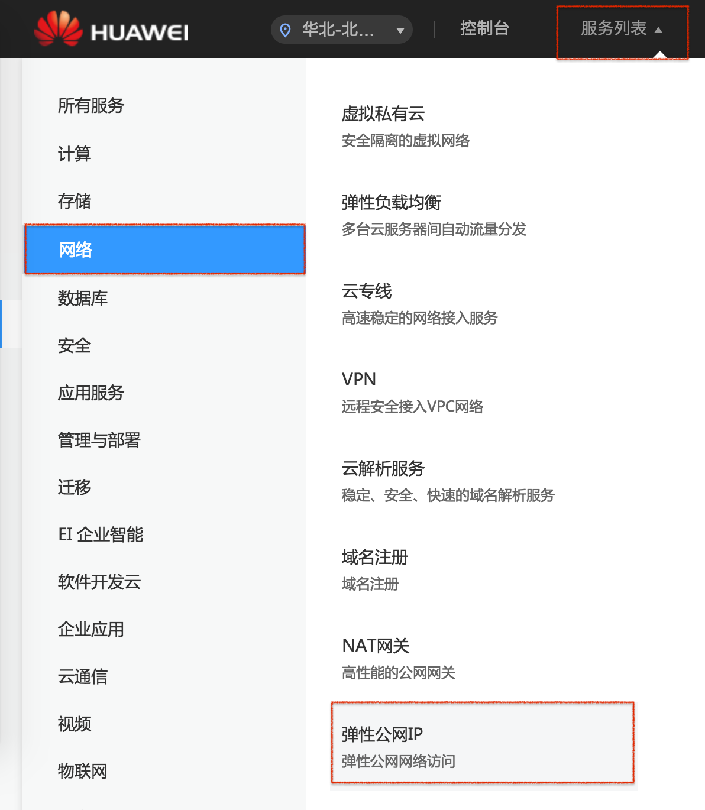

购买IP，按需计费：

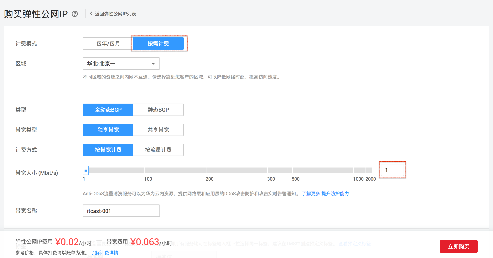

##### 第二步： 创建虚拟私有云

入口：

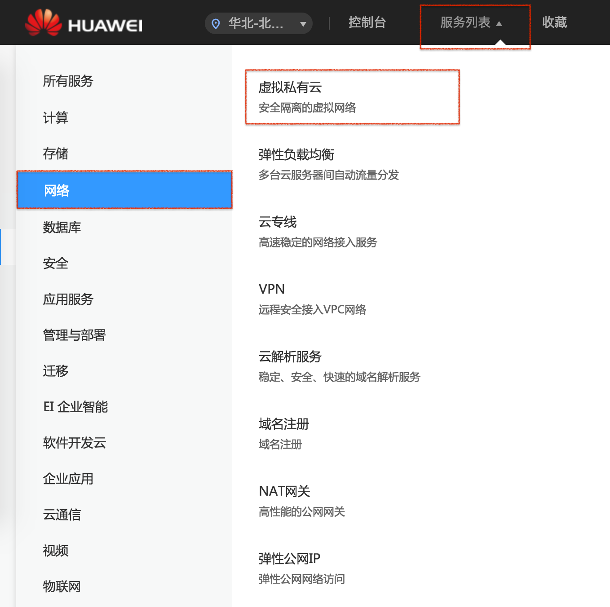

在打开的界面右上角，申请虚拟私有云即可，无需改动参数信息。

##### 第三步：创建秘钥对

入口：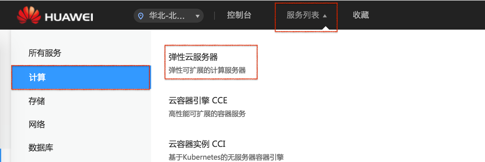

在打开的界面中左侧导航中找到“秘钥对”，点击“创建秘钥对”，填写名字即可。

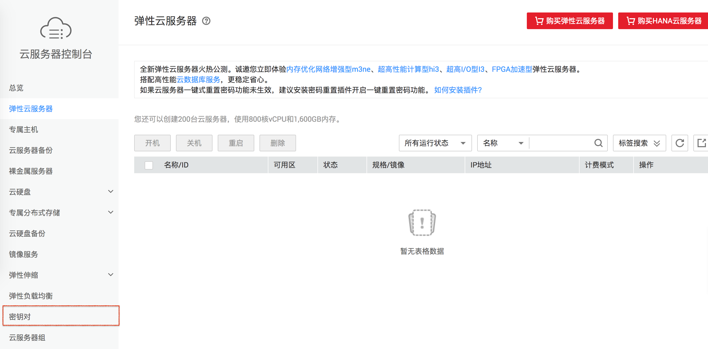


> 注意：保存好密钥文件

##### 第四步：创建集群，并绑定IP

入口

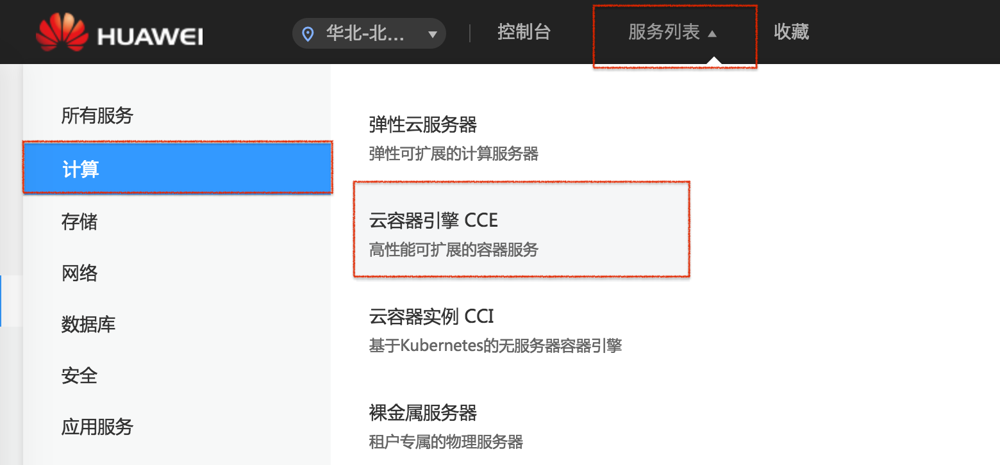

创建集群

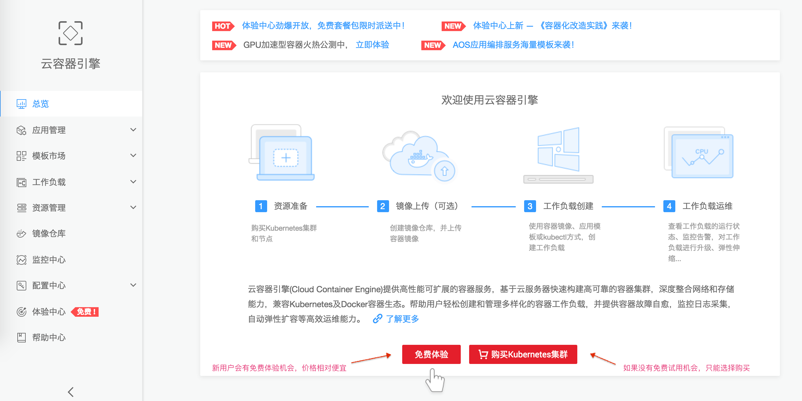

在创建集群的过程中，登录方式选择“秘钥对”：

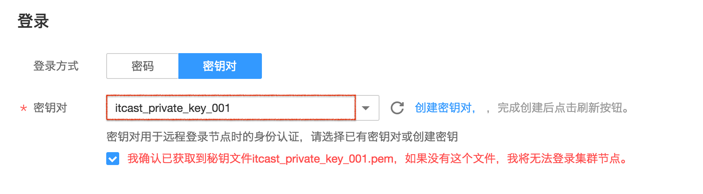

其他配置描述：

|     参数     |                           参数说明                           |
| :----------: | :----------------------------------------------------------: |
|   付费类型   |            按需计费：根据实际使用的资源按小时计费            |
|   集群名称   |                        新建集群的名称                        |
|     版本     |       选择集群对应的版本,对应Kubernetes社区基线版本。        |
| 集群管理规模 | 当前集群支持管理的最大节点规模。若选择50节点,表示当前集群最多可管理50个节点。 |
|    高可用    | 是:高可用集群包含多台管理节点,单管理节点故障时,集群依然可用。否:普通集群是单管理节点,管理节点故障后，集群将不可用，但已运行应用不受影响 |
| 选择的规格为 |                   显示当前创建集群的规格。                   |
|  虚拟私有云  | 新建集群所在的虚拟私有云。若没有可选虚拟私有云,单击新建虚拟私有云进行创建 |
|   所在子网   |                  节点虚拟机运行的子网环境。                  |
|   网络模型   | 容器隧道网络:基于VPC网络之上虚拟出的一层网络,一般应用场景均可满足。 VPC网络:直接基于VPC网络，性能更高，适用于高性能多交互的应用场景。但同个VPC下面只能建一个VPC网络模型的集群。 |
| 服务转发模式 | 建议选择ipvs服务转发模式，吞吐更高，速度更快。iptables:社区传统 kube-proxy 模式，灵活支持各种场景。延时较高，可拓展性较差，不适用于大规模集群。ipvs:由华为主导开发并在社区获得广泛支持的kube-proxy模式，解决了iptables扩展性问题，吞吐更高，速度更快。 |
|   集群描述   |                   新建容器集群的描述信息。                   |

下一步进行节点创建

> 注意：
>
> - 设置已经创建的密钥对和弹性IP
> - 创建集群时，您需要最少添加2个节点且每个节点规格为8U16G及以上，否则可能导致服务部署失败。

##### 第五步：创建网络存储

入口


文件存储卷创建

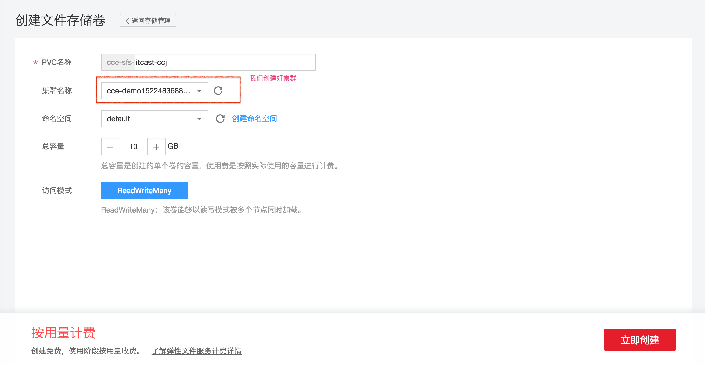


#### 购买区块链服务：

入口：

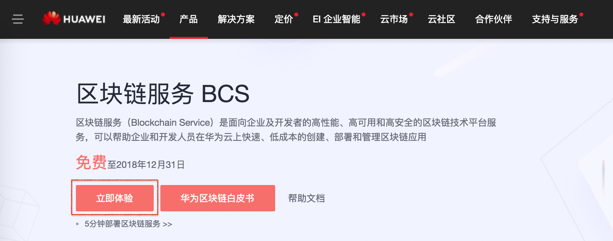

基本信息：

| 参数名称           | 参数值示例                                                   | 说明                                                         |
| ------------------ | ------------------------------------------------------------ | ------------------------------------------------------------ |
| 区块链服务名称     | BCS_demo                                                     | 支持中英文字符及数字,长度为4-24个字符                        |
| 区块链类型         | 联盟链                                                       | 可选择创建私有链或者联盟链。私有链:仅本租户内部使用的区块链服务。联盟链：可以邀请其他租户一起参与的区块链服务。 |
| 容器集群           | -                                                            | 第四步创建的集群                                             |
| 网络存储           | -                                                            | 第五步创建的网络存储                                         |
| 节点组织           | 创建3个节点组织，分别为：xxx1,数量2；xxx2,数量2，xxx3,数量2  | 为区块链服务添加Peer节点组织,每个区块链服务最少添加一个,最多添加五个。每个节点组织的节点数量为1-5 ,即每个节，点组织的实例数 |
| 共识策略           | 快速拜占庭容错共识算法                                       | 提供的共识策略有: 测试策略、快速拜占庭容错共识算法、Kafka(CFT)。 |
| 安全机制           | ECDSA                                                        | 支持两种安全加密机制，包括ECDSA、国密算法                    |
| 版本信息           | 2.1.15                                                       | 区块链服务版本[对应 Fabric 原生 1.1.0]                       |
| 链代码管理初始密码 | -                                                            | 设置登录链代码管理页面的初始密码                             |
| 确认密码           | -                                                            | 再次确认输入链代码管理页面的初始密码                         |
| 共识节点数量       | 4                                                            | 即orderer节点的数量，默认为1。如果共识策略是快速拜占庭容错共识算法，那么共识节点数量应该大于等于4且小于等于10. |
| 通道配置           | 创建名为testchannel的通道，并将xxx1,xxx2,xxx3节点组织添加进此通道。 | 点击“添加通道”为区块链服务添加通道，用于节点组织之间的通信。完成后再为每个通道添加节点组织。 |


#### 链代码管理

步骤：

1. 链代码开发
2. 链代码安装
3. 链代码实例化

##### 第一步：链代码开发

实例代码：[代码示例](./华为区块链.assets/chaincode.go)

go 中文在线文档：https://studygolang.com/pkgdoc

##### 第二步：链代码安装

1. 入口：

   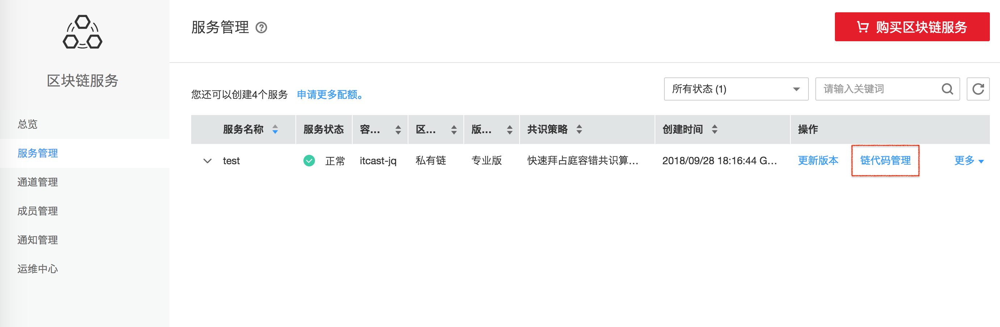

2. 需要进行登录操作

   > 说明：
   >
   > 用户名：admin ,初始登录密码为您在部署区块链服务时设置的密码。

3. 选择一个组织的 peer-0 ,点击“安装链代码” ，进入链代码安装配置界面。输入配置信息，如下图：

   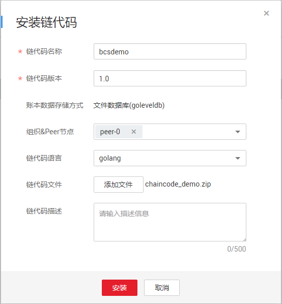

   > 说明：
   >
   > 由于我们的链代码有可能是分文件编写,所以在上传链代码文件的时候，链代码文件需要压缩成 “.zip” 文件,

4. 点击“确认”完成链代码安装，如下图：

   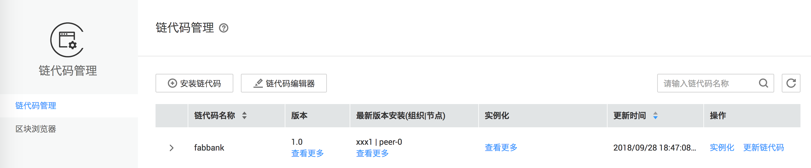

##### 第三步：链代码实例化

1. 链代码安装完成后，单击“实例化”，如上图。

2. 在实例化配置页面输入相关信息，如下图：

   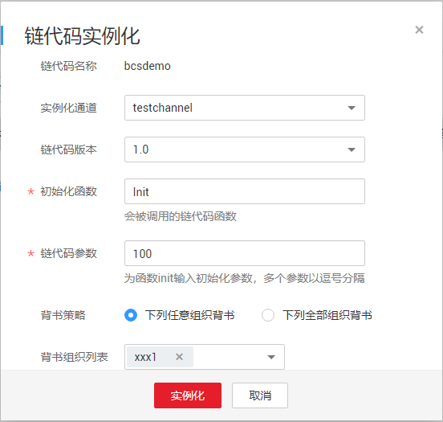

3. 点击“确认”后，会看到链代码在 channel 中正在进行实例化，一段时间后，会提示已经实例化：

   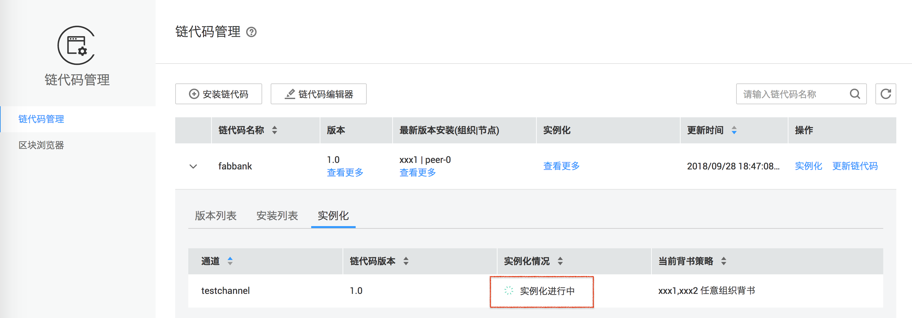


# 2.测试案例开发和构建

## 项目开发

### 学习目标

1. 独立完成测试用chaincode编写
2. 独立完成客户端后端项目编写
3. 独立完成客户端前端项目编写

### 依赖管理

使用 govendor 进行项目依赖管理,该工具将项目依赖的外部包拷贝到项目下的vendor目录下并通过 vendor.json 文件来记录依赖包的版本,方便用户使用相对稳定的依赖.对于 govendor 来说,依赖包主要有一下多种类型:

| 状态      | 缩写状态 | 含义                                           |
| --------- | -------- | ---------------------------------------------- |
| +local    | l        | 本地包,及项目自身的包组织                      |
| +external | e        | 外部包,即被 $GOPATH 管理,但不在 vendor 目录下  |
| +vendor   | v        | 已被 govendor 管理,即在vendor目录下            |
| +std      | s        | 标准库中的包                                   |
| +unused   | u        | 未使用的包,即包在vendor目录下,但项目并没有使用 |
| +missing  | m        | 代码引用了依赖包,但该报并没有找到              |
| +program  | p        | 主程序包,意味着可以编译为执行文件              |
| +outside  |          | 外部包和缺失的包                               |
| +all      |          | 所有的包                                       |

- 安装

  ```shell
  $ go get github.com/kardianos/govendor
  ```

  命令行执行`govendor`	,查看安装结果.

  > 注意:
  >
  > 需要把 `$GOPATH/bin/`加到`PATH`中

- 子命令

  ```
  init		创建 vendor 文件夹和 vendor.json 文件
  
  # 包的增删改查
  add			从$GOPATH 中添加依赖包,回加到 vendor.json
  remove		从vendo文件夹删除依赖
  update		从$GOPATH升级依赖包
  list		列出已经存在的依赖包
  
  fetch		从远端库增加新的,或者更新 vendor 文件中的依赖包
  sync		本地存在 vendor.json 时候拉取依赖包,匹配所记录的版本
  
  status		列出本地丢失的,过期的和修改的 package
  get			类似 go get,但是会把依赖包拷贝到 vendor 目录
  ```

- 测试

  - Fabric-SDK-GO

  ```shell
  $ go get -u github.com/hyperledger/fabric-sdk-go
  ```

  - 初始化

  ```shell
  $ govendor init
  ```

  - 添加依赖包到项目

  ```
  govendor add +external
  ```

  > 注意:
  >
  > 由于项目中没有使用 fabric-sdk-go,所以引入进来的只有项目中用到的第三方依赖

  - 添加 fabric-sdk-go 依赖

  ```shell
  _ "github.com/hyperledger/fabric-sdk-go"
  ```

  - 再次执行添加依赖包到项目

- vendor.json 作用

  项目在传输时可以传递该文件,使用 `govendor sync` 命令可以下载依赖信息

###  测试案例

#### chaincode编写

目标：区块链的数据读写

chaincode编写步骤：

第一步:管理依赖( shim. peer )
第二步:实现Chaincode接口
第三步:主函数中启动Chaincode
第四步:设计读写方法
第五步:完成读写方法入口函数编写( Invoke )

####  导入相关工具包

1、从`https://github.com/hyperledger/fabric`下载fabric项目代码放到$GOPATH下。
2、使用Golang开发工具创建一 个新项目,在新项目中创建chaincode_demo.go文件。
3、添加chaincode开发需要的最核心的依赖文件。

```go
import (
	_"github.com/hyperledger/fabric/core/chaincode/shim"
	_"github.com/hyperledger/fabric/protos/peer
)
```

> 现阶段只是导入依赖,所以前面使用"_"。后续的开发中用到了对应的工具删除”"即可

#### chaincode开发

在shim目录下面,找到interfaces_stable.go文件, Chaincode接口内容如下:

```go
// Chaincode interface must be implemented by all chaincodes. The fabric runs
// the transactions by calling these functions as specified.
type Chaincode interface {
	// Init is called during Instantiate transaction after the chaincode container
	// has been established for the first time, allowing the chaincode to
	// initialize its internal data
	Init(stub ChaincodeStubInterface) pb.Response

	// Invoke is called to update or query the ledger in a proposal transaction.
	// Updated state variables are not committed to the ledger until the
	// transaction is committed.
	Invoke(stub ChaincodeStubInterface) pb.Response
}
```

我们需要实现Init和Invoke方法,现阶段仅仅有简单的返回值即可。

```go
type Test struct {
	// 测试用 chaincode,用于信息的简单读写
}
/*
	实现Chaincode,用于信息的简单读写
*/
func (this *Test)Init(stub shim.ChaincodeStubInterface) pb.Response{
	// 初始化，调用一次
	return shim.Success(nil)
}

func(this *Test)Invoke(stub shim.ChaincodeStubInterface)pb.Response{
	// 更新或查询 ledger 的入口
	return shim.Success(nil)
}
```

##### 1. 主函数中启动Chaincode

在我们的Chaincode中有一个主函数 ( main) , 我们直接在里面启动Chaincode即可。 

```go
func main(){
	shim.Start(new(Test))
}
```

> 测试: Start出现异常时的服务器反馈。

Start方法中需要传递Chaincode类型的参数.

```go
func Start(cc Chaincode) error
```

##### 2. 设计读写方法

我们通过 get 和set 方法来完成数据的读写操作（依据个人喜好：read，write）

- 读取数据方法：

  1.利用ChaincodeStubInterface获取key对应的数据
  2.非空和异常处理
  3.返回读取的结果

```go
/*
	读取数据:
	读取是一条依据key获取到的内容
 */
func (this * Test) get(stub shim.ChaincodeStubInterface,key string) peer.Response {
	// 读数据
	// 读数据的结果处理:error  nil
	// 返回读取数据
	data, err := stub.GetState(key)
	// 处理异常
	if err != nil{
		return shim.Error(err.Error())
	}
	// 处理nil的data
	if data == nil{
		// 数据在ledger中不存在
		return shim.Error("Data not Available")
	}
	return shim.Success(data)
}
```

##### 3. 写入数据方法：

​	1.利用ChaincodeStubInterface写入数据, value的类型为[]byte
​	2.回复写入数据结果(异常处理)

```go
func (this *Test) set(stub shim.ChaincodeStubInterface,key string,value []byte) peer.Response {
	err := stub.PutState(key, value)
	if err !=nil{
		return shim.Error(err.Error())
	}
	return shim.Success(nil)
}
```

##### 4. 入口函数编写

Invoke方法是数据增删改查的统一入口,我们需要依据传递的参数进行调用方法的控制。我们需要处理两个函数的调用,即读写方法的调用。

> 约定:传递的参数中方法名称为"get"调用读方法,方法名称为"set"调用写方法。所以大家在完成客户端代码的时候需要注意传递的方法名称,一旦错误, chaincode中将视为非法参数,返回错误。

操作步骤:
​	1.获取传递的方法名称和参数信息
​	2.依据方法名称完成调用函数的确认
​	3.方法异常处理
​	4.传递参数并处理返回值

```go
func (this *Test) Invoke(stub shim.ChaincodeStubInterface) peer.Response {
	// 入口,更新 添加 查询都可以走这个方法
	// 依据传递的数据区分调用的方法
	// 传递:调用方法的名称(get  set)
	// 传递:依据不同的方法传递参数( get key)(set key value)
	// 使用ChaincodeStubInterface的GetFunctionAndParameters
	// 约定:Parameters,如果是get方法index为0中存储key,如果是set方法index为0中存储key,1中存储value
	function, parameters := stub.GetFunctionAndParameters()

	if function=="get"{
		return this.get(stub,parameters[0])

	}else if function== "set"{
		return this.set(stub,parameters[0],[]byte(parameters[1]))
	}

	// 方法参数传递错误
	return shim.Error("Invalid Smart Contract function name.")
}
```

##### 5. 安装链代码

- 安装链代码	


- 实例化链代码：


项目配置信息如下：

```txt
#chaincode config
chaincode_id = bcsdemo
channel_id = testchannel
CORE_XXX1_CONFIG_FILE=conf/xxx1.yaml
userid=User1
```

#### 客户端开发

目标:客户端完成区块链的数据读写
技术分析:前后端分离方式进行案例开发,后端使用beego完成案例开发。前端使用Vue完成案例开发。

##### 后端项目

该项目无界面部分,我们只需要接收前端请求,将结果回复给前端即可。

##### 从区块链中读数据

操作步骤:
​	1、构建项目,配置路由
​	2、在controller中 ,处理读数据请求
​	3、在models中,使用fabric-sdk-go完成读数据操作(重点)
​	4、在controller中 ,调用models完成读数据操作,并将结果返回给调用者
​	5、测试数据读取

###### 第一步：构建项目，配置路由

构建beego项目`bee new bcsdemo`我们不需要在这个项目中管理界面,所以可以删除视图部分内容。配置路由,在router.go文件中填写如下内容:

```go
 beego.Router("/test",&controllers.MainController{},"get:GetValue'")
```

将/test的get请求交给控制器的GetValue方法进行处理。

###### 第二步：处理读数据请求

在controller中编写GetValue进行数据读取请求处理,现阶段我们仅仅对参数进行校验,还无法读取区块数据。

> 读源码查看如何进行非空判断

```go
/*
	读数据的方法
 */
func (this *MainController) GetValue() {
	key := this.GetString("key")
	if key == "" {
		// 没有传递需要的参数 key
		// this.Ctx.ResponseWriter.WriteHeader(400)
		// this.Ctx.ResponseWriter.Write([]byte("Request parameter key can't be empty"))
		handleResponse(this, 400, "Request parameter key can't be empty")
	}
	beego.Info("key:", key)

	//TODO 依据key获取区块中记录的value信息,需要通过models中操作fabric-sdk-go,完成信息的读取,大家可以把这个过程看做将数据库中的数据读写
	var response []byte
    
	// 获取结果成功后，将结果返回给前端
	handleResponse(this, 200, data)
}

/*
	处理数据回复
*/
func handleResponse(this *MainController, code int, msg interface{}) {
	if code >= 400 {
		beego.Error(msg)
	} else {
		beego.Info(msg)
	}
	this.Ctx.ResponseWriter.WriteHeader(code)
	// 讲msg值进行一个类型的转换,如果转换成功ok(true)
	b, ok := msg.([]byte)
	if ok {
		this.Ctx.ResponseWriter.Write(b)
	} else {
		s := msg.(string)
		this.Ctx.ResponseWriter.Write([]byte(s))
	}
}
```

###### 第三步：用fabric-sdk-go完成读数据

操作步骤:
1、构建读写方法,借鉴一下Demo中的信息

```go
/*
	需要处理的方法有两种：update 和 query
	需要传递数据：方法名称和一组参数
*/

type ChainCodeSpec struct{
	// 操作智能合约
}

/*
	 查询：依据方法和参数组
*/
func (this *ChainCodeSpec)ChaincodeQuery(function string,chaincodeArgs[][]byte)(response[]byte,err error){
	return nil,nil
}

/*
	更新：依据方法和参数组
*/
func (this *ChainCodeSpec)ChaincodeUpdate(function string,chaincodeArgs[][]byte)(response[]byte,err error){
	return nil,nil
}
```

2、依赖添加

> 注意:需要将demo中的vendor信息拷贝到我们的项目中,部分依赖直接下载会失败。
> 另: api和def中的信息是在hyperledger的fabric-sdk-go的基础上开发工具。

两个重要的工具如下：

`fabric-sdk-go/api/apitxn`

`fabric-sdk-go/def/fabapi`

```go
import(
	_ "github.com/hyperledger/fabric-sdk-go/api/apitxn"
	_ "github.com/hyperledger/fabric-sdk-go/def/fabapi"
)
```

3、完善读方法

```go
type ChainCodeSpec struct{
	// 操作智能合约
	client apitxn.ChannelClient
	chaincodeId string
}

/*
	 查询：依据方法和参数组
*/
func (this *ChainCodeSpec)ChaincodeQuery(function string,chaincodeArgs[][]byte)(response[]byte,err error){
	request := apitxn.QueryRequest{this.chaincodeId,function,chaincodeArgs}
	return this.client.Query(request)
}
```

4、加载配置，完成client创建

**通过xxx1.yaml 配置文件创建SDK**

```go
/*
	依据配置文件(xxx1.yaml),创建SDK.
	最常见的错误是证书配置路径问题
 */
func getSDK(config string) (*fabapi.FabricSDK, error) {
	options := fabapi.Options{ConfigFile: config}
	sdk, err := fabapi.NewSDK(options)

	if err != nil {
		beego.Error(err.Error())
		return nil,err
	}
	return sdk, err
}
```

**通过SDK创建client**

```go
/*
	初始化ChainCodeSpec方法
 */
func Initialize(channelId string, userId string, chainCodeId string) (*ChainCodeSpec, error) {
	config := beego.AppConfig.String("CORE_XXX1_CONFIG_FILE")
	sdk, err := getSDK(config)
	if err != nil {
		return nil, err
	}
	client, err := sdk.NewChannelClient(channelId, userId)
	if err != nil {
		beego.Error(err.Error())
		return nil, err
	}

	return &ChainCodeSpec{client, chainCodeId}, nil
}
```

###### 第四步：controllers读数据代码完善

```go
/*
	读区块链中数据
 */
func (this *MainController) GetValue() {
	key := this.GetString("key")
    // 没有 key 无法进行查询
	if key == "" {
		handleResponse(this, 400, "Request parameter key can't be empty")
        return
	}
	beego.Info("key:", key)

	// 依据key获取区块中记录的value信息,需要通过models中操作fabric-sdk-go,完成信息的读取
	var (
		channelId   = beego.AppConfig.String("channel_id")
		userId      = beego.AppConfig.String("useid")
		chainCodeId = beego.AppConfig.String("chaincode_id")
	)
	ccs, err := models.Initialize(channelId, userId, chainCodeId)
	if err != nil {
		handleResponse(this, 500, err.Error())
		return
	}
	defer ccs.Close()
	// chaincode查询需要的参数组装
	var args [][]byte
	args = append(args, []byte(key))

	response, err := ccs.ChainCodeQuery("get", args)

	if err != nil {
		handleResponse(this, 500, err.Error())
		return
	}

	// 获取结果成功后，将结果返回给前端
	handleResponse(this, 200, response)
}
```

###### 第五步：测试数据读取

key=test01 的数据已经写在区块链中了，值为itcast,大家可以使用下面的链接测试一下返回内容：

```url
http://localhost:8080/test?key=test01
```

##### 向区块中写数据

操作步骤:
​	1、配置路由
​	2、在controller中 ,处理写数据请求
​	3、在models中,使用fabric-sdk-go完成写数据操作(重点)
​	4、在controller中,调用models完成写数据操作,并将结果返回给调用者
​	5、测试数据读取

###### 第一步：配置路由

在router.go文件中填写如下内容:

```go
   beego.Router("/test",&controllers.MainController{},"post:SetValue")
```

###### 第二步：处理写请求

在controller中编写SetValue进行数据读取请求处理,现阶段我们仅仅对参数进行校验

```go
/*
	写数据方法
 */
func (this *MainController) SetValue() {
	key := this.GetString("key")
	value := this.GetString("value")

	if key == "" || value == "" {
		handleResponse(this, 400, "Request parameter key(or value) can't be empty")
		return
	}
	beego.Info(key + ":" + value)

	// TODO 写数据
	var response []byte
	// 写数据成功的回复
	handleResponse(this, 200, response)
}
```

###### 第三步：用fabric-sdk-go完成写操作

此处,我们只需要完善ChaincodeUpdate方法即可。

> 读源码查看返回值内容

```go
/*
	更新：依据方法和参数组
*/
func (this ChainCodeSpec)ChaincodeUpdate(function string,chaincodeArgs[][]byte)(response[]byte,err error){
	request := apitxn.ExecuteTxRequest{ChaincodeID:this.chaincodeId,Fcn:function,Args:chaincodeArgs}
	id, err := this.client.ExecuteTx(request)
	return []byte(id.ID),err
}
```

###### 第四步：controllers读数据代码完善

```go
func (this *MainController) SetValue() {
	key := this.GetString("key")
	value := this.GetString("value")

	if key == "" || value == "" {
		handleResponse(this, 400, "Request parameter key(or value) can't be empty")
		return
	}
	beego.Info(key + ":" + value)

	// 写数据
	var(
		channelId=beego.AppConfig.String("channel_id")
		userId=beego.AppConfig.String("useid")
		chainCodeId=beego.AppConfig.String("chaincode_id")
	)
	ccs, err := models.Initialize(channelId, userId, chainCodeId)
	if err !=nil{
		handleResponse(this, 500, err.Error())
		return
	}
	defer ccs.Close()

	// 传递参数
	var args [][]byte
	args=append(args, []byte(key))
	args=append(args, []byte(value))

	response, err := ccs.ChaincodeUpdate("set", args)
	if err !=nil{
		handleResponse(this, 500, err.Error())
		return
	}

	// 写数据成功的回复
	handleResponse(this, 200, response)
}
```

###### 第五步：测试数据读取

通过浏览器模拟一个post请求比较麻烦了, 我们在后面完成前端开发的界面后再进行测试。

**回收资源**

使用client读写操作完成后我们并没有立即的回收资源,在ChannelClient接口中含有Close方法,在后端项目的最后我们完善回收操作。

```go
type ChannelClient struct {
	// Query chaincode
	Query(request QueryRequest)([]byteerror)
	......
	// EXecuteTx(request ExecuteTcRequest)(TransactionId,error)
	......
	//Close releases channel client resources(disconnects event hub etc.)
	Close() error
}
```

在models中添加Close方法，内容如下：

```go
/*
	回收资源
*/

func(this *ChainCodeSpec)Close(){
	this.client.Close()
}
```

在读写方法中,增加Close方法。

```go
ccs,err := models.Initialize(channelID,chainCodeId,userId)
if err != nil{
    handleRequest(this,500,err,Error())
    return
}
defer ccs.Close()
```

> 注意：需要在判断完err后调用


##### 前端项目

###### 1. 前端界面（写数据）

利用WebStorm快速开发一个前端Vue界面。 使用vue-resource发送请求到后台服务。
资源内容:

创建一个空项目, 新建TestSet.html ,导入vue.js和vue-resource.js文件。

```html
<!DOCTYPE html>
<html lang="en">
<head>
    <meta charset="UTF-8">
    <title>写数据到区坎</title>
    <script src="./vue.js"></script>
    <script src="./vue-resource.js"></script>
</head>

<body>
<div id="app">
    <table>
        <tr>
            <td>key:</td>
            <td><input type= "text" V-model="key"></td>
        </tr>
        <tr>
            <td>value:</td>
            <td><input type="text" v-model="value"></td>
        </tr>
    </table>
    <button v-on:click="set">写数据</button>
</div>
</body>
<script>
    var vm = new Vue({
        el:'#app',
        data:{
            key:"test01",
            value:"itcast"
        },
        methods:{
            set:function () {
                var url = "http://localhost:8080/test"
                var params={"key":this.key,"value":this.value}
                this.$http.post(
                    url,
                    params,
                    {emulateJSON:true}   //跨域访问
                ).then(
                    function (response) {
                        console.log(response)
                    },
                    function (response) {
                        console.log(response)
                    }
                )
            }
        }
    });

</script>
</html >
```

###### 2. 前端界面(读数据)

```html
<!DOCTYPE html>
<html lang="en">
<head>
    <meta charset="UTF-8">
    <title>读数据</title>


    <script src="vue.js"></script>
    <script src="vue-resource.js"></script>

</head>
<body>

<div id="app">

    <table>
        <tr>
            <td>key:</td>
            <td><input type="text" v-model="key"></td>
        </tr>
        <tr>
            <td>value:</td>
            <td>{{value}}</td>
        </tr>
    </table>

    <button v-on:click="get">读数据</button>

</div>

</body>

<script>
    var vm =new Vue({
        el:'#app',
        data:{
            key:"test02",
            value:""
        },
        methods:{
            get:function () {
                var url="http://10.211.55.4:8080/test"
                var params={"key":this.key}

                this.$http.get(
                    url,
                    // params,// 如果get请求这样传参数是存在问题的
                    // get请求传递参数是下面的格式
                    {params:params},
                    {emulateJSON:true}
                ).then(
                    function (response) {
                        console.log(response)
                    },
                    function (response) {
                        console.log(response)
                    }
                )
            }
        }
    });
</script>
</html>
```

# 3. BCS 整合到iHome项目

到目前为止，华为云区块链的基本使用流程大家已经熟悉，接下来我们结合iHome项目场景，利用BCS，来辅助我们项目功能的完善。

**学习目标**

1. 了解项目背景和用户诉求
2. 了解项目需求和区块链系统组成
3. 利用第三方云平台完成区块链系统服务创建
4. 独立完成个人信息认证
5. 独立完成房屋信息认证
6. 独立完成个人征信认证
7. 独立完成电子合同和租金记录管理

**项目分析**

​        系统会部分代替中介工作,通过房管局节点校验房屋信息,通过公安局节点验证个人信息,通过征信中心验证个人信用。
​        当租房时,租户能够了解到房屋的一些信息,比如:是否是可租赁房屋,是否是房东直租,房屋是否存在抵押情况等。

​        房东可以通过平台了解到租户的个人信息,是否有违法记录,个人征信信息是否良好等。
​        当出现合租时,房东和现有租户,都可以了解到新租户的个人信息,同时新租户也可以了解到对等的信息。
​         个人认证信息、房产信息、征信信息都会分布在不同的节点上,现阶段由各个部门单独管理,我们在需要认证时发、送认证请求即可。
​         租赁合同、租金、违约金等不可篡改数据会上链。各个节点均可记录这些信息。

**用户诉求**

构建一个更加可靠的互联网租房系统,从根本上解决价值交换与转移中存在的欺诈和寻租等现象.租房者和出租人信息不对称等问题.


**系统组成（联盟链）**

Orderer Service : 2个节点，共识策略使用kafka
Organizations : 3个组织(公安局、房管局、征信中心) , 每个组织两个节点
channel :

   	1. 三个组织独立的channel
 	2. 三个组织的联合channel

    利用华为云平台完成上述系统的创建。

### 个人认证

学习目标：

1. 独立完成个人信息上传( chaincode )编写

1. 独立完成个人信息认证( chaincode )编写
2. 独立完成后端个人信息认证功能
3. 独立完成前端个人信息认证功能
4. 
5. 独立完成chaincode更新
6. 独立完成后端信息上传功能
7. 独立完成前端信息上传功能

### 认证chaincode编写

​	个人认证信息会发送到相关的政府部门节点,通过查询区块链上的数据得到用户的认证信息结果。回复内容包括两项认证结果:**姓名与证件是否匹配**的结果和**是否有不良记录**的结果(考虑到个人隐私,不会返回不良记录内容)。为了能够测试通过,我们当前仅仅返回测试结果。

```go
package main

import (
	"github.com/hyperledger/fabric/core/chaincode/shim"
	"github.com/hyperledger/fabric/protos/peer"
	"strings"
)

/*
	个人认证
	// 接收数据:姓名和身份证号码
	// 回复信息:是否通过认证和是否有不良个人记录
 */

type Auth struct {
}

func (this *Auth) Init(stub shim.ChaincodeStubInterface) peer.Response {
	return shim.Success(nil)
}

func (this *Auth) Invoke(stub shim.ChaincodeStubInterface) peer.Response {
	function, parameters := stub.GetFunctionAndParameters()

	if function == "check" {
		return this.check(stub, parameters)
	}else if function=="add"{
		return this.add(stub,parameters)
	}

	return shim.Error("Invalid Smart Contract function name")
}

// 身份效验
func (this *Auth) check(stub shim.ChaincodeStubInterface, args []string) peer.Response {
	// 参数传递顺序:姓名 身份证号
	name := args[0]
	id := args[1]

	// 依据身份证号码进行数据查询,将查询出来的姓名与name值进行比对
	data, err := stub.GetState(id) // 设计:记录名字和不良记录(name:true false)

	if err != nil {
		return shim.Error(err.Error())
	}

	var result string // 记录返回内容

	if data != nil {
		var str string = string(data[:])
		split := strings.Split(str, ":")

		if split[0] == name {
			result = "true"
		} else {
			result = "true"
		}

		result = result + ":" + split[1]
		return shim.Success([]byte(result))
	}

	return shim.Success([]byte("false:false"))

}

// 添加信息
func (this *Auth) add(stub shim.ChaincodeStubInterface, args []string) peer.Response {
	// 传递三个参数:身份证号  姓名 是否有不良的个人记录
	// 以身份证号码为key  姓名:是否有不良的个人记录作为value
	if len(args) != 3 {
		return shim.Error("Incorrect number of arguments.Expecting 3")
	}

	id := args[0]
	name := args[1]
	record := args[2]

	err := stub.PutState(id, []byte(name+":"+record))
	if err != nil {
		shim.Error(err.Error())
	}

	return shim.Success(nil)
}
```

### 后端个人信息认证

```go
func (this * UserController)Check(){
	resp :=make(map[string]interface{})
	resp["errno"] =  utils.RECODE_OK
	resp["errmsg"] = utils.RecodeText(resp["errno"].(string))
	// 获取用户的真实姓名和身份证号
	name :=this.GetSession("real_name")
	id := this.GetSession("id_card")

	if name==""||id=="" {
		resp["errno"]=utils.RECODE_DATAERR
		resp["errmsg"]=utils.RECODE_DATAERR
		return
	}

	beego.Info("name:",name)
	beego.Info("id:",id)


	var (
		channelId = beego.AppConfig.String("channel_id_gaj")
		chainCodeName = beego.AppConfig.String("chaincode_id_auth")
		userId      = beego.AppConfig.String("user_id")
	)

	ccs,err := models.Initialize(channelId,chainCodeName,userId)
	if err !=nil{
		resp["errno"]=utils.RECODE_DATAERR
		resp["errmsg"]=utils.RECODE_DATAERR
		return
	}

	defer ccs.Close()

	args := [][]byte{[]byte(name.(string)),[]byte(id.(string))}

	response,err := ccs.ChainCodeQuery("check",args)
	if err !=nil{
		resp["errno"]=utils.RECODE_DATAERR
		resp["errmsg"]=utils.RECODE_DATAERR
		return
	}

	beego.Info("response:",response)
}
```

   **测试**

1. 证书下载及解压
2. 配置文件下载及解压
3. Host文件修改
4. app.conf 配置文件修改（参照test项目，完成key和value的同时修盖）
5. 通过浏览器模拟get请求

### 前端个人信息认证

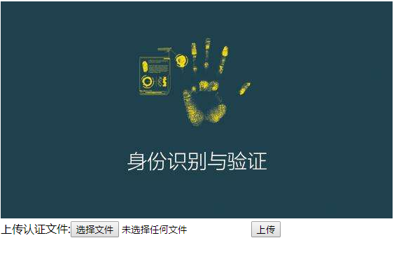

```html
<!DOCTYPE html>
<html lang="en">
<head>
    <meta charset="UTF-8">
    <title>个人认证</title>

    <script src="vue.js"></script>
    <script src="vue-resource.js"></script>
</head>
<body>

<div id="app">

    <table>
        <tr>
            <td>姓名:</td>
            <td><input type="text" v-model="name"></td>
        </tr>
        <tr>
            <td>身份证:</td>
            <td><input type="text" v-model="id"></td>
        </tr>
    </table>

    <button v-on:click="check">认证</button>

</div>

</body>

<script>
    var vm =new Vue({
        el:'#app',
        data:{
            name:"",
            id:""
        },
        methods:{
            check:function () {
                var url="http://localhost:8080/auth"
                var params={"name":this.name,"id":this.id}

                this.$http.get(
                    url,
                    {params:params},
                    {emulateJSON:true}
                ).then(
                    function (response) {
                        console.log(response)
                    },
                    function (response) {
                        console.log(response)
                    }
                )
            }
        }
    });
</script>
</html>
```

#### 后端上传

#### CSV文件操作

写操作

```go
func main() {
    file, _ := os.OpenFile("test.csv", os.O_WRONLY|os.O_CREATE, os.ModePerm)
    w := csv.NewWriter(file)
    w.Write([]string{"123", "234234", "345345", "234234"})
    w.Write([]string{"123", "234234", "345345", "234234"})
    w.Flush()
    file.Close()
}
```

读操作

```go
 func main() {
    file, _ := os.Open("test.csv")
    r := csv.NewReader(file)
    for {
        strs, err := r.Read()
        if err == io.EOF{
            break
        }
        if err != nil{
            beego.Error(err)
        }
        for _, str := range strs {
            fmt.Print(str, "\t")
		}
        fmt.Println()
    }
}
```

#### CSV文件上传

获取上传文件,保存到本地,通过任务管理文件内容写入区块链。

```go
//上传文件
func (this *AuthController) RecordAuth() {
	beego.Debug("receive file") //file，这是一个key值，对应上传Form中的name信息 
	f, h, e := this.GetFile("file")
	if e != nil {
		// 如果出现异常了,f内容为nil 
		handleResponse(this.Ctx.ResponseWriter, 400, e.Error()) 
		return
	}
	//关闭上传的文件，不然的话会出现临时文件不能清除的情况 
	defer f.Close()
	//得到文件的名称
	fileName := h.Filename 
	fmt.Println("文件名称:") 
	fmt.Println(fileName)
	//保存文件到指定的位置 
	//static/uploadfile,这个是文件的地址，第一个static前面不要有/
	err := this.SaveToFile("file", path.Join("static/uploadfile", fileName))
	if err != nil {
		handleResponse(this.Ctx.ResponseWriter, 500, err.Error())
		return
	}
	handleResponse(this.Ctx.ResponseWriter, 200, "ok")
}  
```

开启异步任务：

```go
//上传文件
func (this *AuthController) RecordAuth() {
	beego.Debug("receive file") //file，这是一个key值，对应上传Form中的name信息 
	f, h, e := this.GetFile("auth")
	if e != nil {
		// 如果出现异常了,f内容为nil 
		handleResponse(this.Ctx.ResponseWriter, 400, e.Error()) 
		return
	}
	//关闭上传的文件，不然的话会出现临时文件不能清除的情况 
	defer f.Close()

	//得到文件的名称
	fileName := h.Filename fmt.Println("文件名称:") 
	fmt.Println(fileName)
	//保存文件到指定的位置 
	//static/uploadfile,这个是文件的地址，第一个static前面不要有/
	err := this.SaveToFile("file", path.Join("static/uploadfile", fileName))
	if err != nil {
		handleResponse(this.Ctx.ResponseWriter, 500, err.Error())
		return
	}
	
	// 开启任务
	// 在当前时间的5秒钟后开启
	t := time.Now().Add(5 * time.Second)
	second := t.Second()
	minute := t.Minute()
	hour := t.Hour()
	spec := fmt.Sprintf("%d %d %d * * *", second, minute, hour)
    tk := toolbox.NewTask("myTask", spec,
        func() error {
            beego.Info("start task")
            // 当我们的任务执行完成后,停止
            defer toolbox.StopTask()
            return myTask(fileName)
        })
    // 讲任务添加到容器
    toolbox.AddTask("myTask", tk)
    // 开启任务执行
    toolbox.StartTask()
    handleResponse(this.Ctx.ResponseWriter, 200, "ok")
}
```

myTast内容：

```go
func myTask(fileName string) error{
    rf, _ := os.Open(path.Join("static/uploadfile", fileName))
    r := csv.NewReader(rf)
    for {
        strs, err := r.Read()
        if err == io.EOF {
            break
        }
        if err != nil {
            beego.Error(err)
        }
        for _, str := range strs {
            fmt.Print(str, "\t")
		}
        fmt.Println()
    }
	return nil 
}
```

记录信息到区块：

```go
func myTask(fileName string) error {
	// 读文件
	// 写数据到区块
	var (
		channelId   = beego.AppConfig.String("channel_id_gaj")
		chainCodeId = beego.AppConfig.String("chaincode_id_auth")
		userId      = beego.AppConfig.String("user_id")
	)

	ccs, e := models.Initialize(channelId, chainCodeId, userId)
	defer ccs.Close()

	if e != nil {
		beego.Error(e.Error())
		return e
	}

	file, _ := os.Open(path.Join("static/upload", fileName))
	reader := csv.NewReader(file)

	// 并没有中止,原因:可能某行数据有问题,当并不是所有的都有问题,只需要记录有问题的行信息就可以
	// 还有一种可能涉及异常,某行数据的写区块出错
	// 记录行数:可能会有多个行数据出问题,不会使用行的字符串拼接方式
	// 会定义一个字符串的数组,最终生成字符串时可以使用","进行分割行数

	var line = 0
	var lines []string

	for {
		line += 1
		linestr := strconv.Itoa(line)
		record, err := reader.Read()
		if err == io.EOF {
			// 文件结尾
			break
		}

		if err != nil {
			// 有异常需要处理
			lines = append(lines, linestr)
			continue
		}

		if len(record) != 3 {
			// 有异常需要处理
			lines = append(lines, linestr)
			continue
		}

		var args [][]byte

		for _, str := range record {
			//fmt.Print(str,"\t")
			args = append(args, []byte(str))
		}
		//fmt.Println()
		_, err = ccs.ChainCodeUpdate("add", args)

		if err != nil {
			// 有异常需要处理
			lines = append(lines, linestr)
		}
	}

	if len(lines) > 0 {
		beego.Error("Error lines:", strings.Join(lines, ","))
	}else{
		// 执行的一切顺利
		beego.Info("write data success")
	}

	return nil
}
```

前端上传(代码)：

```html
<!DOCTYPE html>
<html lang="en">
<head>
    <meta charset="UTF-8">
    <title>认证管理</title>
    <script src="vue.js"></script>
    <script src="vue-resource.js"></script>
    <style>
        .app-con{
            width: 500px;
            margin: 50px auto;
        }
    </style>
</head>
<body>

<div id="app" class="app-con">
    
    上传认证文件:<input type="file" @change="onUpload">
    <button v-on:click="upload">上传</button>
</div>
</body>
<script>
    var vm=new Vue({
        el:"#app",
        data:{
            formData:new FormData()
        },
        methods:{
            onUpload(e){
                // 当上传文件内容变动时候
                this.formData.append('auth',e.target.files[0])
                this.formData.append('type','csv')
            },
            upload:function () {
                // 上传文件
                var url = "http://10.211.55.4:8080/ogaj"
                this.$http.post(url,this.formData).then(
                    function (repponse) {
                        console.log(repponse)
                    },
                    function (repponse) {
                        console.log(repponse)
                    }
                )
            }
        }
    })
</script>
</html>
```


