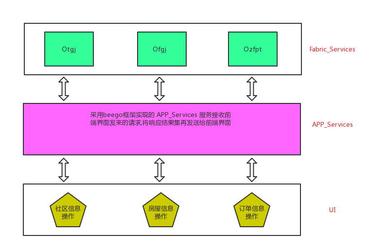
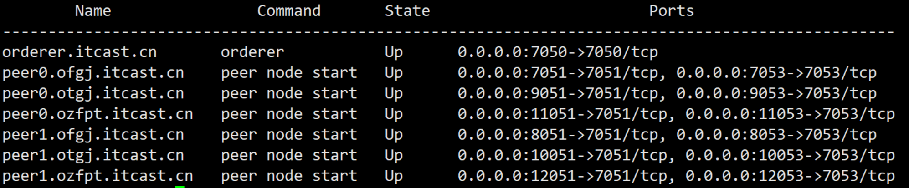
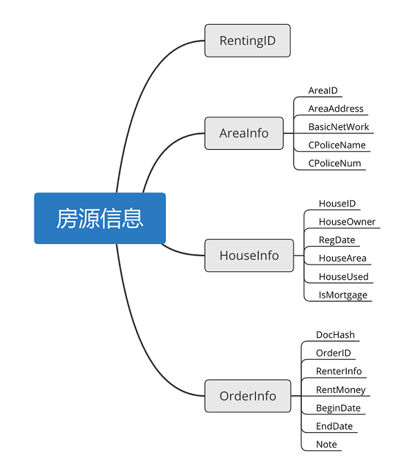

# Origins

​	  当今生产环境,溯源系统主要用于食品溯源,进口产品溯源,品牌产品溯源的领域,因为在这些领域经常会出现一些假冒伪劣产品,以次充好,所以利用区块链实现产品溯源就显得格外重要.

​	  我们要做的案例所能解决的问题:我们可以通过房屋溯源项目，解决现实生活中的一些租房乱象，使用户在签订租房合同之前就能够对将要租住的房子有个大致的认识。当然，我们的这个小项目毕竟只是demo 级别，功能有限，我们旨在拿它学习我们的fabric。

## 程序架构的设计

如下图所示:



​	  本项目 APP_Service 采用 beego 框架实现，调用原生 Fabric-SDK-Go 来完成访问账本数据的目的。

​	  在程序的业务开始之前，我们需要完成Fabric_Services 环境的搭建，然后利用 SDK 将我们编写好了的链代码上传到前面我们所配置的 Fabric 环境当中去 。

## Fabric-Services 环境准备

### 安装软件环境

此项目在 Linux 环境下部署：

 	1、安装git

​	2、安装 golang

​	3、安装 docker

​	4、docker-compose

### 编写配置文件

#### 约定

本项目中设定三个组织：土管局，房管局，租房平台

每个组织中的 peer 节点数：2

每个组织对应一个单独的channel: tgjchannel , fgjchannel , zfptchannel

三个组织有一个共同的 channel：unionchannel

根域名使用：itcast.cn

#### 1. crypto-config.yaml

切换工作目录

```shell
$ cd $GOPATH/origin_fabric_servic
```

> 使用下面命令生成 文件模板
>
> cryptogen showtemplate > crypto-config.yaml

根据实际定义修改内容，最终结果为：	

```yaml
OrdererOrgs:
  - Name: Orderer
    Domain: itcast.cn

    Specs:
      - Hostname: orderer

PeerOrgs:
    # 房管局组织
  - Name: Ofgj
    Domain: ofgj.itcast.cn
    # 是否支持 Nodejs
    EnableNodeOUs: true
    # 组织下面peer节点的个数
    Template:
      Count: 2
    # 创建的普通用户的个数
    Users:
      Count: 1

    # 土管局组织
  - Name: Otgj
    Domain: otgj.itcast.cn
    # 是否支持 Nodejs
    EnableNodeOUs: true
    # 组织下面peer节点的个数
    Template:
      Count: 2
    # 创建的普通用户的个数
    Users:
      Count: 1

    # 租房平台组织
  - Name: Ozfpt
    Domain: ozfpt.itcast.cn
    # 是否支持 Nodejs
    EnableNodeOUs: true
    # 组织下面peer节点的个数
    Template:
      Count: 2
    # 创建的普通用户的个数
    Users:
      Count: 1
```

- 在crypto-config 目录下生成证书目录：

```shell
$ cryptogen generate --config=./crypto-config.yaml
```

#### 2. configtx.yaml - 创始块/通道文件

从 fabric 配置文件例子中获取模板

```shell
$ cp $GOPATH/src/github.com/hyperledger-fabric/fabric-samples/first-network/configtx.yaml ./
```

修改后色内容：

```yaml
Profiles:
  ThreeOrgsOrdererGenesis:
    Capabilities:
      <<: *ChannelCapabilities
    Orderer:
      <<: *OrdererDefaults
      Organizations:
        - *Orderer
      Capabilities:
        <<: *OrdererCapabilities
	# 联盟
    Consortiums:
      # 三个组织的联盟
      ThreeOrgsConsortium:   # 名字可改
        Organizations:
          - *Ofgj
          - *Otgj
          - *Ozfpt
      # 房管局私有链
      OfgjConsortium:
        Organizations:
          - *Ofgj
      # 土改局私有链
      OtgjConsortium:
        Organizations:
          - *Otgj
      #租房平台私有链
      OzfptConsortium:
        Organizations:
          - *Ozfpt
     
  # 生成 unionchannel
  unionOrgschannel:
    Consortium: ThreeOrgsConsortium
    Application:
      <<: *ApplicationDefaults
      Organizations:
        - *Ofgj
        - *Otgj
        - *Ozfpt
      Capabilities:
        <<: *ApplicationCapabilities
   #生成 fgjchannel
  fgjOrgchannel:
   	Consortium:OfgjConsortium
   	Application:
      <<: *ApplicationDefaults
      Organizations:
        - *Ofgj
      Capabilities:
        <<: *ApplicationCapabilities
        
    #生成 tgjchannel
  tgjOrgchannel:
   	Consortium:OtgjConsortium
   	Application:
      <<: *ApplicationDefaults
      Organizations:
        - *Otgj
      Capabilities:
        <<: *ApplicationCapabilities
        
     #生成 zfptchannel
  zfptOrgchannel:
   	Consortium:OzfptConsortium
   	Application:
      <<: *ApplicationDefaults
      Organizations:
        - *Ozfpt
      Capabilities:
        <<: *ApplicationCapabilities
        
Organizations:				# 固定的，不能改
  - &Orderer				# 相当于定义了一个变量，其他地方可以引用它
    Name: Orderer			# 排序节点的组织名
    ID: itcast.cn			# 排序节点组织的ID
    MSPDir: crypto-config/ordererOrganizations/itcast.cn/msp # 组织的 MSP 账号

  - &Ofgj					# 房管局组织
    Name: OfgjMSP			# 组织名称
    ID: ofgj.itcast.cn		# 组织ID,该属性在设置背书策略时需要使用
    MSPDir: crypto-config/peerOrganizations/ofgj.itcast.cn/msp	#组织的 MSP 账号
    AnchorPeers:			# 锚节点
      - Host: peer0.ofgj.itcast.cn
        Port: 7051

  - &Otgj
    Name: OtgjMSP
    ID: otgj.itcast.cn
    MSPDir: crypto-config/peerOrganizations/otgj.itcast.cn/msp
    AnchorPeers:
    - Host: peer0.otgj.itcast.cn
      Port: 7051

  - &Ozfpt
    Name: OzfptMSP
    ID: ozfpt.itcast.cn
    MSPDir: crypto-config/peerOrganizations/ozfpt.itcast.cn/msp
    AnchorPeers:
    - Host: peer0.ozfpt.itcast.cn
      Port: 7051

Orderer: &OrdererDefaults
  # 共识机制 == 排序算法
  OrdererType: solo	  # 共识机制 - solo 算法之支持一个排序节点
  Addresses:          # orderer 节点的网络位置
    - orderer.itcast.cn:7050
  BatchTimeout: 5s    # 产生一个区块的时间单位
  BatchSize:
    MaxMessageCount: 10		# 交易的最大数量，交易数量达到之后会产生一个区块
    AbsoluteMaxBytes: 98 MB # 数据量达到该制定的值，也会产生一个区块
    PreferredMaxBytes: 512 KB # 首选 MaxBytes 
  
  Kafka:			  # 本例中的排序算法指定的是solo,此项可以不指定
    Brokers:
      - 127.0.0.1:9092   	# 指定 Kafka 排序集群所在的网络位置
  MaxChannels: 0
  Organizations:

# 此处不需要修改，默认即可
Application: &ApplicationDefaults
  Organizations:
 
# Fabric_v1.1 之后的内容，全部设为true，是为了兼容 1.1 前面的版本
Capabilities:
    Global: &ChannelCapabilities
        V1_1: true
    Orderer: &OrdererCapabilities
        V1_1: true
    Application: &ApplicationCapabilities
        V1_1: true
```

- 执行命令生成文件：

  - 生成创世块文件

    ```bash
    $ mkdir channel-artifacts
    $ configtxgen -profile ThreeOrgsOrdererGenesis -outputBlock ./channel-artifacts/genesis.block
    ```

  - 生成通道文件

    ```shell
    # 生成 unionchannel 文件
    $ echo "---------------- Create unionchannel.tx file BEGIN -------------------"
    $ configtxgen -profile UnionOrgsChannel -outputCreateChannelTx ./channel-artifacts/unionchannel.tx -channelID unionchannel
    $ echo "---------------- Create unionchannel.tx file END -------------------"
    
    # 生成 fgjchannel
    $ echo "---------------- Create fgjchannel.tx file BEGIN -------------------"
    $ configtxgen -profile fgjOrgchannel -outputCreateChannelTx ./channel-artifacts/fgjchannel.tx -channelID fgjchannel
    $ echo "---------------- Create fgjchannel.tx file END -------------------"
    
    # 生成 tgjchannel
    $ echo "---------------- Create tgjchannel.tx file BEGIN -------------------"
    $ configtxgen -profile tgjOrgchannel -outputCreateChannelTx ./channel-artifacts/tgjchannel.tx -channelID tgjchannel
    $ echo "---------------- Create tgjchannel.tx file END -------------------"
    
    # 生成 tgjchannel
    $ echo "---------------- Create zfptchannel.tx file BEGIN -------------------"
    $ configtxgen -profile zfptOrgchannel -outputCreateChannelTx ./channel-artifacts/zfptchannel.tx -channelID zfptchannel
    $ echo "---------------- Create zfptchannel.tx file END -------------------"
    ```

  - 生成锚节点更新文件

    > 此操作是可选的

    ```shell
    $ echo "---------------- Create AnchorPeerUpdate.tx file BEGIN -----------------"
    $ configtxgen -profile UnionOrgsChannel -outputAnchorPeersUpdate ./channel-artifacts/OfgjMSPanchors.tx -channelID unionchannel -asOrg OfgjMSP
    $ configtxgen -profile UnionOrgsChannel -outputAnchorPeersUpdate ./channel-artifacts/OtgjMSPanchors.tx -channelID unionchannel -asOrg OtgjMSP
    $ configtxgen -profile UnionOrgsChannel -outputAnchorPeersUpdate ./channel-artifacts/OzfptMSPanchors.tx -channelID unionchannel -asOrg OzfptMSP
    $ echo "---------------- Create AnchorPeerUpdate.tx file BEGIN ------------------"
    ```

  以上命令执行完毕后查看生成的结果，如果一下问及那都可以生成成功，说明以上操作都没有问题：

  ```
  channel-artifacts/
  ├── fgjchannel.tx
  ├── OfgjMSPanchors.tx
  ├── OtgjMSPanchors.tx
  ├── OzfptMSPanchors.tx
  ├── unionchannel.tx
  └── zfptchannel.tx
  ```

#### 3. docker-compose.yaml 文件

复制模板文件,然后基于go模版文件修改

```shell
$ cp $GOPATH/src/github.com/hyperledger-fabric/fabric-samples/first-network/docker-compose-cli.yaml
```

修改后的结果：

```yaml
version: '2'

networks:
  ZFW_suyuan:

services:
	# 服务的名称
  orderer.itcast.cn:
    image: hyperledger/fabric-orderer:latest
    # 容器名 
    container_name: orderer.itcast.cn
    environment:
      - ORDERER_GENERAL_LOGLEVEL=debug			# 日志级别
      - ORDERER_GENERAL_LISTENADDRESS=0.0.0.0 	# orderer节点监听的地址
      - ORDERER_GENERAL_LISTENPORT=7050			# orderer 默认监听7050，监听的端口号可以修改
      - ORDERER_GENERAL_GENESISPROFILE=Orderer	
      - ORDERER_GENERAL_GENESISMETHOD=file		# 创世块的来源，file表示来自于文件 
      # 指定创世块文件的路径
      - ORDERER_GENERAL_GENESISFILE=/var/hyperledger/orderer/orderer.genesis.block 
      - ORDERER_GENERAL_LOCALMSPID=itcast.cn	# Orderer组织的ID[Organizations -> Orderer -> ID]
      # 当前节点的 MSP 账号路径
      - ORDERER_GENERAL_LOCALMSPDIR=/var/hyperledger/orderer/msp 
      - ORDERER_GENERAL_TLS_ENABLED=true		# 通信的时候是否使用 TLS 加密 
      - ORDERER_GENERAL_TLS_PRIVATEKEY=/var/hyperledger/orderer/tls/server.key		# 私钥文件
      - ORDERER_GENERAL_TLS_CERTIFICATE=/var/hyperledger/orderer/tls/server.crt		# 证书文件
      - ORDERER_GENERAL_TLS_ROOTCAS=[/var/hyperledger/orderer/tls/ca.crt]			# 根证书文件  
    working_dir: /opt/gopath/src/github.com/hyperledger/fabric
    command: orderer
    volumes:
      - ./channel-artifacts/genesis.block:/var/hyperledger/orderer/orderer.genesis.block
      - ./crypto-config/ordererOrganizations/itcast.cn/orderers/orderer.itcast.cn/msp:/var/hyperledger/orderer/msp
      - ./crypto-config/ordererOrganizations/itcast.cn/orderers/orderer.itcast.cn/tls:/var/hyperledger/orderer/tls
    ports:
      - 7050:7050
    networks:
      default:
        aliases:
          - orderer.itcast.cn

  # ofgj
  peer0.ofgj.itcast.cn:
    image: hyperledger/fabric-peer:latest
    container_name: peer0.ofgj.itcast.cn
    environment:
      - CORE_VM_ENDPOINT=unix:///host/var/run/docker.sock
      - CORE_PEER_ID=peer0.ofgj.itcast.cn			# peer 节点的名字
      - CORE_PEER_ADDRESS=peer0.ofgj.itcast.cn:7051 # 当前 peer 节点的地址信息
      - CORE_VM_DOCKER_ATTACHSTDOUT=true
      - CORE_LOGGING_LEVEL=DEBUG
      - CORE_PEER_ADDRESSAUTODETECT=true
      # 为了别其他节点感知到，如果不设置，其他节点不知道该节点的存在
      - CORE_PEER_GOSSIP_EXTERNALENDPOINT=peer0.ofgj.itcast.cn:7051
      - CORE_PEER_GOSSIP_USELEADERELECTION=true		# leader 节点自动选举机制
      - CORE_PEER_GOSSIP_ORGLEADER=false			# 当前节点是不是 leader 节点，结果应由选举得出所以此处给出 false
      - CORE_PEER_GOSSIP_SKIPHANDSHAKE=true
      # 当前组织的ID[Organizations -> ID]
      - CORE_PEER_LOCALMSPID=ofgj.itcast.cn
      - CORE_PEER_PROFILE_ENABLED=true
      - CORE_PEER_MSPCONFIGPATH=/var/hyperledger/msp
      - CORE_PEER_TLS_ENABLED=true
      - CORE_PEER_TLS_SERVERHOSTOVERRIDE=peer0.ofgj.itcast.cn
      - CORE_PEER_TLS_CERT_FILE=/var/hyperledger/tls/server.crt
      - CORE_PEER_TLS_KEY_FILE=/var/hyperledger/tls/server.key
      - CORE_PEER_TLS_ROOTCERT_FILE=/var/hyperledger/tls/ca.crt
    working_dir: /opt/gopath/src/github.com/hyperledger/fabric/peer
    command: peer node start
    volumes:
      - /var/run/:/host/var/run/
      - ./crypto-config/peerOrganizations/ofgj.itcast.cn/peers/peer0.ofgj.itcast.cn/msp:/var/hyperledger/msp
      - ./crypto-config/peerOrganizations/ofgj.itcast.cn/peers/peer0.ofgj.itcast.cn/tls:/var/hyperledger/tls
    ports:
      - 7051:7051
      - 7053:7053
    depends_on:
      - orderer.itcast.cn
    links:
      - orderer.itcast.cn
    networks:
      default:
        aliases:
          - peer0.ofgj.itcast.cn

  peer1.ofgj.itcast.cn:
    image: hyperledger/fabric-peer:latest
    container_name: peer1.ofgj.itcast.cn
    environment:
      - CORE_VM_ENDPOINT=unix:///host/var/run/docker.sock
      - CORE_VM_DOCKER_ATTACHSTDOUT=true
      - CORE_LOGGING_LEVEL=DEBUG
      - CORE_PEER_PROFILE_ENABLED=true
      - CORE_PEER_TLS_ENABLED=true
      - CORE_PEER_TLS_CERT_FILE=/var/hyperledger/tls/server.crt
      - CORE_PEER_TLS_KEY_FILE=/var/hyperledger/tls/server.key
      - CORE_PEER_TLS_ROOTCERT_FILE=/var/hyperledger/tls/ca.crt
      - CORE_PEER_ID=peer1.ofgj.itcast.cn
      - CORE_PEER_ADDRESSAUTODETECT=true
      - CORE_PEER_ADDRESS=peer1.ofgj.itcast.cn:7051
      - CORE_PEER_GOSSIP_EXTERNALENDPOINT=peer1.ofgj.itcast.cn:7051
      - CORE_PEER_GOSSIP_USELEADERELECTION=true
      - CORE_PEER_GOSSIP_ORGLEADER=false
      - CORE_PEER_GOSSIP_SKIPHANDSHAKE=true
      - CORE_PEER_LOCALMSPID=ofgj.itcast.cn
      - CORE_PEER_MSPCONFIGPATH=/var/hyperledger/msp
      - CORE_PEER_TLS_SERVERHOSTOVERRIDE=peer1.ofgj.itcast.cn
    working_dir: /opt/gopath/src/github.com/hyperledger/fabric/peer
    command: peer node start
    volumes:
      - /var/run/:/host/var/run/
      - ./crypto-config/peerOrganizations/ofgj.itcast.cn/peers/peer1.ofgj.itcast.cn/msp:/var/hyperledger/msp
      - ./crypto-config/peerOrganizations/ofgj.itcast.cn/peers/peer1.ofgj.itcast.cn/tls:/var/hyperledger/tls
    ports:
      - 8051:7051
      - 8053:7053
    depends_on:
      - orderer.itcast.cn
    links:
      - orderer.itcast.cn
    networks:
      default:
        aliases:
          - peer1.ofgj.itcast.cn

  # otgj
  peer0.otgj.itcast.cn:
    image: hyperledger/fabric-peer:latest
    container_name: peer0.otgj.itcast.cn
    environment:
      - CORE_VM_ENDPOINT=unix:///host/var/run/docker.sock
      - CORE_VM_DOCKER_ATTACHSTDOUT=true
      - CORE_LOGGING_LEVEL=DEBUG
      - CORE_PEER_PROFILE_ENABLED=true
      - CORE_PEER_TLS_ENABLED=true
      - CORE_PEER_TLS_CERT_FILE=/var/hyperledger/tls/server.crt
      - CORE_PEER_TLS_KEY_FILE=/var/hyperledger/tls/server.key
      - CORE_PEER_TLS_ROOTCERT_FILE=/var/hyperledger/tls/ca.crt
      - CORE_PEER_ID=peer0.otgj.itcast.cn
      - CORE_PEER_ADDRESSAUTODETECT=true
      - CORE_PEER_ADDRESS=peer0.otgj.itcast.cn:7051
      - CORE_PEER_GOSSIP_EXTERNALENDPOINT=peer0.otgj.itcast.cn:7051
      - CORE_PEER_GOSSIP_USELEADERELECTION=true
      - CORE_PEER_GOSSIP_ORGLEADER=false
      - CORE_PEER_GOSSIP_SKIPHANDSHAKE=true
      - CORE_PEER_LOCALMSPID=otgj.itcast.cn
      - CORE_PEER_MSPCONFIGPATH=/var/hyperledger/msp
      - CORE_PEER_TLS_SERVERHOSTOVERRIDE=peer0.otgj.itcast.cn
    working_dir: /opt/gopath/src/github.com/hyperledger/fabric/peer
    command: peer node start
    volumes:
      - /var/run/:/host/var/run/
      - ./crypto-config/peerOrganizations/otgj.itcast.cn/peers/peer0.otgj.itcast.cn/msp:/var/hyperledger/msp
      - ./crypto-config/peerOrganizations/otgj.itcast.cn/peers/peer0.otgj.itcast.cn/tls:/var/hyperledger/tls
    ports:
      - 9051:7051
      - 9053:7053
    depends_on:
      - orderer.itcast.cn
    links:
      - orderer.itcast.cn
    networks:
      default:
        aliases:
          - peer0.otgj.itcast.cn

  peer1.otgj.itcast.cn:
    image: hyperledger/fabric-peer:latest
    container_name: peer1.otgj.itcast.cn
    environment:
      - CORE_VM_ENDPOINT=unix:///host/var/run/docker.sock
      - CORE_VM_DOCKER_ATTACHSTDOUT=true
      - CORE_LOGGING_LEVEL=DEBUG
      - CORE_PEER_PROFILE_ENABLED=true
      - CORE_PEER_TLS_ENABLED=true
      - CORE_PEER_TLS_CERT_FILE=/var/hyperledger/tls/server.crt
      - CORE_PEER_TLS_KEY_FILE=/var/hyperledger/tls/server.key
      - CORE_PEER_TLS_ROOTCERT_FILE=/var/hyperledger/tls/ca.crt
      - CORE_PEER_ID=peer1.otgj.itcast.cn
      - CORE_PEER_ADDRESSAUTODETECT=true
      - CORE_PEER_ADDRESS=peer1.otgj.itcast.cn:7051
      - CORE_PEER_GOSSIP_EXTERNALENDPOINT=peer1.otgj.itcast.cn:7051
      - CORE_PEER_GOSSIP_USELEADERELECTION=true
      - CORE_PEER_GOSSIP_ORGLEADER=false
      - CORE_PEER_GOSSIP_SKIPHANDSHAKE=true
      - CORE_PEER_LOCALMSPID=otgj.itcast.cn
      - CORE_PEER_MSPCONFIGPATH=/var/hyperledger/msp
      - CORE_PEER_TLS_SERVERHOSTOVERRIDE=peer1.otgj.itcast.cn
    working_dir: /opt/gopath/src/github.com/hyperledger/fabric/peer
    command: peer node start
    volumes:
      - /var/run/:/host/var/run/
      - ./crypto-config/peerOrganizations/otgj.itcast.cn/peers/peer1.otgj.itcast.cn/msp:/var/hyperledger/msp
      - ./crypto-config/peerOrganizations/otgj.itcast.cn/peers/peer1.otgj.itcast.cn/tls:/var/hyperledger/tls
    ports:
      - 10051:7051
      - 10053:7053
    depends_on:
      - orderer.itcast.cn
    links:
      - orderer.itcast.cn
    networks:
      default:
        aliases:
          - peer1.otgj.itcast.cn

  # ozfpt
  peer0.ozfpt.itcast.cn:
    image: hyperledger/fabric-peer:latest
    container_name: peer0.ozfpt.itcast.cn
    environment:
      - CORE_VM_ENDPOINT=unix:///host/var/run/docker.sock
      - CORE_VM_DOCKER_ATTACHSTDOUT=true
      - CORE_LOGGING_LEVEL=DEBUG
      - CORE_PEER_PROFILE_ENABLED=true
      - CORE_PEER_TLS_ENABLED=true
      - CORE_PEER_TLS_CERT_FILE=/var/hyperledger/tls/server.crt
      - CORE_PEER_TLS_KEY_FILE=/var/hyperledger/tls/server.key
      - CORE_PEER_TLS_ROOTCERT_FILE=/var/hyperledger/tls/ca.crt
      - CORE_PEER_ID=peer0.ozfpt.itcast.cn
      - CORE_PEER_ADDRESSAUTODETECT=true
      - CORE_PEER_ADDRESS=peer0.ozfpt.itcast.cn:7051
      - CORE_PEER_GOSSIP_EXTERNALENDPOINT=peer0.ozfpt.itcast.cn:7051
      - CORE_PEER_GOSSIP_USELEADERELECTION=true
      - CORE_PEER_GOSSIP_ORGLEADER=false
      - CORE_PEER_GOSSIP_SKIPHANDSHAKE=true
      - CORE_PEER_LOCALMSPID=ozfpt.itcast.cn
      - CORE_PEER_MSPCONFIGPATH=/var/hyperledger/msp
      - CORE_PEER_TLS_SERVERHOSTOVERRIDE=peer0.ozfpt.itcast.cn
    working_dir: /opt/gopath/src/github.com/hyperledger/fabric/peer
    command: peer node start
    volumes:
      - /var/run/:/host/var/run/
      - ./crypto-config/peerOrganizations/ozfpt.itcast.cn/peers/peer0.ozfpt.itcast.cn/msp:/var/hyperledger/msp
      - ./crypto-config/peerOrganizations/ozfpt.itcast.cn/peers/peer0.ozfpt.itcast.cn/tls:/var/hyperledger/tls
    ports:
      - 11051:7051
      - 11053:7053
    depends_on:
      - orderer.itcast.cn
    links:
      - orderer.itcast.cn
    networks:
      default:
        aliases:
          - peer0.ozfpt.itcast.cn

  peer1.ozfpt.itcast.cn:
    image: hyperledger/fabric-peer:latest
    container_name: peer1.ozfpt.itcast.cn
    environment:
      - CORE_VM_ENDPOINT=unix:///host/var/run/docker.sock
      - CORE_VM_DOCKER_ATTACHSTDOUT=true
      - CORE_LOGGING_LEVEL=DEBUG
      - CORE_PEER_PROFILE_ENABLED=true
      - CORE_PEER_TLS_ENABLED=true
      - CORE_PEER_TLS_CERT_FILE=/var/hyperledger/tls/server.crt
      - CORE_PEER_TLS_KEY_FILE=/var/hyperledger/tls/server.key
      - CORE_PEER_TLS_ROOTCERT_FILE=/var/hyperledger/tls/ca.crt
      - CORE_PEER_ID=peer1.ozfpt.itcast.cn
      - CORE_PEER_ADDRESSAUTODETECT=true
      - CORE_PEER_ADDRESS=peer1.ozfpt.itcast.cn:7051
      - CORE_PEER_GOSSIP_EXTERNALENDPOINT=peer1.ozfpt.itcast.cn:7051
      - CORE_PEER_GOSSIP_USELEADERELECTION=true
      - CORE_PEER_GOSSIP_ORGLEADER=false
      - CORE_PEER_GOSSIP_SKIPHANDSHAKE=true
      - CORE_PEER_LOCALMSPID=ozfpt.itcast.cn
      - CORE_PEER_MSPCONFIGPATH=/var/hyperledger/msp
      - CORE_PEER_TLS_SERVERHOSTOVERRIDE=peer1.ozfpt.itcast.cn
    working_dir: /opt/gopath/src/github.com/hyperledger/fabric/peer
    command: peer node start
    volumes:
      - /var/run/:/host/var/run/
      - ./crypto-config/peerOrganizations/ozfpt.itcast.cn/peers/peer1.ozfpt.itcast.cn/msp:/var/hyperledger/msp
      - ./crypto-config/peerOrganizations/ozfpt.itcast.cn/peers/peer1.ozfpt.itcast.cn/tls:/var/hyperledger/tls
    ports:
      - 12051:7051
      - 12053:7053
    depends_on:
      - orderer.itcast.cn
    links:
      - orderer.itcast.cn
    networks:
      default:
        aliases:
          - peer1.ozfpt.itcast.cn
```

#### 4. 启动网络

由于使用的配置文件名称是docker-compose.yaml，是docker-compose的默认值，所以可以使用下面的命令来启 动网络：

- ```shell
  $ docker-compose up -d
  ```


我们本例中有1个orderer 节点，6个peer节点，所以如果7个docker 容器能够全部启动成功，那么我们的fabric 网络环境就已经启动成功，如下图所示：

```shell
$ docker-compose ps
```



到目前为止,整个 fabric网络环境已经跑起来了.我们前面在学习 Fabric 的时候,在启动 docker 容器的时候,同时启动了一个 cli 容器,它能够利用 CLI 工具完成 channel,chaincode 的一些操作,如下:

- 创建通道, 通过客户端节点来完成

- 将每个组织的每个节点都加入到通道中  -> 客户端来完成的
  - 一个客户端同时只能连接一个peer节点

- 给每个peer节点安装智能合约 -> 链代码(程序: go, node.js, java)

- 对智能合约进行初始化 , 对应智能合约中的 Init 函数
  - <font color="red">只需要在任意节点初始化一次, 数据会自动同步的各个组织的各个节点</font>

- 对数据进行查询 -> 读

- 对数据进行调用 -> 写

>经过前面的讲解我们都知道, 一个客户端只能连接一个指定的节点, 如果想要该客户端连接其他节点, 那么就必须修改当前客户端中相关的环境变量

此项目中,我们不在使用 cli 工具,而是通过 Fabric_SDK_go 来完成相应的工作.


## APP_Service 应用开发

在应用层,我们首先要做的是要,设计并编写链代码,我们需要借助 hyperledger/fabric 框架。那么，首先我们需要把 [fabric源码](https://github.com/hyperledger/fabric) 下载到$GOPATH/src/github.com/hyperledger 目录下

> 之前已经下载过了的，此步可以忽略

接下来我们就可以编写我们的链代码了。那么在这之前我们有必要去提前设计一下我们的链代码。

### 链代码的设计

如下图所示，在 账本中，我们至少要保存如下这些数据:



如图所示，房源信息中包括房屋信息，房屋周围的社区信息，以及与该房源相关的订单信息。这些信息都是通过以 RentingID  为key 存放进入我们的超级账本当中去的，所以，在我们的链代码中需要声明与之对应的结构体，来储存相应的信息。

对应的结构体声明如下：

- HouseInfo 用于存储与房屋信息相关的一些数据，在此项目场景中，此数据应由“房管局组织”维护，所以，对该数据的操作可以走 fgjchannel.

```go
// 房屋信息  ofgj
type HouseInfo struct {
	HouseID    string `json:"house_id"`    // 房产证编号
	HouseOwner string `json:"house_owner"` // 房主
	RegDate    string `json:"reg_date"`    // 登记日期
	HouseArea  string `json:"house_area"`  // 住房面积
	HouseUsed  string `json:"house_used"`  // 房屋设计用途
	IsMortgage string `json:"is_mortgage"` // 是否抵押
}
```

- AreaInfo 用于存储与该房源相关的一些社区信息，用户可以通过该信息了解到一些能够影响将要租住房源的外界信息、基础建设等信息.此数据应由“土管局组织”维护，所以，对该数据的操作可以走 tgjchannel.

```go
// 社区信息 otgj
type AreaInfo struct {
	AreaID       string `json:"area_id"`        // 社区编号
	AreaAddress  string `json:"area_address"`   // 房源所在区域
	BasicNetWork string `json:"basic_net_work"` // 区域基础网络编号
	CPoliceName  string `json:"c_police_name"`  // 社区民警姓名
	CPoliceNum   string `json:"c_police_num"`   // 社区民警工号
}
```

- OrderInfo 用于存储与房源相关的历史租住信息，用户可以通过信息了解到房屋的以往租金等信息。此数据应由“租房平台组织”维护，所以，对该数据的操作可以走 zfptchannel.

```go
// 订单信息	ozfpt
type OrderInfo struct {
	DocHash   string `json:"doc_hash"`   // 电子合同Hash
	OrderID   string `json:"order_id"`   // 订单编号
	RenterID  string `json:"renter_id"`  // 承租人信息
	RentMoney string `json:"rent_money"` // 租金
	BeginDate string `json:"begin_date"` // 开始日期
	EndDate   string `json:"end_date"`   // 结束日期
	Note      string `json:"note"`       // 备注
}
```

由此，我们我们可以得出 “房源信息” 结构体的 声明原型：

```go
// 房源信息
type RentingHouseInfo struct {
	RentingID        string    `json:"renting_id"`         // 统一编码
	RentingHouseInfo HouseInfo `json:"renting_house_info"` // 房屋信息
	RentingAreaInfo  AreaInfo  `json:"renting_area_info"`  //区域信息
	RentingOrderInfo OrderInfo `json:"renting_order_info"` //订单信息
}
```

### 链代码的实现

现在我们已经清楚了 chaincode 需要操作的一些数据模型，下面就可以编写我们的链代码了。在开始写chaincode 之前，我们需要声明一个 chaincode 结构体，并重载它的 Init 和 Invoke 方法，其中Invoke 方法中解析出请求的内容，调用不同的请求,这是我们编写chaincode的模板写法儿.

 ```go
type HouseChainCode struct {
	// 房屋溯源链代码
}
// Init 方法
func (this *HouseChainCode) Init(stub shim.ChaincodeStubInterface) peer.Response {}
// Invoke 方法
func (this *HouseChainCode) Invoke(stub shim.ChaincodeStubInterface) peer.Response {
	// 获取 函数名 和 参数列表
	fn, parameters := stub.GetFunctionAndParameters()

	// 通过函数名匹配对应的链代码函数调用
	if fn == "addHouseInfo" {
		// 添加房源信息
		return this.addHouseInfo(stub, parameters)
	} else if fn == "getHouseInfo" {
		// 获取房源信息
		return this.getHouseInfo(stub, parameters)
	} else if fn == "addOrderInfo" {
		// 添加订单信息
		return this.addOrderInfo(stub, parameters)
	} else if fn == "getOrderInfo" {
		// 获取订单信息
		return this.getOrderInfo(stub, parameters)
	} else if fn == "addAreaInfo" {
		// 添加社区信息
		return this.addAreaInfo(stub, parameters)
	} else if fn == "getAreaInfo" {
		// 获取社区信息
		return this.getAreaInfo(stub, parameters)
	}

	// 没有任何函数被匹配到，返回错误消息
	fmt.Println("==== fn = ", fn)
	return shim.Error("Received unknow function invocation")
}
 ```

我们通过项目的展示,已经基本清楚项目的大致模型,下面一段代码是 addHouseCode 函数的实现,它的主要功能是实现将用户输入的房屋信息,写入超级账本当中去,它通过接收用户参数,并将数据以 rentingID 为key,以 args的接送编码数据为value的形式写进账本当中去.

```go
// 添加房屋信息
func (this *HouseChainCode) addHouseInfo(stub shim.ChaincodeStubInterface, args []string) peer.Response {
	// 定义一个房屋信息结构体
	var HouseInfos RentingHouseInfo

	if len(args) != 7 {
		return shim.Error("Incorrect number oof arguments.")
	}

	HouseInfos.RentingID = args[0]
	if HouseInfos.RentingID == "" {
		return shim.Error("RentingId can't be empty.")
	}

	HouseInfos.RentingHouseInfo.HouseID = args[1]
	HouseInfos.RentingHouseInfo.HouseOwner = args[2]
	HouseInfos.RentingHouseInfo.RegDate = args[3]
	HouseInfos.RentingHouseInfo.HouseArea = args[4]
	HouseInfos.RentingHouseInfo.HouseUsed = args[5]
	HouseInfos.RentingHouseInfo.IsMortgage = args[6]

	HouseInfosJsonBytes, err := json.Marshal(HouseInfos)
	if err != nil {
		return shim.Error(err.Error())
	}

	err = stub.PutState(HouseInfos.RentingID, HouseInfosJsonBytes)
	if err != nil {
		return shim.Error(err.Error())
	}

	return shim.Success([]byte("ok"))
}
```

前面,我们已经将房屋信息写进了区块链,下面一段代码是将刚才写入区块链中的数据读出来,以达到数据参看的目的.

```go
// 查看房屋信息
func (this *HouseChainCode) getHouseInfo(stub shim.ChaincodeStubInterface, args []string) peer.Response {
	// 判断参数个数
	if len(args) != 1 {
		return shim.Error("Incorrect number of arguments.")
	}
	// 获取唯一标识码
	rentingID := args[0]

	// 获得查询结果迭代器
	resultItreator, err := stub.GetHistoryForKey(rentingID)
	if err != nil {
		return shim.Error(err.Error())
	}

	// 释放迭代器资源
	defer resultItreator.Close()

	var rentHouseInfo HouseInfo

	// 使用迭代器遍历查询结果集
	for resultItreator.HasNext() {
		var HouseInfos RentingHouseInfo
		// 取一条结果
		response, err := resultItreator.Next()
		if err != nil {
			return shim.Error(err.Error())
		}

		err = json.Unmarshal(response.Value, &HouseInfos)
		if err != nil {
			return shim.Error(err.Error())
		}

		if HouseInfos.RentingHouseInfo.HouseOwner != "" {
			rentHouseInfo = HouseInfos.RentingHouseInfo
			continue
		}
	}

	jsonAsBytes, err := json.Marshal(rentHouseInfo)
	if err != nil {
		return shim.Error(err.Error())
	}

	// 返回数据查询结果
	return shim.Success(jsonAsBytes)
}
```

以上两端代码仅仅只是与房屋相关的信息，其他两个我们可以参照这两个去写。

### APP_Service的框架搭建

到目前为止呢，我们有关与 Fabric_Services 相关的工作都应做完了，下面我们就需要针对于 APP_Services 做功能的实现了。我们的 APP_Services 采用的是beego框架，所以，我们首先要做的就是设置我们的路由，然后根据路由一次实现对应的处理函数。

#### 1. route配置

​	根据链代码中 Invoke 函数分支调用模型，路由设计如下：

```go
func init() {
    beego.Router("/", &controllers.MainController{})
	beego.Router("/form_area",&controllers.MainController{},"get:FormArea")
	beego.Router("/form_house",&controllers.MainController{},"get:FormHouse")
	beego.Router("/form_orderer",&controllers.MainController{},"get:FormOrderer")
	beego.Router("/area_search",&controllers.MainController{},"get:AreaSearch")
	beego.Router("/house_search",&controllers.MainController{},"get:HouseSearch" )
	beego.Router("/orderer_search",&controllers.MainController{},"get:OrdererSearch")
}
```

#### 2. controller函数原型

​	根据设计好的路由，controllers 模块中对应的函数实现：

```go
// 发布房源信息
func (this *MainController) FormHouse() {}
// 查询房源信息
func (this *MainController) HouseSearch() {}
// 发布社区信息
func (this *MainController) FormArea() {}
// 查询社区信息
func (this *MainController) AreaSearch() {}
// 发布订单信息
func (this *MainController) FormOrderer() {}
//　查询订单信息
func (this *MainController) OrdererSearch() {}
```

​	下面拿 “房源信息” 为例，我们需要在函数内部获取前端用户的输入，并调用models层业务逻辑，完成数据的账本记入，具体实现如下：

```go
// 发布房源信息
func (this *MainController) FormHouse() {
	// 响应 /form_house 请求,将 form_house.html 页面返回给客户端
	this.TplName = "form_house.html"

	rentingID := this.GetString("rentingID")
	if rentingID == "" {
		return
	} else {
		// 获取用户输入
		fczbh := this.GetString("fczbh")
		fzxm := this.GetString("fzxm")
		djrq := this.GetString("djrq")
		zfmj := this.GetString("zfmj")
		fwsjyt := this.GetString("fwsjyt")
		sfdy := this.GetString("sfdy")

		// 组织参数
		var args []string
		args = append(args, "addHouseInfo")
		args = append(args, rentingID)
		args = append(args, fczbh)
		args = append(args, fzxm)
		args = append(args, djrq)
		args = append(args, zfmj)
		args = append(args, fwsjyt)
		args = append(args, sfdy)

		//TODO  调用models 层业务逻辑,把数据记入超级账本
	}
	// 最后返回在首页
	this.TplName = "index.html"
}
```

上面 TODO 需要借助models层业务逻辑，所以接下来我们去写models层实现，以支撑上层的开发

#### 3. 编写 SDK 配置文件

我们可以参照`$GOPATH/src/github.com/hyperledger/fabric-sdk-go/pkg/core/config/testdata/template/config.yaml` 模板文件完成我们SDK配置文件的编写，同时 fabric-sdk-go 给我们提供了两个demo程序，我们也可以把它们的 配置文件拿过来参考，这两个文件在如下目录中,

```shell
$GOPATH/src/github.com/hyperledger/fabric-sdk-go/test/fixtures/config/config_test.yaml
$GOPATH/src/github.com/hyperledger/fabric-sdk-go/pkg/core/config/testdata/config_test.yaml 
```

相关配置如下：

```yaml
# 配置文件的名字,可以不写
name: "suyuan-service-network"

version: 1.0.0

# client 相关配置
client:
  # 此 SDK 实例属于哪个组织
  organization: Ofgj
  # 日志级别
  logging:
    level: info
  # 证书所在目录
  cryptoconfig:
    path: /home/stu/workspace/src/origins/conf/crypto-config
  # 这种方式就是把用户名和密码直接存储在本地的一个文件中，而用户和密码对通过一个别名来引用，这样可以避免密码明文格式可能会存在的安全问题
  credentialStore:
    path: /tmp/suyuan-service-store

  # 区块链密码服务提供者,指定加密策略
  BCCSP:
    security:
      enabled: true
      default:
        provider: "SW"
      hashAlgorithm: "SHA2"
      softVerify: true
      level: 256

  tlsCerts:
  	# 证书池策略，默认为false,提高身份认证速率
    systemCertPool: true
    client:
      keyfile: /home/stu/workspace/src/origins/conf/crypto-config/peerOrganizations/ofgj.itcast.cn/users/User1@ofgj.itcast.cn/tls/client.key
      certfile: /home/stu/workspace/src/origins/conf/crypto-config/peerOrganizations/ofgj.itcast.cn/users/User1@ofgj.itcast.cn/tls/client.crt


# channel 相关配置
channels:
  # channelID
  fgjchannel:
    # orderer 组织必须指定
    orderers:
      - orderer.itcast.cn
	# 添加到该 channel 中的组织的 peer 列表
    peers:
      peer0.ofgj.itcast.cn:
        endorsingPeer: true
        chaincodeQuery: true
        ledgerQuery: true
        eventSource: true

      peer1.ofgj.itcast.cn:
        endorsingPeer: true
        chaincodeQuery: true
        ledgerQuery: true
        eventSource: true


    policies:
      queryChannelConfig:
        minResponses: 1
        maxTargets: 1
        retryOpts:
          attempts: 5
          initialBackoff: 500ms
          maxBackoff: 5s
          backoffFactor: 2.0

# organizations 相关配置
organizations:
  ofgj:
    # configtx.yaml organizations -> ID
    mspid: ofgj.itcast.cn

    cryptoPath: /home/stu/workspace/src/origins/conf/crypto-config/peerOrganizations/ofgj.itcast.cn/users/{userName}@ofgj.itcast.cn/msp
    peers:
    - peer0.ofgj.itcast.cn
    - peer1.ofgj.itcast.cn


  ordererorg:
    mspID: itcast.cn
    cryptoPath: /home/stu/workspace/src/origins/conf/crypto-config/ordererOrganizations/itcast.cn/users/Admin@itcast.cn/msp

# orderer 相关配置
orderers:
  orderer.itcast.cn:
    url: localhost:7050
    grpcOptions:
      ssl-target-name-override: orderer.itcast.cn
      keep-alive-time: 0s
      keep-alive-timeout: 20s
      keep-alive-permit: false
      fail-fast: false
      allow-insecure: false

    tlsCACerts:
      path: /home/stu/workspace/src/origins/conf/crypto-config/ordererOrganizations/itcast.cn/tlsca/tlsca.itcast.cn-cert.pem

# peer 相关配置
peers:
  peer0.ofgj.itcast.cn:
    url: grpc://localhost:7051
    eventUrl: localhost:7053
    grpcOptions:
      ssl-target-name-override: peer0.ofgj.itcast.cn
      keep-alive-time: 0s
      keep-alive-timeout: 20s
      keep-alive-permit: false
      fail-fast: false
      allow-insecure: false

    tlsCACerts:
      path: /home/stu/workspace/src/origins/conf/crypto-config/peerOrganizations/ofgj.itcast.cn/tlsca/tlsca.ofgj.itcast.cn-cert.pem

  peer1.ofgj.itcast.cn:
    url: localhost:8051
    eventUrl: localhost:8053
    grpcOptions:
      ssl-target-name-override: peer1.ofgj.itcast.cn
      keep-alive-time: 0s
      keep-alive-timeout: 20s
      keep-alive-permit: false
      fail-fast: false
      allow-insecure: false

    tlsCACerts:
      path: /home/stu/workspace/src/origins/conf/crypto-config/peerOrganizations/ofgj.itcast.cn/tlsca/tlsca.ofgj.itcast.cn-cert.pem
```


#### 4. models设计

我们在models层操作需要用到 Fabric_SDK ,所以我们首先要做的就是先拿到 SDK 句柄，创建channel，添加节点，安装链代码，实例化链代码之手，才能进行数据的操作。首先我们定义一个结构体，该结构体里面存放一些与创建Fabric-SDK 有关的配置信息，格式如下：

```go
// FabricSetup implementation
type FabricSetup struct {
	ConfigFile      string				// 初始化 SDK 对应的配置文件
	OrdererID       string				// orderer节点
	ChannelID       string				// ChannelID
	ChainCodeID     string				// ChainCodeID
	ChannelConfig   string				// 与channel相关的配置文件
	ChaincodeGoPath string				// GOPATH 环境变量
	ChaincodePath   string				// ChainCode 存放路径
	OrgAdmin        string				// Admin 用户名
	OrgName         string				// 组织名称
	UserName        string				// 普通用户名
	eventID         string				// eventID
    
	client          *channel.Client		
	admin           *resmgmt.Client
	sdk             *fabsdk.FabricSDK
	event           *event.Client
}
```

我们新建一个 SDK_Init.go 文件，在里面定义我们的结构体变量，并初始化它：

```go
	fSetup := FabricSetup{
		// Network parameters
		OrdererID: "orderer.itcast.cn",

		// Channel parameters
		ChannelID:     "fgjchannel",
		ChannelConfig: os.Getenv("GOPATH") + "/src/origins/conf/channel-artifacts/fgjchannel.tx",

		// Chaincode parameters
		ChainCodeID:     "mycc",
		ChaincodeGoPath: os.Getenv("GOPATH"),
		ChaincodePath:   "origins/chaincode",
		OrgAdmin:        "Admin",
		OrgName:         "ofgj",
		ConfigFile:      "conf/config.yaml",

		// User parameters
		UserName: "User1",
		eventID:"eventInvoke",
	}
```

到此，我们只是设置好了一些与SDK相关的一些配置信息，我们还需要调用SDK—AP去完成我们上面所说的内容，新建setup.go 文件，显示内容如下：

```go
package models

import (
	"fmt"
	"github.com/hyperledger/fabric-sdk-go/pkg/client/resmgmt"
	"github.com/hyperledger/fabric-sdk-go/pkg/common/errors/retry"
	"github.com/hyperledger/fabric-sdk-go/pkg/core/config"
	mspclient "github.com/hyperledger/fabric-sdk-go/pkg/client/msp"
	"github.com/hyperledger/fabric-sdk-go/pkg/common/providers/msp"
	"github.com/hyperledger/fabric-sdk-go/pkg/fabsdk"
	"github.com/pkg/errors"
)

// SDK 初始化
func (setup *FabricSetup) Initialize() error{

	// 1> 利用配置文件初始化一个 SDK,我们使用 fabsdk.New 方法
	sdk,err := fabsdk.New(config.FromFile(setup.ConfigFile))
	if err!=nil{
		return errors.WithMessage(err,"failed to create SDK")
	}
	fmt.Println("SDK created")
	setup.sdk = sdk

	// 2> 利用第一步得到的 SDK ,创建 channel
	// 在创建channel之前我们需要创建一个资源管理客户端
	// 创建上下文
	resourceManagerClientContext := setup.sdk.Context(fabsdk.WithUser(setup.OrgAdmin),fabsdk.WithOrg(setup.OrgName))
	// 创建资源管理客户端
	resMgmtClient,err := resmgmt.New(resourceManagerClientContext)
	if err!=nil{
		return errors.WithMessage(err,"failed to chreate channel manager client from Admin identity!")
	}
	setup.resMgmtClient = resMgmtClient
	fmt.Println("Resource managerment client created!")


	// 3> 创建一个 MSP 客户端,相当于创建一个组织的句柄
	// 创建 ofgj 组织的 MSP client
	mspClient, err := mspclient.New(sdk.Context(), mspclient.WithOrg(setup.OrgName))
	if err != nil {
		return errors.WithMessage(err, "failed to create MSP client")
	}
	// 对该组织中的 Admin 用户进行身份签署
	adminIdentity, err := mspClient.GetSigningIdentity(setup.OrgAdmin)
	if err != nil {
		return errors.WithMessage(err, "failed to get admin signing identity")
	}
	req := resmgmt.SaveChannelRequest{ChannelID:setup.channelID,ChannelConfigPath:setup.channelConfigPath,SigningIdentities:[]msp.SigningIdentity{adminIdentity}}

	txID,err := setup.resMgmtClient.SaveChannel(req,resmgmt.WithOrdererEndpoint(setup.OrdererID))
	if err!=nil||txID.TransactionID==""{
		return errors.WithMessage(err,"Failed to create channel!")
	}
	fmt.Println("Channel Created!")

	// 4> 将 MSP 句柄对应的组织节点加入到先前创建的 channel,默认会讲所有的组织添加到channel中
	err = setup.resMgmtClient.JoinChannel(setup.channelID,resmgmt.WithRetry(retry.DefaultResMgmtOpts),resmgmt.WithOrdererEndpoint(setup.OrdererID))
	if err!=nil{
		return errors.WithMessage(err,"Failed to join channel!")
	}

	fmt.Println("Joined channel!")

	fmt.Println("Initialization Successful!")

	return nil
}

// chaincode 的安装和实例化
func (setup *FabricSetup) InstallAndInstantiateCC() error {

	// Create the chaincode package that will be sent to the peers
	ccPkg, err := packager.NewCCPackage(setup.ChaincodePath, setup.ChaincodeGoPath)
	if err != nil {
		return errors.WithMessage(err, "failed to create chaincode package")
	}
	fmt.Println("ccPkg created")

	// Install example cc to org peers
	installCCReq := resmgmt.InstallCCRequest{Name: setup.ChainCodeID, Path: setup.ChaincodePath, Version: "0", Package: ccPkg}
	_, err = setup.admin.InstallCC(installCCReq, resmgmt.WithRetry(retry.DefaultResMgmtOpts))
	if err != nil {
		return errors.WithMessage(err, "failed to install chaincode")
	}
	fmt.Println("Chaincode installed")

	// Set up chaincode policy
	ccPolicy := cauthdsl.SignedByAnyMember([]string{"ofgj.itcast.cn"})


	resp, err := setup.admin.InstantiateCC(setup.ChannelID, resmgmt.InstantiateCCRequest{Name: setup.ChainCodeID, Path: setup.ChaincodeGoPath, Version: "0", Args: [][]byte{[]byte("init")}, Policy: ccPolicy})
	if err != nil || resp.TransactionID == "" {
		return errors.WithMessage(err, "failed to instantiate the chaincode")
	}
	fmt.Println("Chaincode instantiated")

	// Channel client is used to query and execute transactions
	clientContext := setup.sdk.ChannelContext(setup.ChannelID, fabsdk.WithUser(setup.UserName))
	setup.client, err = channel.New(clientContext)
	if err != nil {
		return errors.WithMessage(err, "failed to create new channel client")
	}
	fmt.Println("Channel client created")

	// Creation of the client which will enables access to our channel events
	setup.event, err = event.New(clientContext)
	if err != nil {
		return errors.WithMessage(err, "failed to create new event client")
	}

	fmt.Println("Event client created")

	fmt.Println("Chaincode Installation & Instantiation Successful")
	return nil
}

func (setup *FabricSetup) CloseSDK() {
	setup.sdk.Close()
}
```

现在，我们的 chaincode 已经被安装在了 Fabric_Service 上，那么我们就可以在 models 层调用 SDK 完成数据的操作了，我们还以 FormHouse 为例，在models 层新建 addHouseItem.go 文件，用以将 房屋信息记入区块链，实现如下：

```go
func (this *Application)AddHouseItem(args[]string)(string,error){

	tempDataMap := make(map[string][]byte)
	tempDataMap["result"]=[]byte("Transient data in AddHouseItem")

	reg,_,err := this.FabricSetup.event.RegisterChaincodeEvent(this.FabricSetup.ChainCodeID,this.FabricSetup.eventID)
	if err!=nil{
		errors.WithMessage(err,"RegisterChaincodeEvent err...")
		return "",err
	}

	defer this.FabricSetup.event.Unregister(reg)

	var tempArgs [][]byte
	for i:=1;i<len(args);i++{
		tempArgs = append(tempArgs,[]byte(args[i]))
	}

	request := channel.Request{ChaincodeID:this.FabricSetup.ChainCodeID,Fcn:args[0],Args:[][]byte{[]byte(args[1]),[]byte(args[2]),[]byte(args[3]),[]byte(args[4]),[]byte(args[5]),[]byte(args[6]),[]byte(args[7])},TransientMap:tempDataMap}
	response ,err := this.FabricSetup.client.Execute(request)
	if err!=nil{
		// 资产转移失败
		return "",err
	}

	return string(response.TransactionID),nil
}
```

这时我们在 controller 层的 FormHouse() 函数就可以写成如下形式：

```go
// 发布房源信息
func (this *MainController) FormHouse() {
	// 响应 /form_house 请求,将 form_house.html 页面返回给客户端
	this.TplName = "form_house.html"

	rentingID := this.GetString("rentingID")
	if rentingID == "" {
		return
	} else {
		// 获取用户输入
		fczbh := this.GetString("fczbh")
		fzxm := this.GetString("fzxm")
		djrq := this.GetString("djrq")
		zfmj := this.GetString("zfmj")
		fwsjyt := this.GetString("fwsjyt")
		sfdy := this.GetString("sfdy")

		// 组织参数
		var args []string
		args = append(args, "addHouseInfo")
		args = append(args, rentingID)
		args = append(args, fczbh)
		args = append(args, fzxm)
		args = append(args, djrq)
		args = append(args, zfmj)
		args = append(args, fwsjyt)
		args = append(args, sfdy)

		// 调用models 层业务逻辑,把数据记入超级账本
		ret, err := models.App.AddHouseItem(args)
		if err != nil {
			fmt.Println("AddHouseItem err...")
		}

		fmt.Println("<--- 添加房源信息结果　--->：", ret)
	}
	// 最后返回在首页
	this.TplName = "index.html"
}
```

现在，我们一个完整的流程已经跑通，剩下的功能我们按照同样的方法实现即可。