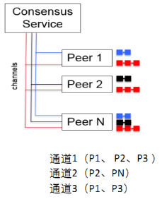
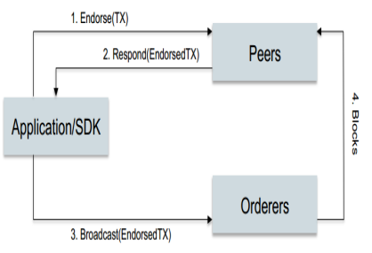
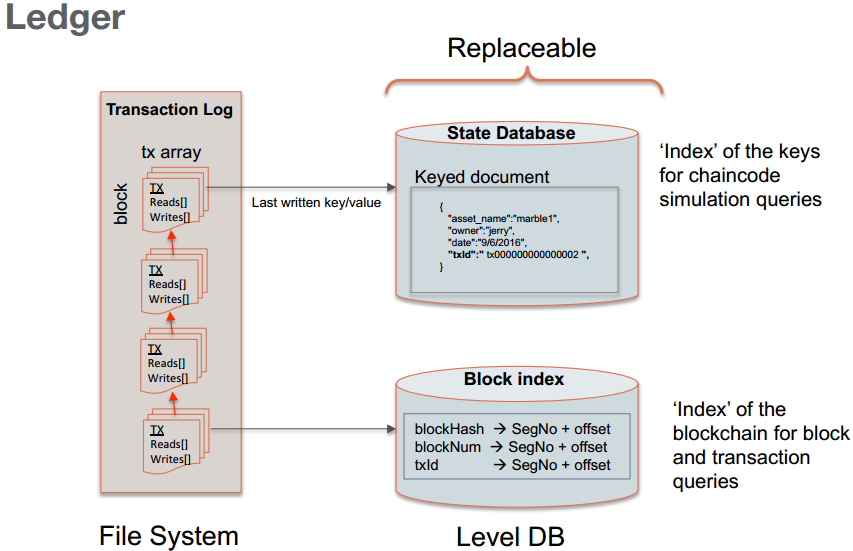

## 1. shell脚本基础

### 1.1 shell脚本介绍

- 什么是shell脚本

  > 一系列的shell命令的集合, 还可以加入一些逻辑操作（if else for） 将这些命令放入一个文件中.
  >
  > - 文件
  > - shell命令 * n个
  > - 可以加入逻辑
  > - 需要在linux的终端中执行

  ```shell
  # test.sh
  ls
  pwd
  if [ xxx ]
  	cd ..
  ```


  - 什么是shell命令?

    ```shell
    $ ls
    $ cd
    $ pwd
    ```

- shell脚本的基本格式
  - 命名格式

    - 一般命名规则 : xxxxx.sh  (建议以.sh为后缀命名)

  - 书写格式

    ```shell
    # test.sh #是shell脚本中的注释
    # 第一行如果忘了了写, 使用默认的命令解析器 /bin/sh
    #!/bin/bash  # 指定解析shell脚本的时候使用的命令解析器 /bin/sh也可以
    # 一系列的shell命令
    ls
    pwd
    cp 
    rm
    ```

- shell脚本的执行

  ```shell
  # shell脚本编写完成之后, 必须添加执行权限
  chmod u+x xxx.sh
  # 执行shell脚本
  ./xxx.sh
  sh test.sh
  ```

### 1.2 shell脚本中的变量

- 变量的定义
  - 普通变量(本地变量)

    ```shell
    # 定义变量, 定义完成, 必须要赋值, =前后不能有空格
    temp=666
    # 普通变量只能在当前进程中使用
    ```

  - ## 环境变量 - 一般大写

    ```shell
    # 可以理解问全局变量, 在当前操作系统中可以全局访问
    # 分类
    	- 系统自带的
    		- PWD
    		- SHELL
    		- PATH
    		- HOME
    	- 用户自定义的
    		- 将普通变量提升为系统级别的环境变量
    		GOPATH=/home/zoro/go/src - > 普通环境变量
    		set GOPATH=/home/zoro/go/src - > 系统环境变量
    		export GOPATH=/home/zoro/go/src
    		~/.bashrc
    ```

- 位置变量

  > 执行脚本的时候, 可以给脚本传递参数, 在脚本内部接收这些参数, 需要使用位置变量

  ```shell
  # 已经存在的脚本test.sh
  #!/bin/bash
  echo "hello , world, $0"
  echo "第一个参数: $1"
  echo "第2参数: $2"
  echo "第3个参数: $3"
  echo "第4个参数: $4"
  echo "第5个参数: $5"
  echo "第6个参数: $6"
  # 执行test.sh
  $ ./test.sh 11 22 3 4 5 6 aa bb
  hello , world, ./test.sh
  第一个参数: 11
  第2参数: 22
  第3个参数: 3
  第4个参数: 4
  第5个参数: 5
  第6个参数: 6
  ```

  - $0:  执行的脚本文件的名字
  - $1:  第一个参数
  - $2: 第2个参数
  - $3: 第三个参数
  - ......

- 特殊变量
  - $#:  获取传递的参数的个数
  - $@: 给脚本传递的所有的参数
  - $?: 脚本执行完成之后的状态, 失败>0 or 成功=0
  - $$: 脚本进程执行之后对应的进程ID

  ```shell
  # test.sh
  #!/bin/bash
  echo "hello , world, $0"
  echo "第一个参数: $1"
  echo "第2参数: $2"
  echo "第3个参数: $3"
  echo "第4个参数: $4"
  echo "第5个参数: $5"
  echo "第6个参数: $6"
  echo "传递的参数个数: $#"
  echo "传递的所有的参数: $@"
  echo "当前脚本的进程ID: $$" 
  
  $ ./test.sh aa bb cc dd ee ff 8 9 0 
  hello , world, ./test.sh
  第一个参数: aa
  第2参数: bb
  第3个参数: cc
  第4个参数: dd
  第5个参数: ee
  第6个参数: ff
  传递的参数个数: 9
  传递的所有的参数: aa bb cc dd ee ff 8 9 0
  当前脚本的进程ID: 47946
  # 脚本执行状态查看
  $ echo $?
  0 -> 成功
  非0 -> 失败
  ```

- 普通变量取值

  ```shell
  # 变量定义
  value=123	# 默认以字符串处理
  value1 = "123 456"
  echo $value
  # 如何取变量的值:
   - $变量名
   - ${变量名}
  ```

- 取命令执行之后的结果值

  ```shell
  # 取值的两种方式:
  var=$(shell命令)
  var=`shell命令`
  
  ```

- 引号的使用

  ```shell
  # 双引号
  echo "当前文件: $var"
  - 打印的时候会将var中的值取出并输出
  # 单引号
  echo '当前文件: $var'
  - 将字符串原样输出
  ```

### 1.3 条件判断和循环

- shell脚本中的if条件判断

  ```shell
  # if语句
  # 注意事项:
  	- if 和 []直接有一个空格
  	- [ 条件 ] : 条件的前后都有空格
  	- else if => elif
  	- 
  if [ 条件判断 ];then
  	逻辑处理 -> shell命令
  	xxx
  	xxxx
  	xxxx
  fi
  # ===================
  if [ 条件判断 ]
  then
  	逻辑处理 -> shell命令
  	xxx
  	xxx
  fi
  # if ... elif .. fi
  if [ 条件判断 ];then
  	逻辑处理 -> shell命令
  	xxx
  	xxxx
  	xxxx
  elif [ 条件判断 ];then
  	shell命令
  elif [ 条件判断 ];then
  	shell命令
  elif [ 条件判断 ];then
  	shell命令
  else
  	shell命令
  fi
  ```

  ```shell
  # if.sh
  #!/bin/bash
  # 需要对传递到脚本内部的文件名做判断
  if [ -d $1 ];then
      echo "$1 是一个目录!"                                                
  elif [ -s $1 ];then
      echo "$1 是一个文件, 并文件不为空"
  else
      echo "$1 不是目录, 有肯能不存在, 或文件大小为0"
  fi
  ```

- shell脚本for循环

  ```shell
  # shell中的循环 for/ while
  # 语法: for 变量 in 集合; do;done
  for var in 集合;do
  	shell命令
  done
  ```

  ```shell
  # for.sh
  #!/bin/bash
  # 对当前目录下的文件进行遍历
  list=`ls`
  for var in $list;do
      echo "当前文件: $var"
      echo '当前文件: $var'                                       
  done
  # 运行脚本
  $ ./for.sh     
  当前文件: a
  当前文件: $var
  当前文件: abc
  当前文件: $var
  当前文件: for.sh
  当前文件: $var
  当前文件: if.sh
  当前文件: $var
  当前文件: test.sh
  当前文件: $var
  ```

#### 1.4 shell脚本中的函数

```shell
# 没有函数修饰, 没有参数, 没有返回值
# 格式
funcName(){
	# 得到第一个参数
	arg1=$1
	# 得到第2个参数
	arg2=$2
	函数体 -> shell命令 + 逻辑循环和判断
	mkdir /root/abc
}
# 没有参数列表, 但是可以传参
# 函数调用
funcName aa bb cc dd
# 函数调用之后的状态: 
0 -> 调用成功
非0 -> 失败
```

```shell
#!/bin/bash
# 判断传递进行来的文件名是不是目录, 如果不是, 创建...
# 定义函数
is_directory()
{
    # 得到文件名, 通过参数得到文件名
    name=$1
    if [ -d $name ];then
        echo "$name 是一个目录!"
    else
        # 创建目录
        mkdir $name
        if [ 0 -ne $? ];then
            echo "目录创建失败..."
            exit
        fi  
        echo "目录创建成功!!!"                                                                                         
    fi  
}

# 函数调用
is_directory $1
```


## 2. Fabric环境搭建

## 3. Fabric基本概念

### 3.1 逻辑架构


- **成员管理（MemberShip）**
  - 会员注册
    - 注册成功一个账号得到的不是用户名密码
    - 使用证书作用身份认证的标志
  - 身份保护
  - 交易审计
  - 内容保密
    - 可以多条区块链, 通过通道来区分的
- **账本管理**
  - 区块链
    - 保存所有的交易记录
  - 世界状态
    - 数据的最新状态
    - 数据存储在当前节点的数据库中
      - 自带的默认数据库: levelDB, 也可以使用couchdb
        - 以键值对的方式进行存储 的
- **交易管理**
  - 部署交易
    - 部署的是链码, 就是给节点安装链码 - chaincode
  - 调用交易
    - invoke
- **智能合约**
  - 一段代码， 处理网络成员所同意的业务逻辑
  - 真正实现了链码和账本的分离（逻辑和数据分离）

### 3.2 基础概念


- **组织**

  > 是指这样一个社会实体，它具有明确的目标导向和精心设计的结构与有意识协调的活动系统，同时又同外部环境保持密切的联系
  >
  > 在Fabric中一个组织里边都有什么?
  >
  > - 有用户
  > - 有进行数据处理 的节点 -> peer
  >   - put -> 写数据到区块链中
  >   - get -> 数据查询

- **节点**

  - client

    进行交易管理(cli , node sdk, java sdk)

    - cli -> 通过linux的命令行进行通过, 使用的是shell命令对象数据进行提交和查询
    - node.js -> 通过node.js api 实现一个客户端
    - java -> 通过java api 实现一个客户端
    - go也可以

  - peer

    存储和同步账本数据

    - 用户通过客户端工具对数据进行put操作, 数据写入到一个节点里边
    - 数据同步是fabric框架实现的

  - orderer

    排序和分发交易

    - 为什么要排序?
      - 解决双花问题
      - 没发起一般交易都会在orderer节点进行排序

    - 交易数据需要先进行打包, 然后写入到区块中

- **通道** -> channel

  > 通道是有共识服务（ordering）提供的一种通讯机制，将peer和orderer连接在一起，形成一个个具有保密性的通讯链路（虚拟），实现了业务隔离的要求；通道也与账本（ledger）-状态（worldstate）紧密相关

  


  > consensus Server : orderer节点
  >
  > 三条不同颜色的线, 代表三个通道
  >
  > 一个peer节点是可以同时加入到不同的通道中的
  >
  > peer节点每加入到一个新的通道, 存储数据的区块链就需要添加一条, 只要加入到通道中就可以拥有这个通道中的数据, 每个通道对应一个区块链.

- 交易流程

  

  > 要完成交易, 这笔交易必须要有背书策略的, 假设:
  >
  >  - 组织A中的成员必须同意
  >  - 组织B中的成员也必须同意
  >
  > 1. Application/SDK : 充当的是客户端的角色
  >    - 写数据
  > 2. 客户端发起一个提案, 给到peer节点
  >    - 会发送给组织A和组织B中的节点
  > 3. peer节点将交易进行预演, 会得到一个结果
  > 4. peer节点将交易结果发送给客户端
  >    - 如果模拟交易失败, 整个交易流程终止
  >    - 成功, 继续
  > 5. 客户端将交易提交给排序节点
  > 6. 排序节点对交易打包
  > 7. orderer节点将打包数据发送给peer, peer节点将数据写入区块中
  >    1. 打包数据的发送, 这不是时时的
  >    2. 有设定条件, 在配置文件中
  >
  > 背书策略:
  >
  > - 要完成一笔交易, 这笔交易的完成过程叫背书

- **账本**

  ​	


### 

## shell条件测试参考

1. 文件状态测试

   | -b filename                          | 当filename 存在并且是块文件时返回真(返回0)                   |
   | ------------------------------------ | ------------------------------------------------------------ |
   | -c filename                          | 当filename 存在并且是字符文件时返回真                        |
   | <font color="red">-d pathname</font> | 当pathname 存在并且是一个目录时返回真                        |
   | -e pathname                          | 当由pathname 指定的文件或目录存在时返回真                    |
   | -f filename                          | 当filename 存在并且是正规(普通)文件时返回真                  |
   | -g pathname                          | 当由pathname   指定的文件或目录存在并且设置了SGID 位时返回真 |
   | -h/-L   filename                     | 当filename 存在并且是符号链接文件时返回真 (或  filename)     |
   | -k pathname                          | 当由pathname   指定的文件或目录存在并且设置了"粘滞"位时返回真 |
   | -p filename                          | 当filename 存在并且是命名管道时返回真                        |
   | -r pathname                          | 当由pathname 指定的文件或目录存在并且可读时返回真            |
   | <font color="red">-s filename</font> | 当filename 存在并且文件大小大于0 时返回真                    |
   | -S filename                          | 当filename 存在并且是socket 时返回真                         |
   | -t fd                                | 当fd   是与终端设备相关联的文件描述符时返回真                |
   | -u pathname                          | 当由pathname   指定的文件或目录存在并且设置了SUID 位时返回真 |
   | <font color="red">-w pathname</font> | 当由pathname 指定的文件或目录存在并且可写时返回真            |
   | <font color="red">-x pathname</font> | 当由pathname 指定的文件或目录存在并且可执行时返回真          |
   | -O pathname                          | 当由pathname   存在并且被当前进程的有效用户id 的用户拥有时返回真(字母O 大写) |
   | -G pathname                          | 当由pathname   存在并且属于当前进程的有效用户id 的用户的用户组时返回真 |
   | file1 -nt   file2                    | file1   比file2 新时返回真                                   |
   | file1 -ot   file2                    | file1   比file2 旧时返回真                                   |
   | f1 -ef f2                            | files f1   and f2 are hard links to the same file            |

2. 常见字符串测试 

   | -z string      | 字符串string   为空串(长度为0)时返回真         |
   | -------------- | ---------------------------------------------- |
   | -n string      | 字符串string   为非空串时返回真                |
   | str1 =   str2  | 字符串str1   和字符串str2 相等时返回真         |
   | str1 ==   str2 | 同 =                                           |
   | str1 !=   str2 | 字符串str1   和字符串str2 不相等时返回真       |
   | str1 <   str2  | 按字典顺序排序，字符串str1 在字符串str2 之前   |
   | str1 >   str2  | 按字典顺序排序，字符串str1   在字符串str2 之后 |

3. 常见数值测试

   | nt1 -eq   int2  | 如果int1   等于int2，则返回真     |
   | --------------- | --------------------------------- |
   | int1 -ne   int2 | 如果int1   不等于int2，则返回真   |
   | int1 -lt   int2 | 如果int1   小于int2，则返回真     |
   | int1 -le   int2 | 如果int1   小于等于int2，则返回真 |
   | int1 -gt   int2 | 如果int1   大于int2，则返回真     |
   | int1 -ge   int2 | 如果int1   大于等于int2，则返回真 |

4. 测试时使用的逻辑操作符

   | -a   | 逻辑与，操作符两边均为真，结果为真，否则为假。&&     |
   | ---- | ---------------------------------------------------- |
   | -o   | 逻辑或，操作符两边一边为真，结果为真，否则为假。\|\| |
   | !    | 逻辑否，条件为假，结果为真。                         |